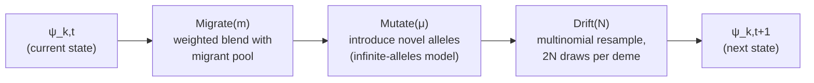
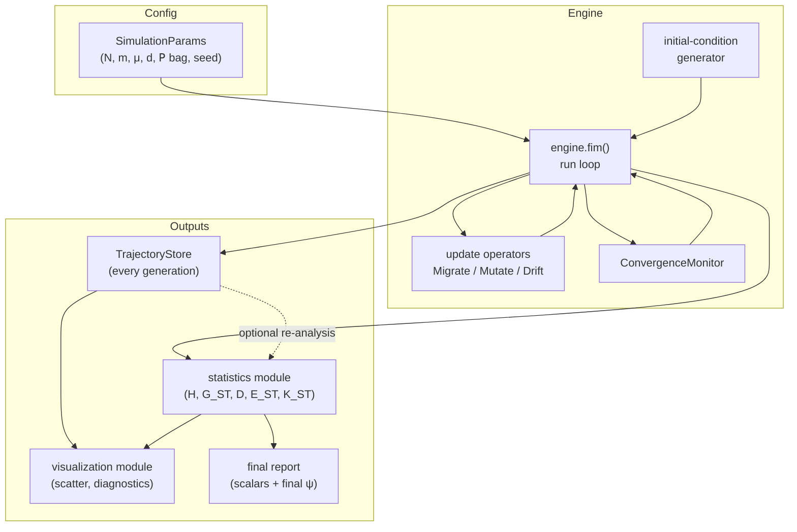

# Finite island model simulator: design document

- [Finite island model simulator: design document](#finite-island-model-simulator-design-document)
  - [Who this document is for](#who-this-document-is-for)
  - [1. Purpose and scope](#1-purpose-and-scope)
  - [2. Requirements as understood](#2-requirements-as-understood)
  - [3. The formal model](#3-the-formal-model)
    - [3.1 Signature and state](#31-signature-and-state)
    - [3.2 Alleles, loci, and identity](#32-alleles-loci-and-identity)
    - [3.3 Initial conditions](#33-initial-conditions)
    - [3.4 The generation-update pipeline](#34-the-generation-update-pipeline)
    - [3.5 What "converges" means here](#35-what-converges-means-here)
  - [4. System architecture](#4-system-architecture)
    - [4.1 Component overview](#41-component-overview)
    - [4.2 Data flow](#42-data-flow)
    - [4.3 The parameter bag (P)](#43-the-parameter-bag-p)
    - [4.4 Language and library choice](#44-language-and-library-choice)
  - [5. Module-level implementation plan](#5-module-level-implementation-plan)
  - [6. Persistence design](#6-persistence-design)
  - [7. Statistics module](#7-statistics-module)
  - [8. Visualization module](#8-visualization-module)
  - [9. Extensibility: where the next "what if" lands](#9-extensibility-where-the-next-what-if-lands)
  - [10. Validation and test strategy](#10-validation-and-test-strategy)
  - [11. Open questions requiring a decision](#11-open-questions-requiring-a-decision)
  - [12. Out of scope for this pass](#12-out-of-scope-for-this-pass)
  - [Metadata](#metadata)

## Who this document is for

Written for whoever implements the simulator: comfortable with software
architecture, arrays, and basic probability; no population-genetics
background assumed beyond what is restated inline. The two companion
documents in this directory —
[the finite island model introduction](20260810-claude-sonnet-5-finite-island-model-introduction.md)
and
[the Jost differentiation-measures guide](20260810-claude-sonnet-5-jost-differentiation-measures.md)
— are the source of every formula and biological claim used below and are
not re-derived here; this document is architecture and implementation
planning built on top of them, not a third exposition of the model itself.
The primary-source PDFs in `../../lou-jost-papers/` (the papers the two
companion documents themselves cite and quote) were also checked directly
for this pass; none contains simulator-architecture or convergence-
methodology guidance beyond what the companion documents already extract
— they are diversity- and differentiation-statistic papers, not simulation
methodology papers — so no additional citation was warranted here.

## 1. Purpose and scope

Build a simulator for the finite island model (FIM) that a botanist
(Lou Jost, or a collaborator working in his tradition) can use to generate
known-ground-truth allele-frequency trajectories, then compute and inspect
population-differentiation statistics against that known history. The
motivating gap, per the companion introduction (§4 of that document): the
existing tools in this space (quantiNemo 2, `hierfstat`) are built to
answer "what is the equilibrium statistic?", not "show me every
generation's allele frequencies" — and per-generation history is exactly
what this project exists to keep.

This document covers the **first implementation pass**: a single,
symmetric-island-model core (constant `N`, `m`, `μ` shared across demes;
one allele length `L` shared across loci) built so that the known future
variations — unequal deme sizes, migration matrices, per-locus length,
selection, alternative mutation models — are extensions of the parameter
set and the update pipeline rather than rewrites of it. §9 makes that
mapping explicit.

## 2. Requirements as understood

Restated from the botanist's requirements, as given, for traceability. This
section records the requirement as stated — not a reinterpretation — so
that any gap between what is written here and what was actually meant can
be spotted and corrected in review rather than discovered downstream.

1. Simulate the FIM: `fim(N, m, μ, d; 𝖯) ⇒ {ψ_k,t : k ∈ 1..d, t ∈ 𝗭+}`.
   `N`, `m`, `μ`, `d` are named inputs; `𝖯` is an open, untyped bag of
   further parameters. `ψ_k,t` is the state of deme `k` at generation `t`.
   The run ends when a selected population statistic converges.
2. Alleles are an unordered, countably infinite set `{a_k : k ∈ 𝗭+}` with
   identity comparison `same(a_j, a_k) = (j == k)` and no other structure
   — no ordering, no distance, no similarity.
3. Each allele has a locus `l ∈ 𝗭+` and a length `L ∈ 𝗭+`. The initial
   pass may assume `L` is constant across loci; per-locus `L` is a known
   future generalization.
4. Initial allele-frequency distributions per deme may be random; the
   model is asserted to converge analytically for any starting
   population.
5. This pass persists every intermediate generation's state and reports
   the converged final state.
6. Botanist-facing output is (a) final population-differentiation metrics
   (scalars) and (b) per-deme allele-frequency distributions, with a
   canonical visual of a scatter plot of allele frequency in `d`-dimensional
   space.

Two places in this list carry real ambiguity, worth naming rather than
silently resolving:

- **"Locus" vs. "allele" as the length-bearer** (item 3). The companion
  differentiation-measures document (Part I) defines length as a property
  of the **locus** (the interval), not the allele (the value found there):
  `μ ≈ μ_b · L` for a per-base-pair rate `μ_b`. §3.2 below follows that
  document rather than the literal item-3 wording, and treats `L` as a
  `LocusSpec` field. Flagged in [§11](#11-open-questions-requiring-a-decision)
  for confirmation.
- **"Converges" applied to a stochastic process that has no fixed point**
  (item 1, item 4). Under the finite island model with `μ > 0`, no state
  is absorbing — allele frequencies keep moving forever, and the system
  settles into a *stochastic equilibrium*: the **distribution** of a
  summary statistic stabilizes, not the state itself. §3.5 makes this
  operational.

## 3. The formal model

### 3.1 Signature and state

```math
\mathrm{fim}(N, m, \mu, d;\, \mathsf{P}) \;\Rightarrow\; \{\psi_{k,t} : k \in 1..d,\ t \in \mathbf{Z}^+\}
```

`ψ_k,t` is deme `k`'s complete state at generation `t`: one allele-frequency
vector per tracked locus.

```math
\psi_{k,t} = \bigl\{\, (l,\ p_{k,t,l}) \;:\; l \in \text{Loci} \,\bigr\},
\qquad
p_{k,t,l} : \text{Allele} \to [0, 1],
\qquad
\sum_{a} p_{k,t,l}(a) = 1
```

`p_{k,t,l}` is a probability vector over whatever alleles are actually
present at locus `l` in deme `k` at generation `t` — not over the whole
infinite allele universe. This is the load-bearing representational choice
(§3.2): the universe is unbounded, but the *support* of `p_{k,t,l}` is
never larger than `2N` (there are only `2N` gene copies to be one allele
or another), so the state is finite and small at every instant even though
the label space it draws from is not.

### 3.2 Alleles, loci, and identity

An allele is an opaque label with exactly one operation: `same(a_j, a_k) =
(j == k)`. No ordering, no metric, no structure — this is deliberate (the
differentiation-measures guide, "Distance between alleles is a different
model," is explicit that imposing a metric on alleles answers a different
question than the one this model and Jost's statistics are built for).
Implementation consequence: an allele is represented as an opaque integer
ID, nothing more — never a string, never a structured value that invites
comparison by anything other than equality.

New alleles are minted by mutation under the infinite-alleles assumption
(every mutation event produces a label never seen before — a good
approximation once a locus spans "many base pairs," per the
differentiation-measures guide). A single global `AlleleRegistry` hands out
the next unused integer on every mutation event across the whole run,
guaranteeing `same()` is exactly integer equality with no risk of two
independent mutations colliding on the same label.

A locus is a separate concept from an allele: it names *where* to look,
carrying its own identity `l ∈ 𝗭+` and length `L ∈ 𝗭+`. `L` matters only
through the mutation rate (`μ ≈ μ_b · L`, per the differentiation-measures
guide) — it plays no role in any statistic computed from a frequency
vector. Represented as a `LocusSpec(locus_id, length)` value object from
day one, with every run configuration providing one `LocusSpec` per
tracked locus, **even in the initial pass where every `LocusSpec.length`
is equal.** That is the cheapest possible way to make "per-locus length"
(item 3's stated future generalization) a data change instead of a
schema change later.

### 3.3 Initial conditions

The per-deme, per-locus initial frequency vector `p_{k,0,l}` is generated,
not hand-specified, by default: an i.i.d. symmetric Dirichlet draw over a
starting allele set, one draw per `(deme, locus)` pair, seeded from the
run's RNG seed for exact reproducibility. Concentration parameter and
starting allele count live in `𝖯` (§4.3), not as hardcoded constants —
different concentration values produce visibly different starting
"evenness," which is itself a useful knob for a botanist probing the
model. An explicit, user-supplied `p_0` is also accepted as an alternative
initial-condition source, for reproducing a specific published scenario or
a real allele-frequency survey as a starting point.

The requirement's claim that the model "is guaranteed (analytically) to
converge for any starting population" is a property of the underlying
Markov chain (ergodicity toward a stationary distribution once mutation
keeps the chain from being absorbed), not something this software proves
or needs to prove — it is inherited as a modeling assumption from the
theory the companion documents describe. The simulator's job is purely
operational: detect, empirically, when a chosen statistic has stopped
moving (§3.5).

### 3.4 The generation-update pipeline

Per the finite-island-model introduction (§3.2), one generation is two
composed operators — migration (weighted blend) then drift (random
resampling) — with mutation as a documented optional third step inserted
between them (introduction, §3.3):

```math
p_{t+1} = \mathrm{Drift}\bigl(\mathrm{Mutate}_\mu\bigl(\mathrm{Migrate}_m(p_t)\bigr)\bigr)
```



Each stage is implemented as a pure function of state to state — no
stage reads or mutates global state, and each is independently unit-
testable against the closed-form expectations in the companion documents
(§10). This directly answers the design lesson already on record in this
repository's own research history: keep the generative model and the
statistic computation as two separate concerns, and keep each stage of the
generative model itself separately testable rather than one fused update
step.

### 3.5 What "converges" means here

There is no state to converge to once `μ > 0` — frequencies keep moving
forever. What the requirement means, operationally, is: **the value of a
chosen population statistic, tracked generation over generation, stops
changing beyond a tolerance, over a trailing window of generations.** That
is a statement about the statistic's trajectory, not about `ψ` itself, and
it is what `ConvergenceMonitor` (§5) actually implements.

Degenerate case worth naming: if `μ = 0` exactly, the whole system *is*
eventually absorbed (every deme fixed for a single shared allele, per the
finite-island-model introduction §2.2) — a literal fixed point. The
monitor should detect that case as a special, faster-converging instance
of the same general check (the statistic's trailing-window variance goes
to exactly zero), not as a separate code path.

## 4. System architecture

### 4.1 Component overview



`engine.fim()` owns the run loop; every other component is a function or
small class it calls, none of them aware of the loop that drives them.
`TrajectoryStore` and the statistics module are usable standalone against
a previously persisted run — re-computing a new statistic against an old
trajectory should never require re-running the simulation.

### 4.2 Data flow

1. `SimulationParams` (validated) plus a seed produce an initial `ψ_0` via
   the initial-condition generator (§3.3).
2. The run loop writes `ψ_0` to the `TrajectoryStore`, then repeatedly
   applies the update pipeline (§3.4), writing each `ψ_t` as it is
   produced, and feeding the chosen statistic's value at `ψ_t` to the
   `ConvergenceMonitor`.
3. When the monitor signals stop (statistic converged) or a hard
   generation cap is hit (safety valve — see §5), the loop ends.
4. The statistics module computes the full final-generation report from
   `ψ_T`.
5. The visualization module reads from the `TrajectoryStore` (for the
   canonical scatter and any diagnostic plots) and from the final report.

### 4.3 The parameter bag (P)

`𝖯` is deliberately open — the requirement says so, and the pattern
across every companion document is "the botanist will keep asking to vary
one more thing." The design response: every value that varies by
scenario — not just the four named arguments — is a named entry in `𝖯`,
read at the point of use with an explicit default, and never a hardcoded
literal inside an operator or the run loop. A partial, illustrative (not
exhaustive) schema for the initial pass:

| Key | Meaning | Default |
|---|---|---|
| `seed` | RNG seed for the whole run | required, no default |
| `n_loci` | number of independent loci tracked | `1` |
| `locus_lengths` | `LocusSpec.length` per locus | one shared constant |
| `initial_allele_count` | starting allele count per locus | `2` (biallelic/SNP-like) |
| `initial_concentration` | Dirichlet concentration for random start | `1.0` (uniform) |
| `deme_weighting` | `"equal"` or `"size"` — used by `E_ST` and by the convergence statistic if size-sensitive | `"equal"` |
| `convergence_statistic` | which statistic(s) the monitor watches | `"D"` |
| `convergence_window` | trailing-window length, generations | `50` |
| `convergence_tolerance` | stability tolerance on that window | `0.01` |
| `max_generations` | hard safety cap | `10000` |

`N` and `m` are themselves designed to accept either a scalar (the
symmetric initial-pass case) or an array/matrix (per-deme size, full
migration matrix) from the start — see §9. Extending to unequal demes or
asymmetric migration is then "pass a richer value for an existing
argument," not a new code path threaded through the operators.

### 4.4 Language and library choice

No language is yet committed in this repository (documentation-only to
date). Recommendation: **Python 3, with NumPy as the array backend**,
matching two things already visible in this codebase's neighborhood: the
sibling Selby repositories use a Python-first toolchain (Docker-wrapped
`python3`, per `belize-orchid-genera-key`), and this project's own prior
research doc (`.attic/20260808-…-01.md`, §6) already recommends
NumPy-vectorized batched binomial/multinomial sampling across loci and
replicate runs as the natural fit for the drift step's workload — that
recommendation is adopted directly rather than re-derived. Output formats
(§6) are chosen to be equally easy to load from R, since the origin of
this whole project was a researcher wanting per-generation frequencies he
could load into his own analysis tooling.

This is a recommendation, not a foregone conclusion — flagged again in
[§11](#11-open-questions-requiring-a-decision).

## 5. Module-level implementation plan

Proposed package layout:

```text
jost-finite-island-model/
├── doc/
├── src/
│   └── fim/
│       ├── __init__.py
│       ├── model/
│       │   ├── allele.py          # AlleleId, AlleleRegistry
│       │   ├── locus.py           # LocusSpec
│       │   ├── state.py           # ModelState (ψ_k,t), (de)serialization
│       │   ├── params.py          # SimulationParams, validated P-bag schema
│       │   ├── initial.py         # initial-condition generators
│       │   └── operators.py       # migrate(), mutate(), drift() — pure fns
│       ├── convergence/
│       │   ├── criteria.py        # ConvergenceCriterion protocol + built-ins
│       │   └── monitor.py         # ConvergenceMonitor
│       ├── statistics/
│       │   └── differentiation.py # H, H_S, H_T, G_ST, D, E_ST, K_ST, Hill numbers
│       ├── persistence/
│       │   ├── trajectory_store.py
│       │   └── manifest.py
│       ├── viz/
│       │   ├── scatter.py         # canonical d-dimensional frequency scatter
│       │   └── diagnostics.py     # convergence trace, per-deme frequency bars
│       ├── engine.py              # fim(N, m, μ, d, P) — the public entry point
│       └── cli.py                 # command-line entry point
├── test/
│   ├── model/
│   ├── convergence/
│   ├── statistics/
│   ├── persistence/
│   └── viz/
└── bin/
    └── fim                        # thin wrapper invoking the CLI
```

**`model/allele.py`.** `AlleleId` is a plain integer newtype (or an
`int`-backed enum-like wrapper if the language's type system rewards it) —
carries no payload beyond its identity. `AlleleRegistry.next_id()` hands
out a fresh globally-unique ID; the registry is the *only* place a new
`AlleleId` value is ever created, so the infinite-alleles guarantee (every
mutation event is novel) reduces to "call this one function."

**`model/locus.py`.** `LocusSpec(locus_id, length)`, immutable. A run's
`loci: tuple[LocusSpec, ...]` is part of `SimulationParams`.

**`model/state.py`.** `ModelState` holds, per deme and per locus, a
sparse mapping `AlleleId → frequency` (§3.1's `p_{k,t,l}`) — not a dense
array indexed by allele, because the allele universe is unbounded and
only a small, varying subset is ever present. Provides equality,
serialization to/from the persistence layer's row format, and a
`total_frequency()` invariant check (`Σp ≈ 1`, within floating-point
tolerance) usable by tests. Where a run is known in advance to be
fixed-`K`, no-mutation (the common biallelic/SNP case), the drift
operator may use a dense-array fast path internally for vectorization —
purely an internal performance detail behind `operators.drift()`'s
interface, invisible to `ModelState`'s public shape.

**`model/params.py`.** `SimulationParams` is the validated, immutable
config object: the four named arguments (`N`, `m`, `μ`, `d`, each
scalar-or-array as described in §4.3/§9), the `loci` tuple, the RNG seed,
and the `𝖯` bag with a documented schema and defaults (§4.3's table,
extended as new variants are added — see §9). Serializes losslessly
alongside every run's output, so a run's exact parameters are always
recoverable from its persisted results (this is what makes a run
re-playable given its seed).

**`model/initial.py`.** `generate_initial_state(params) -> ModelState`,
implementing §3.3: default random-Dirichlet generator plus an
explicit-`p_0` override path. Structured as a small strategy interface
(`InitialConditionGenerator`) so a botanist-supplied starting distribution
(e.g., from a real allele-frequency survey) is a second implementation of
the same interface, not a special case wired into the engine.

**`model/operators.py`.** Three pure functions, each `ModelState ->
ModelState`, matching §3.4 exactly:

- `migrate(state, m) -> ModelState` — per-deme weighted blend with the
  migrant pool (all-other-demes average, per the introduction's "island
  model proper"; the stepping-stone alternative is a documented but
  unimplemented pool-selection strategy for this pass — see §9).
- `mutate(state, mu, registry) -> ModelState` — infinite-alleles model:
  each of the `2N` gene copies independently mutates with probability
  `μ`; a mutating copy's label is replaced by a fresh ID from `registry`.
- `drift(state, N) -> ModelState` — multinomial resample of `2N` gene
  copies from the post-migration/mutation frequency vector, per deme, per
  locus.

**`convergence/criteria.py`.** `ConvergenceCriterion` protocol:
`is_stable(history: Sequence[float], window: int, tolerance: float) ->
bool`. Built-ins: a trailing-window stability check (compare the mean of
the window's first half against its second half; stable when the
difference is within `tolerance`) and a fixed-`max_generations` fallback
that always eventually fires regardless of statistical behavior — the
safety valve named in §3.5, since stochastic-equilibrium detection is not
guaranteed to trigger quickly, or at all, for a badly chosen tolerance.
Criteria compose (default: convergence on *all* watched statistics in
`convergence_statistic`, ANY/ALL combinator configurable).

**`convergence/monitor.py`.** `ConvergenceMonitor` wraps one or more
criteria plus the running history of the watched statistic(s); the engine
calls `monitor.record(t, state)` once per generation and checks
`monitor.should_stop()`. On stop, it reports *why* (statistic converged,
vs. hard cap reached) — a run that hit the cap without converging is
still a valid, inspectable result, not an error (a botanist probing an
edge case where the model genuinely does not settle is itself useful
information, and the run should say so plainly rather than raise).

**`statistics/differentiation.py`.** Pure functions of a frequency table
— entirely independent of the simulator, consistent with this project's
own prior design guidance (`.attic/…-01.md`, §6.2: "separate the
generative model from the statistic computation"). Implements exactly the
formula sheet in the differentiation-measures guide's Appendix A: `H`,
`H_S`, `H_T`, `J`, Hill numbers `^qD`, `G_ST`, `D` (Jost's), `E_ST`,
`K_ST`, plus the general `Differentiation_q` family formula so a botanist
can sweep `q` directly rather than being limited to the three named
measures. Usable standalone against any persisted trajectory, current run
or historical.

**`persistence/trajectory_store.py`** and **`manifest.py`** — see §6.

**`viz/scatter.py`** and **`viz/diagnostics.py`** — see §8.

**`engine.py`.** `fim(N, m, mu, d, *, params: SimulationParams) ->
RunResult` — the public entry point matching the requirement's own
signature. Owns the run loop described in §4.2 and nothing else; every
step it takes is a call into one of the modules above.

**`cli.py`** / **`bin/fim`.** Thin command-line wrapper: parse a config
file or flags into `SimulationParams`, call `engine.fim()`, print a
one-page summary of the final report, and write the persisted trajectory,
report, and canonical scatter to an output directory.

## 6. Persistence design

Every generation is persisted (requirement 5) as it is produced — not
batched in memory and flushed at the end, since a botanist's own future
"what if" is likely to include "run it for a lot longer" long before it
includes "keep less history." Row shape, one row per `(generation, deme,
locus, allele)` with nonzero frequency (the sparse representation from
§3.1/§5 carries straight through to storage — no wasted rows for absent
alleles):

| Column | Type | Meaning |
|---|---|---|
| `run_id` | string | groups rows from one `fim()` call |
| `generation` | int | `t` |
| `deme` | int | `k`, `1..d` |
| `locus_id` | int | `l` |
| `allele_id` | int | opaque allele label |
| `frequency` | float | `p_{k,t,l}(allele_id)` |

Long-format, tidy, one value per row — directly loadable into R or Python
without a custom parser, matching this project's founding motivation
(giving a researcher per-generation frequencies he can load into his own
analysis, not a black box). Backend format is an implementation choice
independent of the schema above (candidates: Parquet for run sizes large
enough that columnar compression matters, plain CSV/JSONL for small runs
and maximum tool-agnostic portability); flagged in
[§11](#11-open-questions-requiring-a-decision) since the right answer
depends on typical run sizes the botanist actually needs, not yet known.

A **run manifest** is written alongside the trajectory: the full
`SimulationParams` (including seed — this is what makes a run exactly
re-playable), start/end wall-clock time, the convergence outcome
(converged vs. hit the cap, on which statistic, at which generation), and
software version. The manifest is what lets someone hand a `run_id` to a
collaborator and have them reproduce the identical trajectory.

## 7. Statistics module

Implements, from the differentiation-measures guide's Appendix A formula
sheet, exactly:

```math
H = 1 - \sum_i p_i^2 \qquad J = 1 - H \qquad {}^{q}D = \Bigl(\sum_i p_i^q\Bigr)^{1/(1-q)}\ (q\neq1)
```

```math
G_{ST} = 1 - \frac{H_S}{H_T} \qquad
D = \left[\frac{H_T-H_S}{1-H_S}\right]\cdot\frac{d}{d-1} \qquad
E_{ST} = \frac{E_T-E_S}{E_w} \qquad
K_{ST} = 1 - \frac{K_T/K_S-d}{1-d}
```

against the frequency table produced by a `ModelState` (or read back from
a persisted trajectory — the module never depends on the engine). Deme
weighting (`𝖯["deme_weighting"]`, §4.3) is threaded through here: `D` is
defined with equal deme weighting by construction (per the guide, Part
III), while `E_ST` natively supports size weighting — the module exposes
both, and the caller's weighting choice is explicit rather than a
silently different default per function. This is also where the final
scalar report (requirement 6a) and the final per-deme frequency table
(requirement 6b) both originate — the report is nothing more than this
module's output at `t = T`, formatted.

## 8. Visualization module

**Canonical view (requirement 6, "scatter plot of frequency in
`d`-dimensional space"):** one point per `(locus, allele)`, plotted with
coordinates `(p_{1,T,l}(a), p_{2,T,l}(a), …, p_{d,T,l}(a))` — i.e., the
axes are the `d` demes, and a point's position shows how that allele's
frequency is distributed across them. An allele private to one deme sits
on that deme's axis; an allele shared evenly across all demes sits near
the diagonal. This reads directly against the differentiation-measures
guide's central theme — allelic differentiation is exactly a question of
which alleles are shared versus private across demes, and this plot shows
that question's answer geometrically rather than as a single scalar.

Direct rendering only works for `d ≤ 3`. For `d > 3` — the common case —
`viz/scatter.py` dispatches to one of two projections, both computed from
the same underlying point set:

- a pairwise scatterplot matrix (`d choose 2` panels), which stays fully
  faithful to the data at the cost of screen space; the default for
  moderate `d`.
- a 2-D projection (PCA, or another dimensionality reduction) for large
  `d`, trading faithfulness for a single legible panel; explicitly
  labeled as a projection, never presented as equivalent to the direct
  plot.

Because every generation is already persisted (§6), the same scatter
function trivially generalizes to an animation or small-multiples view
across generations — not a requirement of this pass, but effectively free
given the persistence design, and a natural answer to a future "what does
this look like *building up* over time" request.

**Supporting diagnostic views**, useful for trusting the primary output
rather than botanist-facing deliverables in their own right: a time
series of the watched convergence statistic (lets a user visually confirm
`ConvergenceMonitor`'s decision, and see at a glance whether a
non-converged run was heading somewhere or genuinely oscillating), and a
per-deme stacked allele-frequency bar chart (the same information as the
final report table, in the STRUCTURE-plot style population geneticists
already read fluently).

## 9. Extensibility: where the next "what if" lands

Every companion document ends with some version of "it would be
interesting to see what happens if you could change X." The architecture
above is built so each of the changes already on record in this
repository's research history has a specific, small landing spot rather
than requiring a redesign:

| "What if…" | Landing spot | Why it's small |
|---|---|---|
| …island sizes differed (`N_i`)? | `N` accepts a length-`d` array | `drift()` already receives `N` as a parameter; per-deme `2N_i` is a broadcast, not new logic |
| …migration were asymmetric, or a full matrix? | `m` accepts a `d × d` matrix | `migrate()`'s weighted blend generalizes to a matrix–vector product; the scalar case is that matrix's symmetric special case |
| …migration were spatial (stepping-stone)? | a sparse/neighbor-restricted `m` matrix, or a `MigrantPoolStrategy` interface | same mechanism as the row above; "who is a neighbor" is a matrix-construction question, not an operator change |
| …locus length varied? | `LocusSpec.length` per locus | already a first-class field (§3.2), unused only because the initial pass sets every locus equal |
| …selection were added? | a new `select()` operator inserted before `drift()` | the pipeline (§3.4) is already a composition of independent stages; adding one is additive |
| …the mutation model weren't infinite-alleles (e.g., stepwise mutation for microsatellites)? | swap the strategy behind `mutate()` | `AlleleRegistry` is already the sole minting point for new IDs; a different model changes what gets minted, not who mints it |
| …many replicate runs were needed for a confidence interval? | `engine.py` batches `n_replicates` as a vectorized array dimension | the attic research doc's own recommendation (§6.4 there): loci and replicates are i.i.d. under fixed parameters, an embarrassingly parallel array problem |
| …a different statistic should drive convergence? | `ConvergenceCriterion` is a pluggable protocol | the monitor never hardcodes which statistic it watches |
| …deme weighting should default to size instead of equal? | `𝖯["deme_weighting"]` | already a named, read-at-point-of-use parameter, never a literal in the statistics module |

## 10. Validation and test strategy

**Golden worked examples.** The differentiation-measures guide's Part IV
provides several fully worked, hand-checked scenarios with exact expected
values — including one documented erratum against the published paper
(`D = 0.5556`, not the paper's printed `0.5`, for the "five demes fixed
for A, five for B" case) — which makes them unusually good regression
fixtures: the "nine-fixed-for-A, one-for-B" family (`D` = 0.20, 0.5556,
1.00 across three configurations), the three-species `G_ST`-near-zero
family (Species A/B/C), the "98% within demes" trap recomputation, and
the `D`-vs-`K_ST` disagreement case. `statistics/differentiation.py`'s
test suite should assert against these exact values directly, not just
against internal consistency — they were independently recomputed from
first principles in that document, not copied from the paper.

**Invariant tests**, checked as properties over randomly generated
frequency tables rather than single fixed inputs:

- `G_ST ≤ 1 - H_S` (the ceiling identity, Part V).
- `H_T ≥ H_S` always.
- `H_T = H_S + H_ST - H_S · H_ST` (the correct subadditive partition,
  Part V) with `H_ST` matching `D`'s own first bracket exactly.
- `D ∈ [0, 1]`; `D = 1` iff demes share no alleles; `D = 0` iff demes are
  identical.
- The replication principle: pooling two equally sized, equally diverse,
  completely disjoint groups exactly doubles `^HD_T / ^HD_S` (Part V).

**Statistical/asymptotic property tests** against the model itself, not
just the statistics module: the drift operator's per-generation variance
should match the theoretical `p(1-p)/(2N)` (this project's own prior
research doc flags this exact check as the thing to validate before
trusting anything built on top of it), and many-replicate runs at fixed
`N, m, μ, d` should have their sample-mean `G_ST` and `D` approach the
equilibrium formulas (differentiation-measures guide, Part VI, Eq. 2 and
Eq. 4) within a pre-derived confidence bound. These are inherently
stochastic checks; they must still be **deterministic given the commit** —
fix the seed(s) used, and derive the tolerance band analytically in
advance from the sample size chosen, rather than picking a seed after the
fact because it happens to pass. A test whose outcome can change on a
re-run with the code unchanged is a defect in the test, not an acceptable
property of a stochastic simulator.

**Interface-level tests.** `ConvergenceMonitor` against synthetic
statistic sequences (constant, slowly converging, oscillating-forever) to
confirm both the stability criterion and the hard-cap fallback fire
correctly and report the right reason. `TrajectoryStore` round-trips
(write then read back, exact match) independent of any simulation run.

## 11. Open questions requiring a decision

These are choices the design deliberately leaves open rather than
guesses, because getting them wrong is expensive to unwind and the right
answer depends on how the tool will actually be used:

1. **Default convergence statistic, window, and tolerance.** `D` is
   proposed as the default (§4.3) because it is the botanist's own
   headline statistic, but the right window length and tolerance depend
   on typical `N`, `m`, `d` values in real use and are not derivable from
   the model alone.
2. **Single statistic vs. a required set.** Should the monitor require
   *all* of a configured set of statistics to stabilize before stopping
   (e.g., `D` and `G_ST` together), or is one sufficient? Affects how
   conservative a "converged" label actually is.
3. **Deme-weighting default** (`equal` vs. `size`) when deme sizes are
   allowed to differ (§9) — affects both `E_ST` and, potentially, the
   convergence statistic itself.
4. **Persistence backend** (§6) — Parquet, CSV/JSONL, or something else —
   depends on expected run sizes (generations × demes × loci × alleles)
   and who consumes the output downstream.
5. **Whether the initial pass should exercise mutation at all**, or start
   `μ = 0` and add it in a second pass. The formal signature names `μ` as
   a required top-level argument, which argues for including it from the
   start; but mutation is also the single largest driver of complexity in
   the state representation (§3.1's unbounded allele universe) and in the
   convergence question (§3.5's degenerate-case discussion). Worth an
   explicit decision rather than an implicit one.
6. **Locus length as an allele property vs. a locus property** (§2) —
   this document follows the differentiation-measures guide and treats it
   as a locus property; confirm that matches what was actually meant by
   requirement item 3.
7. **Language/library commitment** (§4.4) — Python + NumPy is a
   recommendation with a stated rationale, not yet a decision made by
   this repository.

## 12. Out of scope for this pass

Named explicitly so a first implementation is not held up chasing them:
selection; non-infinite-alleles mutation models (stepwise mutation for
microsatellites); stepping-stone or other non-all-to-all migration
topologies; per-locus allele length; unequal deme sizes; a general
migration matrix. Every one of these has a specific landing spot already
identified (§9) — they are deferred, not precluded.

## Metadata

```text
generator-name: Claude Code
generator-version: Claude Sonnet 5
generator-model-token: claude-sonnet-5
generator-provider: Anthropic
generation-date: 2026-08-14
generator-responsibility: other
```
