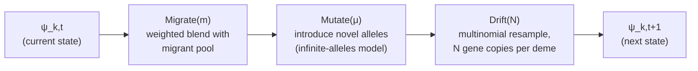
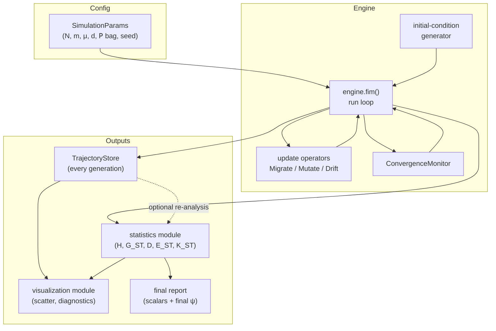
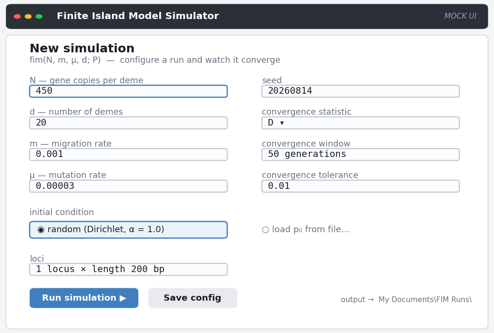
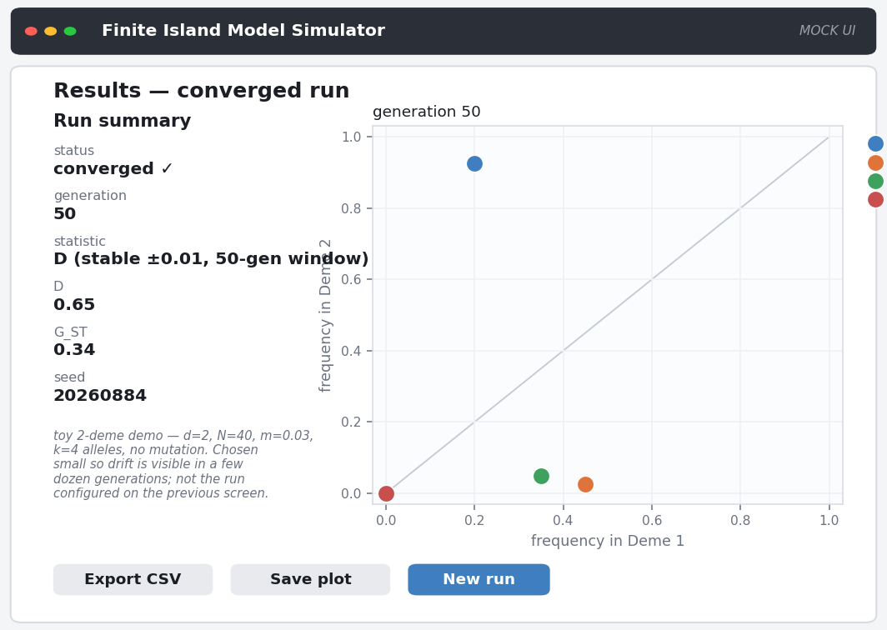
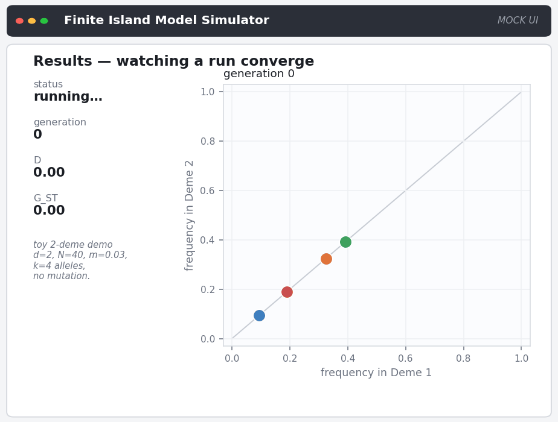

# Finite island model simulator: design document

- [Finite island model simulator: design document](#finite-island-model-simulator-design-document)
  - [Who this document is for](#who-this-document-is-for)
  - [1. Purpose and scope](#1-purpose-and-scope)
  - [2. Requirements as understood](#2-requirements-as-understood)
  - [3. The formal model](#3-the-formal-model)
    - [3.1 Signature and state](#31-signature-and-state)
    - [3.2 Alleles, loci, and identity](#32-alleles-loci-and-identity)
    - [3.3 Initial conditions](#33-initial-conditions)
    - [3.4 The generation-update pipeline](#34-the-generation-update-pipeline)
    - [3.5 What "converges" means here](#35-what-converges-means-here)
  - [4. System architecture](#4-system-architecture)
    - [4.1 Component overview](#41-component-overview)
    - [4.2 Data flow](#42-data-flow)
    - [4.3 The parameter bag (P)](#43-the-parameter-bag-p)
    - [4.4 Language and library choice](#44-language-and-library-choice)
    - [4.5 Packaging and distribution](#45-packaging-and-distribution)
  - [5. Module-level implementation plan](#5-module-level-implementation-plan)
  - [6. Persistence design](#6-persistence-design)
  - [7. Statistics module](#7-statistics-module)
  - [8. Visualization module](#8-visualization-module)
  - [9. Extensibility: where the next "what if" lands](#9-extensibility-where-the-next-what-if-lands)
  - [10. Validation and test strategy](#10-validation-and-test-strategy)
  - [11. Open questions requiring a decision](#11-open-questions-requiring-a-decision)
  - [12. Out of scope for this pass](#12-out-of-scope-for-this-pass)
  - [13. Illustrated walkthrough (mocked)](#13-illustrated-walkthrough-mocked)
    - [Installing it (mocked)](#installing-it-mocked)
    - [Using it from the command line (mocked)](#using-it-from-the-command-line-mocked)
    - [Using it from a GUI (mocked)](#using-it-from-a-gui-mocked)
  - [Metadata](#metadata)

## Who this document is for

Primarily written for whoever implements the simulator: comfortable with
software architecture, arrays, and basic probability; no population-
genetics background assumed beyond what is restated inline. But this is
also the design record for a piece of software the botanist himself asked
for, so it is written to be readable by him too — not every section
needs it, and the table below says which.

| If you are... | Read | Treat as optional |
|---|---|---|
| The botanist, checking this matches what you asked for | §1, §2 (do these read back what you meant?), §4.5 (how you'll install and run it), §13 (a plain walkthrough — start here if you want the short version) | §3, §5, §6, §7, §9, §10 — internal architecture, informative but not required |
| The botanist, curious about a specific design choice | Also skim §8 (what the plots actually show and why) and §11 (what's still undecided — your input would help) | §5, §6, §9, §10 — module-level detail |
| Whoever implements the simulator | Everything, in order | — |

Sections written for the implementer are marked as such at their start;
skipping them costs nothing needed to follow §13's walkthrough, which is
the closest thing in this document to "here is what using the software
actually feels like." The two companion documents in this directory —
[the finite island model introduction](20260810-claude-sonnet-5-finite-island-model-introduction.md)
and
[the Jost differentiation-measures guide](20260810-claude-sonnet-5-jost-differentiation-measures.md)
— are the source of every formula and biological claim used below and are
not re-derived here; this document is architecture and implementation
planning built on top of them, not a third exposition of the model itself.
The primary-source PDFs in `../../lou-jost-papers/` (the papers the two
companion documents themselves cite and quote) were also checked directly
for this pass. Most are diversity- and differentiation-statistic papers
with no simulator-architecture content beyond what the companion documents
already extract — but one, `Dear-NolanMarch17Final.{pages,pdf}`, is
exactly on point: an unpublished open letter from Jost to Nolan Kane
(undated beyond the filename; internal references to Whitlock (2011) place
it in or after 2011), written specifically to rebut a blog post with two
worked finite-island-model simulations, run by Jost's colleagues Anne Chao
and T. C. Hsieh, complete with parameters, expected/observed statistic
values, and the actual scatter plots. §4.3, §8, and §10 below draw on it
directly and cite it as what it is — primary correspondence from the
model's own author, not a peer-reviewed publication.

## 1. Purpose and scope

Build a simulator for the finite island model (FIM) that a botanist
(Lou Jost, or a collaborator working in his tradition) can use to generate
known-ground-truth allele-frequency trajectories, then compute and inspect
population-differentiation statistics against that known history. The
motivating gap, per the companion introduction (§4 of that document): the
existing tools in this space (quantiNemo 2, `hierfstat`) are built to
answer "what is the equilibrium statistic?", not "show me every
generation's allele frequencies" — and per-generation history is exactly
what this project exists to keep.

This document covers the **first implementation pass**: a single,
symmetric-island-model core (constant `N`, `m`, `μ` shared across demes;
one allele length `L` shared across loci) built so that the known future
variations — unequal deme sizes, migration matrices, per-locus length,
selection, alternative mutation models — are extensions of the parameter
set and the update pipeline rather than rewrites of it. §9 makes that
mapping explicit.

## 2. Requirements as understood

Restated from the botanist's requirements, as given, for traceability. This
section records the requirement as stated — not a reinterpretation — so
that any gap between what is written here and what was actually meant can
be spotted and corrected in review rather than discovered downstream.

1. Simulate the FIM: `fim(N, m, μ, d; 𝖯) ⇒ {ψ_k,t : k ∈ 1..d, t ∈ 𝗭+}`.
   `N`, `m`, `μ`, `d` are named inputs; `𝖯` is an open, untyped bag of
   further parameters. `ψ_k,t` is the state of deme `k` at generation `t`.
   The run ends when a selected population statistic converges.
2. Alleles are an unordered, countably infinite set `{a_k : k ∈ 𝗭+}` with
   identity comparison `same(a_j, a_k) = (j == k)` and no other structure
   — no ordering, no distance, no similarity.
3. Each allele has a locus `l ∈ 𝗭+` and a length `L ∈ 𝗭+`. The initial
   pass may assume `L` is constant across loci; per-locus `L` is a known
   future generalization.
4. Initial allele-frequency distributions per deme may be random; the
   model is asserted to converge analytically for any starting
   population.
5. This pass persists every intermediate generation's state and reports
   the converged final state.
6. Botanist-facing output is (a) final population-differentiation metrics
   (scalars) and (b) per-deme allele-frequency distributions, with a
   canonical visual of a scatter plot of allele frequency in `d`-dimensional
   space.

Two places in this list carry real ambiguity, worth naming rather than
silently resolving:

- **"Locus" vs. "allele" as the length-bearer** (item 3). The companion
  differentiation-measures document (Part I) defines length as a property
  of the **locus** (the interval), not the allele (the value found there):
  `μ ≈ μ_b · L` for a per-base-pair rate `μ_b`. §3.2 below follows that
  document rather than the literal item-3 wording, and treats `L` as a
  `LocusSpec` field. **Confirmed** as the intended reading — no longer
  open.
- **"Converges" applied to a stochastic process that has no fixed point**
  (item 1, item 4). Under the finite island model with `μ > 0`, no state
  is absorbing — allele frequencies keep moving forever, and the system
  settles into a *stochastic equilibrium*: the **distribution** of a
  summary statistic stabilizes, not the state itself. §3.5 makes this
  operational.

## 3. The formal model

*Implementer detail — optional for the botanist; §13 shows what this
adds up to in practice.*

### 3.1 Signature and state

```math
\mathrm{fim}(N, m, \mu, d;\, \mathsf{P}) \;\Rightarrow\; \{\psi_{k,t} : k \in 1..d,\ t \in \mathbf{Z}^+\}
```

`ψ_k,t` is deme `k`'s complete state at generation `t`: one allele-frequency
vector per tracked locus.

```math
\psi_{k,t} = \bigl\{\, (l,\ p_{k,t,l}) \;:\; l \in \text{Loci} \,\bigr\},
\qquad
p_{k,t,l} : \text{Allele} \to [0, 1],
\qquad
\sum_{a} p_{k,t,l}(a) = 1
```

`p_{k,t,l}` is a probability vector over whatever alleles are actually
present at locus `l` in deme `k` at generation `t` — not over the whole
infinite allele universe. This is the load-bearing representational choice
(§3.2): the universe is unbounded, but the *support* of `p_{k,t,l}` is
never larger than `N` (there are only `N` gene copies at that locus in
that deme to be one allele or another — see the ploidy note directly
below), so the state is finite and small at every instant even though the
label space it draws from is not.

**`N` is a gene-copy count, not an individual count — deliberately
ploidy-neutral.** The companion introduction document frames `N` as
"diploid individuals per deme," i.e. `2N` gene copies, which is the
standard convention for autosomal nuclear markers and is what most of that
document's exposition assumes. Jost's own worked examples (the "Dear
Nolan" letter — §4.3, §8) are explicitly **haploid**: `N` there already
*is* the gene-copy count. Rather than bake in a ploidy assumption and
special-case haploid markers later, `fim`'s `N` is defined here as the
gene-copy count directly, and `drift` (§3.4, §5) draws `N` copies, not
`2N`. A caller modeling diploid autosomal individuals passes `N = 2 ×
(census individuals)`; a caller modeling a haploid marker (mitochondrial
DNA, a Y-chromosome locus, an organelle genome) passes census individuals
directly, unchanged. This is strictly more general — it covers both cases
with one parameter and no ploidy flag — and it is what makes Jost's own
example parameters (`N = 100`, `N = 2000`) usable as §4.3's development
defaults without a conversion.

### 3.2 Alleles, loci, and identity

An allele is an opaque label with exactly one operation: `same(a_j, a_k) =
(j == k)`. No ordering, no metric, no structure — this is deliberate (the
differentiation-measures guide, "Distance between alleles is a different
model," is explicit that imposing a metric on alleles answers a different
question than the one this model and Jost's statistics are built for).
Implementation consequence: an allele is represented as an opaque integer
ID, nothing more — never a string, never a structured value that invites
comparison by anything other than equality.

New alleles are minted by mutation under the infinite-alleles assumption
(every mutation event produces a label never seen before — a good
approximation once a locus spans "many base pairs," per the
differentiation-measures guide). A single global `AlleleRegistry` hands out
the next unused integer on every mutation event across the whole run,
guaranteeing `same()` is exactly integer equality with no risk of two
independent mutations colliding on the same label.

A locus is a separate concept from an allele: it names *where* to look,
carrying its own identity `l ∈ 𝗭+` and length `L ∈ 𝗭+`. `L` matters only
through the mutation rate (`μ ≈ μ_b · L`, per the differentiation-measures
guide) — it plays no role in any statistic computed from a frequency
vector. Represented as a `LocusSpec(locus_id, length)` value object from
day one, with every run configuration providing one `LocusSpec` per
tracked locus, **even in the initial pass where every `LocusSpec.length`
is equal.** That is the cheapest possible way to make "per-locus length"
(item 3's stated future generalization) a data change instead of a
schema change later.

### 3.3 Initial conditions

The per-deme, per-locus initial frequency vector `p_{k,0,l}` is generated,
not hand-specified, by default: an i.i.d. symmetric Dirichlet draw over a
starting allele set, one draw per `(deme, locus)` pair, seeded from the
run's RNG seed for exact reproducibility. Concentration parameter and
starting allele count live in `𝖯` (§4.3), not as hardcoded constants —
different concentration values produce visibly different starting
"evenness," which is itself a useful knob for a botanist probing the
model. An explicit, user-supplied `p_0` is also accepted as an alternative
initial-condition source, for reproducing a specific published scenario or
a real allele-frequency survey as a starting point.

The requirement's claim that the model "is guaranteed (analytically) to
converge for any starting population" is a property of the underlying
Markov chain (ergodicity toward a stationary distribution once mutation
keeps the chain from being absorbed), not something this software proves
or needs to prove — it is inherited as a modeling assumption from the
theory the companion documents describe. The simulator's job is purely
operational: detect, empirically, when a chosen statistic has stopped
moving (§3.5).

One labeling detail worth being deliberate about: the founding allele set
at `t = 0` for each locus is assigned small, **locus-relative** IDs (`0,
1, …` up to `initial_allele_count - 1`) rather than draws from the same
global `AlleleRegistry` counter used for mutations. This is what keeps a
question like "did locus 1 and locus 2 fix on the same starting allele"
well-defined and cheap to answer — it reduces to comparing two small
integers — while every allele *born from a mutation event* still gets a
globally unique ID from the registry, so it can never be mistaken for one
of the founding alleles or for a mutant at another locus. Founding IDs and
minted IDs share one namespace (both are just `AlleleId` integers) but are
allocated from disjoint ranges so the two can never collide.

### 3.4 The generation-update pipeline

Per the finite-island-model introduction (§3.2), one generation is two
composed operators — migration (weighted blend) then drift (random
resampling) — with mutation as a documented optional third step inserted
between them (introduction, §3.3):

```math
p_{t+1} = \mathrm{Drift}\bigl(\mathrm{Mutate}_\mu\bigl(\mathrm{Migrate}_m(p_t)\bigr)\bigr)
```



Each stage is implemented as a pure function of state to state — no
stage reads or mutates global state, and each is independently unit-
testable against the closed-form expectations in the companion documents
(§10). This directly answers the design lesson already on record in this
repository's own research history: keep the generative model and the
statistic computation as two separate concerns, and keep each stage of the
generative model itself separately testable rather than one fused update
step.

### 3.5 What "converges" means here

There is no state to converge to once `μ > 0` — frequencies keep moving
forever. What the requirement means, operationally, is: **the value of a
chosen population statistic, tracked generation over generation, stops
changing beyond a tolerance, over a trailing window of generations.** That
is a statement about the statistic's trajectory, not about `ψ` itself, and
it is what `ConvergenceMonitor` (§5) actually implements.

Degenerate case worth naming: if `μ = 0` exactly, the whole system *is*
eventually absorbed (every deme fixed for a single shared allele, per the
finite-island-model introduction §2.2) — a literal fixed point. The
monitor should detect that case as a special, faster-converging instance
of the same general check (the statistic's trailing-window variance goes
to exactly zero), not as a separate code path.

## 4. System architecture

### 4.1 Component overview

*§4.1–§4.4 are implementer detail — optional for the botanist; skip
ahead to §4.5 for what this means for installing and running the
software.*



`engine.fim()` owns the run loop; every other component is a function or
small class it calls, none of them aware of the loop that drives them.
`TrajectoryStore` and the statistics module are usable standalone against
a previously persisted run — re-computing a new statistic against an old
trajectory should never require re-running the simulation.

### 4.2 Data flow

1. `SimulationParams` (validated) plus a seed produce an initial `ψ_0` via
   the initial-condition generator (§3.3).
2. The run loop writes `ψ_0` to the `TrajectoryStore`, then repeatedly
   applies the update pipeline (§3.4), writing each `ψ_t` as it is
   produced, and feeding the chosen statistic's value at `ψ_t` to the
   `ConvergenceMonitor`.
3. When the monitor signals stop (statistic converged) or a hard
   generation cap is hit (safety valve — see §5), the loop ends.
4. The statistics module computes the full final-generation report from
   `ψ_T`.
5. The visualization module reads from the `TrajectoryStore` (for the
   canonical scatter and any diagnostic plots) and from the final report.

### 4.3 The parameter bag (P)

`𝖯` is deliberately open — the requirement says so, and the pattern
across every companion document is "the botanist will keep asking to vary
one more thing." The design response: every value that varies by
scenario — not just the four named arguments — is a named entry in `𝖯`,
read at the point of use with an explicit default, and never a hardcoded
literal inside an operator or the run loop. A partial, illustrative (not
exhaustive) schema for the initial pass:

| Key | Meaning | Default |
|---|---|---|
| `seed` | RNG seed for the whole run | required, no default |
| `n_loci` | number of independent loci tracked | `1` |
| `locus_lengths` | `LocusSpec.length` per locus | one shared constant |
| `initial_allele_count` | starting allele count per locus | `2` (biallelic/SNP-like) |
| `initial_concentration` | Dirichlet concentration for random start | `1.0` (uniform) |
| `deme_weighting` | `"equal"` or `"size"` — used by `E_ST` and by the convergence statistic if size-sensitive | `"size"` |
| `convergence_statistic` | which statistic(s) the monitor watches | `"D"` |
| `convergence_window` | trailing-window length, generations | `50` |
| `convergence_tolerance` | stability tolerance on that window | `0.01` |
| `max_generations` | hard safety cap | `10000` |

`N` and `m` are themselves designed to accept either a scalar (the
symmetric initial-pass case) or an array/matrix (per-deme size, full
migration matrix) from the start — see §9. Extending to unequal demes or
asymmetric migration is then "pass a richer value for an existing
argument," not a new code path threaded through the operators.

**Deme weighting defaults to `"size"`, not `"equal"`.** `"size"` is the
more general case — it is well-defined and correct whether or not deme
sizes actually differ — while `"equal"` is only correct in the special
case they don't. The initial pass keeps every deme's `N_i` fixed at one
constant `N` (§1's "symmetric initial-pass core"), which makes the two
weighting choices numerically identical for this pass's own runs; the
default is chosen for where the code is headed (§9's unequal-`N_i`
extension), not because it changes anything yet. `D` remains defined with
equal deme weighting by construction regardless of this setting (§7) — the
`deme_weighting` key governs `E_ST` and, if configured, the convergence
statistic, never `D` itself.

**Suggested development defaults.** Absent a botanically-derived default
for `convergence_window` and `convergence_tolerance`, any value adequate
for exercising the code during development is sufficient — the values
above (`50` generations, `0.01`) are exactly that: a development starting
point, not a claim about what a real study needs. For `N`, `m`, `μ`, and
`d` themselves, Jost's own "Dear Nolan" letter (identified above; see
[§8](#8-visualization-module) and [§10](#10-validation-and-test-strategy)
for how it is used there) gives two concrete, real worked scenarios —
run by his colleagues Anne Chao and T. C. Hsieh specifically to test the
finite island model at equilibrium — which are a far better source for
development defaults than an arbitrary guess:

| Scenario | `N` | `d` | `m` | `μ` | `Nm` | expected `G_ST` | expected `D` |
|---|---|---|---|---|---|---|---|
| Low migration, low mutation | `100` | `5` | `0.0001` | `0.000001` | `0.01` | `0.97` | `0.04` |
| Higher migration, higher mutation | `2000` | `100` | `0.01` | `0.001` | `20` | `0.02` | `0.91` |

Both scenarios are explicitly **haploid** in the letter ("`N=100` haploid
reproductive individuals," "`100` demes of `2000` haploid reproductive
individuals") — i.e. `N` there already is the gene-copy count, which is
exactly the ploidy-neutral convention §3.1 adopts for `fim`'s own `N`, so
these two scenarios plug in directly with no conversion. (Mean *observed*
values from the letter's own simulations agree closely with the expected
values shown above — `0.04` observed vs. `0.04` expected `D` for the
first scenario, `0.90` observed vs. `0.91` expected `D` for the second —
which is itself a small piece of corroborating evidence that the letter's
worked examples are internally consistent.)

These two points sit at opposite ends of the interesting range — one
nearly fully fixed (`G_ST` near its ceiling, `D` near zero — the demes
agree because everything has drifted to one shared allele), the other
strongly allelically differentiated (`D` near one) while barely departing
from fixation-neutrality (`G_ST` near zero) — which is exactly the point
the letter itself is making (Nm does not control allelic differentiation;
`m/[μ(d-1)]` does), rendered as a parameter sweep rather than a static
table. A geometric-mean-ish midpoint of the two — roughly `N ≈ 450`,
`d ≈ 20`, `m ≈ 0.001`, `μ ≈ 0.00003` — is a reasonable single default
scenario for exercising the simulator end to end during development,
sitting between the two regimes rather than at either extreme.

One notational caution, confirmed directly from the letter's own figures
(both plot titles read the parameters back verbatim, e.g. `"L=200 N=100
d=5 m=0.0001 u=0.000001"`): `L` there is the number of independent
**replicate simulation runs** plotted together (`200` and `50`
respectively) — confirmed, not merely suspected — and is **not** the same
`L` as this document's `LocusSpec.length` (§3.2) despite the shared
letter; a coincidence of the letter's own notation (which also writes the
mutation rate as `u`, not `μ`), not a hint about locus-length defaults.

### 4.4 Language and library choice

**Confirmed: Python 3, with NumPy as the array backend.** This matches
two things already visible in this codebase's neighborhood: the sibling
Selby repositories use a Python-first toolchain (Docker-wrapped
`python3`, per `belize-orchid-genera-key`), and this project's own prior
research doc (`.attic/20260808-…-01.md`, §6) already recommends
NumPy-vectorized batched binomial/multinomial sampling across loci and
replicate runs as the natural fit for the drift step's workload — that
recommendation is adopted directly rather than re-derived. Output formats
(§6) are chosen to be equally easy to load from R, since the origin of
this whole project was a researcher wanting per-generation frequencies he
could load into his own analysis tooling. §4.5 below records the
packaging consequence of this choice.

### 4.5 Packaging and distribution

A firm, non-tunable constraint, not one of the "what if" knobs elsewhere
in this document: the tool must be easy for a researcher to install and
run on a **Windows laptop**, with minimal demands on that researcher to
set up their own system — no expectation that they separately install
Python, a package manager, or a compiler toolchain, and no admin-rights
installer step beyond what "download and run" already requires.

This constrains, rather than reopens, several choices already made
above:

- **Single self-contained executable.** Package the CLI (§5's `cli.py`)
  as a one-file Windows executable (e.g. via PyInstaller), bundling the
  Python interpreter and every dependency. The researcher's own machine
  needs nothing pre-installed.
- **Dependency footprint stays deliberately small,** and every dependency
  is chosen for having solid, well-maintained prebuilt Windows wheels —
  NumPy and a plotting library (e.g. Matplotlib) both qualify — so the
  bundling step itself stays simple and reproducible. Anything that would
  need a local compiler to install from source on a researcher's machine
  is disqualified by this constraint alone, independent of its other
  merits.
- **Plain-text configuration and output** reinforce the same goal from a
  different angle: a `SimulationParams` config file the researcher edits
  directly (§4.3) and a persistence backend (§6) that is human-readable
  and needs no separate database engine or server process to inspect —
  which is also, independently, why JSONL (§6) is the right default
  persistence backend rather than a compiled/columnar format that would
  need extra tooling to open.
- **No network dependency at run time.** The tool must run entirely
  offline once installed — nothing in the update pipeline, statistics, or
  visualization modules should require reaching out to any remote
  service.

What this section does *not* yet settle — recorded as open questions in
[§11](#11-open-questions-requiring-a-decision) — is the exact shape of the
researcher-facing front end (a config file plus a command-line
executable, versus a minimal local GUI) and how updates to the tool
itself would reach the researcher's machine.

## 5. Module-level implementation plan

*Implementer detail — optional for the botanist.*

Proposed package layout:

```text
jost-finite-island-model/
├── doc/
├── src/
│   └── fim/
│       ├── __init__.py
│       ├── model/
│       │   ├── allele.py          # AlleleId, AlleleRegistry
│       │   ├── locus.py           # LocusSpec
│       │   ├── state.py           # ModelState (ψ_k,t), (de)serialization
│       │   ├── params.py          # SimulationParams, validated P-bag schema
│       │   ├── initial.py         # initial-condition generators
│       │   └── operators.py       # migrate(), mutate(), drift() — pure fns
│       ├── convergence/
│       │   ├── criteria.py        # ConvergenceCriterion protocol + built-ins
│       │   └── monitor.py         # ConvergenceMonitor
│       ├── statistics/
│       │   └── differentiation.py # H, H_S, H_T, G_ST, D, E_ST, K_ST, Hill numbers
│       ├── persistence/
│       │   ├── store.py           # TrajectoryStore protocol (backend-agnostic)
│       │   ├── jsonl_store.py     # JSONLTrajectoryStore — the v1 backend
│       │   └── manifest.py
│       ├── viz/
│       │   ├── scatter.py         # canonical d-dimensional frequency scatter
│       │   └── diagnostics.py     # convergence trace, per-deme frequency bars
│       ├── engine.py              # fim(N, m, μ, d, P) — the public entry point
│       └── cli.py                 # command-line entry point
├── test/
│   ├── model/
│   ├── convergence/
│   ├── statistics/
│   ├── persistence/
│   └── viz/
└── bin/
    └── fim                        # thin wrapper invoking the CLI
```

**`model/allele.py`.** `AlleleId` is a plain integer newtype (or an
`int`-backed enum-like wrapper if the language's type system rewards it) —
carries no payload beyond its identity. `AlleleRegistry.next_id()` hands
out a fresh globally-unique ID; the registry is the *only* place a new
`AlleleId` value is ever created, so the infinite-alleles guarantee (every
mutation event is novel) reduces to "call this one function."

**`model/locus.py`.** `LocusSpec(locus_id, length)`, immutable. A run's
`loci: tuple[LocusSpec, ...]` is part of `SimulationParams`.

**`model/state.py`.** `ModelState` holds, per deme and per locus, a
sparse mapping `AlleleId → frequency` (§3.1's `p_{k,t,l}`) — not a dense
array indexed by allele, because the allele universe is unbounded and
only a small, varying subset is ever present. Provides equality,
serialization to/from the persistence layer's row format, and a
`total_frequency()` invariant check (`Σp ≈ 1`, within floating-point
tolerance) usable by tests. Where a run is known in advance to be
fixed-`K`, no-mutation (the common biallelic/SNP case), the drift
operator may use a dense-array fast path internally for vectorization —
purely an internal performance detail behind `operators.drift()`'s
interface, invisible to `ModelState`'s public shape.

**`model/params.py`.** `SimulationParams` is the validated, immutable
config object: the four named arguments (`N`, `m`, `μ`, `d`, each
scalar-or-array as described in §4.3/§9), the `loci` tuple, the RNG seed,
and the `𝖯` bag with a documented schema and defaults (§4.3's table,
extended as new variants are added — see §9). Serializes losslessly
alongside every run's output, so a run's exact parameters are always
recoverable from its persisted results (this is what makes a run
re-playable given its seed).

**`model/initial.py`.** `generate_initial_state(params) -> ModelState`,
implementing §3.3: default random-Dirichlet generator plus an
explicit-`p_0` override path. Structured as a small strategy interface
(`InitialConditionGenerator`) so a botanist-supplied starting distribution
(e.g., from a real allele-frequency survey) is a second implementation of
the same interface, not a special case wired into the engine.

**`model/operators.py`.** Three pure functions, each `ModelState ->
ModelState`, matching §3.4 exactly:

- `migrate(state, m) -> ModelState` — per-deme weighted blend with the
  migrant pool (all-other-demes average, per the introduction's "island
  model proper"; the stepping-stone alternative is a documented but
  unimplemented pool-selection strategy for this pass — see §9).
- `mutate(state, mu, registry) -> ModelState` — infinite-alleles model:
  each of the `N` gene copies independently mutates with probability `μ`;
  a mutating copy's label is replaced by a fresh ID from `registry`.
- `drift(state, N) -> ModelState` — multinomial resample of `N` gene
  copies (§3.1's ploidy-neutral convention: `N` is already a gene-copy
  count, not an individual count) from the post-migration/mutation
  frequency vector, per deme, per locus.

**`convergence/criteria.py`.** `ConvergenceCriterion` protocol:
`is_stable(history: Sequence[float], window: int, tolerance: float) ->
bool`. Built-ins: a trailing-window stability check (compare the mean of
the window's first half against its second half; stable when the
difference is within `tolerance`) and a fixed-`max_generations` fallback
that always eventually fires regardless of statistical behavior — the
safety valve named in §3.5, since stochastic-equilibrium detection is not
guaranteed to trigger quickly, or at all, for a badly chosen tolerance.
The initial pass watches a **single** statistic (`𝖯["convergence_statistic"]`,
default `"D"`); the interface still accepts a list and a combinator
(ANY/ALL) so that watching several statistics together is a config change
rather than a rewrite, but only the single-statistic path is exercised
until that need actually arises (§9).

**`convergence/monitor.py`.** `ConvergenceMonitor` wraps one or more
criteria plus the running history of the watched statistic(s); the engine
calls `monitor.record(t, state)` once per generation and checks
`monitor.should_stop()`. On stop, it reports *why* (statistic converged,
vs. hard cap reached) — a run that hit the cap without converging is
still a valid, inspectable result, not an error (a botanist probing an
edge case where the model genuinely does not settle is itself useful
information, and the run should say so plainly rather than raise).

**`statistics/differentiation.py`.** Pure functions of a frequency table
— entirely independent of the simulator, consistent with this project's
own prior design guidance (`.attic/…-01.md`, §6.2: "separate the
generative model from the statistic computation"). Implements exactly the
formula sheet in the differentiation-measures guide's Appendix A: `H`,
`H_S`, `H_T`, `J`, Hill numbers `^qD`, `G_ST`, `D` (Jost's), `E_ST`,
`K_ST`, plus the general `Differentiation_q` family formula so a botanist
can sweep `q` directly rather than being limited to the three named
measures. Usable standalone against any persisted trajectory, current run
or historical.

**`persistence/store.py`**, **`jsonl_store.py`**, and **`manifest.py`** —
see §6.

**`viz/scatter.py`** and **`viz/diagnostics.py`** — see §8.

**`engine.py`.** `fim(N, m, mu, d, *, params: SimulationParams) ->
RunResult` — the public entry point matching the requirement's own
signature. Owns the run loop described in §4.2 and nothing else; every
step it takes is a call into one of the modules above.

**`cli.py`** / **`bin/fim`.** Thin command-line wrapper: parse a config
file or flags into `SimulationParams`, call `engine.fim()`, print a
one-page summary of the final report, and write the persisted trajectory,
report, and canonical scatter to an output directory.

## 6. Persistence design

*Implementer detail — optional for the botanist.*

Every generation is persisted (requirement 5) as it is produced — not
batched in memory and flushed at the end, since a botanist's own future
"what if" is likely to include "run it for a lot longer" long before it
includes "keep less history." Row shape, one row per `(generation, deme,
locus, allele)` with nonzero frequency (the sparse representation from
§3.1/§5 carries straight through to storage — no wasted rows for absent
alleles):

| Column | Type | Meaning |
|---|---|---|
| `run_id` | string | groups rows from one `fim()` call |
| `generation` | int | `t` |
| `deme` | int | `k`, `1..d` |
| `locus_id` | int | `l` |
| `allele_id` | int | opaque allele label |
| `frequency` | float | `p_{k,t,l}(allele_id)` |

Long-format, tidy, one value per row — directly loadable into R or Python
without a custom parser, matching this project's founding motivation
(giving a researcher per-generation frequencies he can load into his own
analysis, not a black box).

**Backend is swappable behind a `TrajectoryStore` protocol** (`persistence/
store.py`); the row schema above is the store's public contract, not any
one file format's. `write_generation(run_id, generation, rows)` and
`read(run_id) -> Iterator[row]` are the whole interface the rest of the
system depends on — `engine.py`, the statistics module, and the
visualization module all talk to a `TrajectoryStore`, never to a file
format directly.

**`JSONLTrajectoryStore` (`persistence/jsonl_store.py`) is the v1
implementation**: one JSON object per line, one line per row, appended as
each generation is produced. JSONL is chosen as the *starting* backend
for reasons that hold specifically for this pass — human-readable with no
extra tooling to open (reinforcing §4.5's packaging constraint), trivial
to append to incrementally without rewriting the file, and zero-dependency
to read from R or Python — while remaining an explicit non-final choice:
run sizes large enough for JSONL's lack of compression or columnar
structure to matter should get a second backend (Parquet is the obvious
candidate) implementing the same protocol, selected by configuration, not
by changing any caller. Nothing downstream of `TrajectoryStore` needs to
know which backend is in use.

A **run manifest** is written alongside the trajectory: the full
`SimulationParams` (including seed — this is what makes a run exactly
re-playable), start/end wall-clock time, the convergence outcome
(converged vs. hit the cap, on which statistic, at which generation), and
software version. The manifest is what lets someone hand a `run_id` to a
collaborator and have them reproduce the identical trajectory.

## 7. Statistics module

*Implementer detail — optional for the botanist; the numbers it produces
are what §13's mocked results screen shows.*

Implements, from the differentiation-measures guide's Appendix A formula
sheet, exactly:

```math
H = 1 - \sum_i p_i^2 \qquad J = 1 - H \qquad {}^{q}D = \Bigl(\sum_i p_i^q\Bigr)^{1/(1-q)}\ (q\neq1)
```

```math
G_{ST} = 1 - \frac{H_S}{H_T} \qquad
D = \left[\frac{H_T-H_S}{1-H_S}\right]\cdot\frac{d}{d-1} \qquad
E_{ST} = \frac{E_T-E_S}{E_w} \qquad
K_{ST} = 1 - \frac{K_T/K_S-d}{1-d}
```

against the frequency table produced by a `ModelState` (or read back from
a persisted trajectory — the module never depends on the engine). Deme
weighting (`𝖯["deme_weighting"]`, §4.3) is threaded through here: `D` is
defined with equal deme weighting by construction (per the guide, Part
III), while `E_ST` natively supports size weighting — the module exposes
both, and the caller's weighting choice is explicit rather than a
silently different default per function. This is also where the final
scalar report (requirement 6a) and the final per-deme frequency table
(requirement 6b) both originate — the report is nothing more than this
module's output at `t = T`, formatted.

## 8. Visualization module

*Written for the implementer, but describes the botanist-facing output
directly — worth reading in full if you're curious why the plot looks
the way it does; §13 shows a mock of the result itself, no implementation
language required.*

**Canonical view (requirement 6, "scatter plot of frequency in
`d`-dimensional space"):** one point per `(locus, allele)`, plotted with
coordinates `(p_{1,T,l}(a), p_{2,T,l}(a), …, p_{d,T,l}(a))` — i.e., the
axes are the `d` demes, and a point's position shows how that allele's
frequency is distributed across them. An allele private to one deme sits
on that deme's axis; an allele shared evenly across all demes sits near
the diagonal. This reads directly against the differentiation-measures
guide's central theme — allelic differentiation is exactly a question of
which alleles are shared versus private across demes, and this plot shows
that question's answer geometrically rather than as a single scalar.

Direct rendering only works for `d ≤ 3`. For `d > 3` — the common case —
`viz/scatter.py` dispatches to one of two projections, both computed from
the same underlying point set:

- a pairwise scatterplot matrix (`d choose 2` panels), which stays fully
  faithful to the data at the cost of screen space; the default for
  moderate `d`.
- a 2-D projection (PCA, or another dimensionality reduction) for large
  `d`, trading faithfulness for a single legible panel; explicitly
  labeled as a projection, never presented as equivalent to the direct
  plot.

**This fallback is now directly confirmed by precedent, not just
plausible.** The "Dear Nolan" letter's own two figures (§4.3) are, in the
letter's own words, built by "plot\[ting\] the frequency of each allele in
Deme 1 versus its frequency in Deme 2" — always exactly **two named
demes** on the two axes, with a `y = x` reference line drawn in and a
title stating the run's `N`, `m`, `μ`, `d` directly on the figure, even
at `d = 100` demes (Fig. 2). That is a single panel of exactly the
pairwise-matrix fallback described above, confirming both that the
fallback's shape is right and that titling a plot with its own generating
parameters is worth adopting as a house style for every scatter this
module produces, not just this one.

One real difference is worth being precise about, because it changes what
gets built, not just how it looks: the letter's plots are **not** a single
run's per-locus, per-allele scatter (this document's own primary design,
above) — they aggregate one point per allele **per independent replicate
run**, many replicate runs overlaid on the same axes, all drawn from
demes assumed to already be at equilibrium. Where many points coincide
(common in that regime — Fig. 1 has `189` of `200` replicate points
landing on exactly `(1, 1)`), the letter's rendering scales the marker and
annotates the count rather than letting the points silently overplot; Fig.
2 additionally colors points by whether they represent a common or a rare
allele in their run. Both are good, cheap techniques worth adopting
directly in `viz/scatter.py` regardless of which mode is rendering.

**Both views belong in this module, as two distinct, non-competing
modes:**

- The **single-run, full-`d`-dimensional view** (this section's opening
  paragraph) is what requirement 6 literally asks for — the per-deme
  allele-frequency distribution of *the* converged run being reported —
  and stays the primary, always-available output.
- A **replicate-aggregate, two-deme view**, modeled directly on the
  letter's own convention, is a natural second mode once `n_replicates`
  batching exists (§9): pick two demes (or sweep every pair, `d choose 2`
  panels), run many replicates to equilibrium, and overlay one point per
  allele per replicate with the letter's own coincidence-count and
  common/rare-color conventions. This is exactly the view a botanist
  needs to sanity-check a *distribution* of outcomes against a single
  reported run, and it costs nothing new architecturally — it consumes
  the same `TrajectoryStore` rows and the same per-pair projection
  `viz/scatter.py` already needs for `d > 3`.

Because every generation is already persisted (§6), the primary scatter
function also trivially generalizes to an animation or small-multiples
view of one run across generations — not a requirement of this pass, but
effectively free given the persistence design, and a natural answer to a
future "what does this look like *building up* over time" request.

**Supporting diagnostic views**, useful for trusting the primary output
rather than botanist-facing deliverables in their own right: a time
series of the watched convergence statistic (lets a user visually confirm
`ConvergenceMonitor`'s decision, and see at a glance whether a
non-converged run was heading somewhere or genuinely oscillating), and a
per-deme stacked allele-frequency bar chart (the same information as the
final report table, in the STRUCTURE-plot style population geneticists
already read fluently).

## 9. Extensibility: where the next "what if" lands

*Implementer detail — optional for the botanist, though the table itself
may be worth skimming: it is a fairly direct list of which future
requests are cheap.*

Every companion document ends with some version of "it would be
interesting to see what happens if you could change X." The architecture
above is built so each of the changes already on record in this
repository's research history has a specific, small landing spot rather
than requiring a redesign:

| "What if…" | Landing spot | Why it's small |
|---|---|---|
| …island sizes differed (`N_i`)? | `N` accepts a length-`d` array **(shipped, v1.0.0 — see note below)** | `drift()` already receives `N` as a parameter; per-deme `N_i` gene copies is a broadcast, not new logic |
| …migration were asymmetric, or a full matrix? | `m` accepts a `d × d` matrix | `migrate()`'s weighted blend generalizes to a matrix–vector product; the scalar case is that matrix's symmetric special case |
| …migration were spatial (stepping-stone)? | a sparse/neighbor-restricted `m` matrix, or a `MigrantPoolStrategy` interface | same mechanism as the row above; "who is a neighbor" is a matrix-construction question, not an operator change |
| …locus length varied? | `LocusSpec.length` per locus | already a first-class field (§3.2), unused only because the initial pass sets every locus equal |
| …selection were added? | a new `select()` operator inserted before `drift()` | the pipeline (§3.4) is already a composition of independent stages; adding one is additive |
| …the mutation model weren't infinite-alleles (e.g., stepwise mutation for microsatellites)? | swap the strategy behind `mutate()` | `AlleleRegistry` is already the sole minting point for new IDs; a different model changes what gets minted, not who mints it |
| …many replicate runs were needed for a confidence interval? | `engine.py` batches `n_replicates` as a vectorized array dimension | the attic research doc's own recommendation (§6.4 there): loci and replicates are i.i.d. under fixed parameters, an embarrassingly parallel array problem |
| …a different statistic should drive convergence? | `ConvergenceCriterion` is a pluggable protocol | the monitor never hardcodes which statistic it watches |
| …several statistics needed to agree before stopping? | `ConvergenceCriterion`'s ANY/ALL combinator over `𝖯["convergence_statistic"]` as a list | the single-statistic v1 path (§5) is that combinator's one-element special case, not a different code path |
| …a study needed run outputs at a scale JSONL doesn't suit well? | a second `TrajectoryStore` implementation (e.g. Parquet-backed) | `TrajectoryStore` is already a protocol (§6); nothing outside `persistence/` knows which backend is in use |

**Note on the first row — per-deme island sizes shipped in v1.0.0, not
deferred.** `SimulationParams.N` accepted a length-`d` array from this
project's very first `params.py` commit, ahead of a dedicated
implementation pass for this "what if": every stage that reads `N` —
`migrate()`'s size-weighted migrant pool, `mutate()`'s per-copy event
count, `drift()`'s multinomial resample, `ModelState.validate_support()`,
and the statistics module's `deme_weighting: size` path — already threads
a per-deme array through instead of a single scalar (§4.3 already
documents `deme_weighting` defaulting to `"size"` for exactly this
reason). What this pass adds is verification and documentation that the
mechanism landed here anticipated: dedicated tests exercising a full run
with unequal `N_i` end to end (per-deme drift variance against binomial
theory at each deme's own `N_i`, a reproducible engine run bounding
per-generation support by each deme's configured size, and an
engine-level check that `deme_weighting: size` actually uses the
configured sizes rather than an equal split), plus a CLI test running a
config with `N` as a list. See [`doc/configuration.md`](configuration.md#n)
for the user-facing contract. Accordingly, §12 below no longer lists
unequal deme sizes as out of scope.

## 10. Validation and test strategy

*Implementer detail — optional for the botanist.*

**Golden worked examples.** The differentiation-measures guide's Part IV
provides several fully worked, hand-checked scenarios with exact expected
values — including one documented erratum against the published paper
(`D = 0.5556`, not the paper's printed `0.5`, for the "five demes fixed
for A, five for B" case) — which makes them unusually good regression
fixtures: the "nine-fixed-for-A, one-for-B" family (`D` = 0.20, 0.5556,
1.00 across three configurations), the three-species `G_ST`-near-zero
family (Species A/B/C), the "98% within demes" trap recomputation, and
the `D`-vs-`K_ST` disagreement case. `statistics/differentiation.py`'s
test suite should assert against these exact values directly, not just
against internal consistency — they were independently recomputed from
first principles in that document, not copied from the paper.

**Invariant tests**, checked as properties over randomly generated
frequency tables rather than single fixed inputs:

- `G_ST ≤ 1 - H_S` (the ceiling identity, Part V).
- `H_T ≥ H_S` always.
- `H_T = H_S + H_ST - H_S · H_ST` (the correct subadditive partition,
  Part V) with `H_ST` matching `D`'s own first bracket exactly.
- `D ∈ [0, 1]`; `D = 1` iff demes share no alleles; `D = 0` iff demes are
  identical.
- The replication principle: pooling two equally sized, equally diverse,
  completely disjoint groups exactly doubles `^HD_T / ^HD_S` (Part V).

**Statistical/asymptotic property tests** against the model itself, not
just the statistics module: the drift operator's per-generation variance
should match the theoretical `p(1-p)/N` (§3.1's gene-copy-count `N`; this
project's own prior research doc flags this exact check as the thing to
validate before trusting anything built on top of it), and many-replicate
runs at fixed `N, m, μ, d` should have their sample-mean `G_ST` and `D`
approach the equilibrium formulas (differentiation-measures guide, Part
VI, Eq. 2 and Eq. 4) within a pre-derived confidence bound. These are inherently
stochastic checks; they must still be **deterministic given the commit** —
fix the seed(s) used, and derive the tolerance band analytically in
advance from the sample size chosen, rather than picking a seed after the
fact because it happens to pass. A test whose outcome can change on a
re-run with the code unchanged is a defect in the test, not an acceptable
property of a stochastic simulator.

**Published-scenario fixtures.** The two scenarios in §4.3's development-
defaults table — from Jost's "Dear Nolan" letter, source and citation
confirmed above ("Who this document is for") — are strong candidates for
exactly this kind of test: real `(N, m, μ, d)` tuples with a stated
expected `G_ST` and both expected *and* mean-observed `D`, letting a test
compare a many-replicate simulated run against a real prior result in
addition to the two equilibrium formulas from the differentiation-measures
guide's Part VI. One caveat still applies before promoting them from
"development defaults" to a hard-coded pass/fail oracle: they are
themselves simulation output from a colleague's independent tool (Anne
Chao and T. C. Hsieh's, per the letter), not an analytically exact value,
and the letter is correspondence rather than a peer-reviewed publication
— appropriate for a tolerance-banded statistical check (consistent with
how this section already treats every other stochastic test), not for an
exact-equality assertion. The letter's own closed-form approximations for
`H_S` and `H_T` (stated in terms of `N`, `m`, `μ`, `d` directly) are an
additional, independent analytic cross-check beyond the differentiation-
measures guide's Eq. 2 and Eq. 4, usable the same way.

**Interface-level tests.** `ConvergenceMonitor` against synthetic
statistic sequences (constant, slowly converging, oscillating-forever) to
confirm both the stability criterion and the hard-cap fallback fire
correctly and report the right reason. `TrajectoryStore` round-trips
(write then read back, exact match) independent of any simulation run.

## 11. Open questions requiring a decision

*Worth the botanist's attention, selectively: the "Still open" list below
is exactly where his input would actually change the design.*

### Resolved

The following were open in the first draft of this document and have
since been decided; recorded here for traceability rather than silently
edited away:

1. **Default convergence statistic, window, and tolerance.** `D` is the
   default statistic (the botanist's own headline measure); window and
   tolerance have no botanically-derived default yet and none is needed
   — any value adequate for exercising the code during development is
   sufficient for now (§4.3's `50` generations / `0.01` are exactly that).
2. **Single statistic vs. a required set.** Single statistic for the
   initial pass; a required set is future work, already accounted for in
   the `ConvergenceCriterion` interface (§5) so it is additive later.
3. **Deme-weighting default.** `"size"` (§4.3) — the more general case,
   correct whether or not deme sizes differ — with `N_i` held constant
   across demes in this pass, so the choice has no numerical effect yet
   and only matters once §9's unequal-`N_i` extension lands.
4. **Persistence backend.** Not a single choice but a swappable interface
   (§6): `TrajectoryStore` is the contract, `JSONLTrajectoryStore` is the
   v1 implementation, chosen for readability and zero extra tooling
   (reinforcing §4.5's packaging constraint), with a compiled/columnar
   backend implementing the same protocol available later purely as a
   configuration change.
5. **Whether the initial pass should exercise mutation at all.** Yes —
   mutation is central enough to the questions this tool exists to answer
   that deferring it would undercut the project's own purpose; it is
   architecturally present from §3 onward, not bolted on later.
6. **Locus length as an allele property vs. a locus property.** Confirmed
   as a locus property, per §2 and §3.2.
7. **Language/library commitment.** Confirmed: Python 3 + NumPy (§4.4).
8. **What `N` counts — individuals or gene copies.** Confirmed
   ploidy-neutral: `N` is the gene-copy count directly (§3.1); a diploid
   caller passes `2 × individuals`, a haploid caller passes individuals
   unchanged. Surfaced by, and resolved directly from, Jost's own worked
   examples being explicitly haploid (§4.3) — not an item the first draft
   had identified as open at all, recorded here rather than silently
   folded into the original text.
9. **Exact source and citation for the two worked scenarios.** Confirmed:
   Jost's unpublished open letter to Nolan Kane,
   `Dear-NolanMarch17Final.{pages,pdf}` in `lou-jost-papers/` — primary
   correspondence from the model's own author (simulations run by Anne
   Chao and T. C. Hsieh), not a peer-reviewed publication, referencing
   Whitlock (2011) and so written in or after 2011. §4.3 and §10 now cite
   it directly on that basis.
10. **What those published scatter plots' axes actually are.** Confirmed
    from the letter's own text: exactly two named demes ("Deme 1" vs.
    "Deme 2"), never a genuinely `d`-dimensional plot even at `d = 100`,
    and never loci — one point per allele **per independent replicate
    run**, many replicates overlaid (§8). This is a different axis
    convention from this document's own single-run primary design, not a
    contradiction of it; §8 now designs for both as separate view modes.

### Still open

1. **Researcher-facing front-end shape** (§4.5) — a plain config file
   plus a command-line executable, versus a minimal local GUI, for a
   non-technical-setup Windows researcher. Both are compatible with
   every other decision in this document (the front end sits entirely
   outside `engine.py` and the modules it calls); this is purely about
   which is friendlier to actually use.
2. **Update/distribution mechanism** (§4.5) — how a revised build of the
   packaged executable reaches the researcher's machine (a versioned
   download, a simple installer with an update check, or fully manual
   replacement). Not architecturally significant to the simulator itself,
   but needed before "easy to install and use" is actually delivered.

## 12. Out of scope for this pass

Named explicitly so a first implementation is not held up chasing them:
selection; non-infinite-alleles mutation models (stepwise mutation for
microsatellites); stepping-stone or other non-all-to-all migration
topologies; per-locus allele length; a general migration matrix. Every one
of these has a specific landing spot already identified (§9) — they are
deferred, not precluded.

**Unequal deme sizes is removed from this list, not merely deferred** — it
shipped in v1.0.0, ahead of the rest of this list, because `N` was built
as a scalar-or-array value from the first `SimulationParams` commit rather
than added later. See §9's note on its first table row for what shipped
and what this pass added on top of it (tests and this documentation
update); the original first-draft wording naming it out of scope is
recorded here, struck from the list, rather than silently dropped.

## 13. Illustrated walkthrough (mocked)

*For the botanist as much as the implementer — this is the plain-language
payoff of everything above. Nothing in this section is built yet, and
none of it is a commitment to a particular look: §4.5 and §11 leave the
actual front end (a config file and a command line, a GUI, or both) as an
open decision. What follows is illustrative of what **using** the
software would feel like either way, so the design above has a concrete
shape to react to instead of staying abstract. The CLI and the GUI mocked
below are two windows onto the exact same engine (§4's architecture) —
neither is more "real" than the other at this stage.*

### Installing it (mocked)

Per §4.5's packaging constraint — a Windows laptop, no separate Python or
package-manager install, no admin rights beyond running a downloaded
file:

1. Download `fim-windows-x64.exe` from the project's release page.
2. Double-click it. Windows SmartScreen will likely warn that the file is
   from an unrecognized publisher (it is a small, unsigned research tool,
   not commercial software) — click **More info**, then **Run anyway**.
3. On first run, `fim` creates `project-root\results\` and drops a starter
   config file (`example-run.yaml`) there, pre-filled with the
   development defaults from §4.3.
4. Run it again — either by double-clicking (opens the GUI, below) or
   from a terminal (the CLI, below). Both read and write the same
   `project-root\results\` folder.

No install step touches anything outside that one folder; uninstalling is
deleting the `.exe` and, if wanted, that folder.

### Using it from the command line (mocked)

A config file (`myrun.yaml`) — every key here is one of §4.3's `𝖯`-bag
entries, plus the four named arguments:

```yaml
# myrun.yaml
N: 450                    # gene copies per deme (§3.1: ploidy-neutral)
d: 20                     # demes
m: 0.001                  # migration rate
mu: 0.00003               # mutation rate
seed: 20260814
loci:
  - length: 200
initial_allele_count: 2
initial_concentration: 1.0
deme_weighting: size
convergence_statistic: D
convergence_window: 50
convergence_tolerance: 0.01
max_generations: 10000
```

Running it:

```console
$ fim run myrun.yaml
Loading myrun.yaml ... ok  (N=450, d=20, m=0.001, μ=0.00003, seed=20260814)
Generating initial state (random, Dirichlet α=1.0) ... ok
Generation      1 ...
Generation    100 ...   D=0.31
Generation    500 ...   D=0.44
Generation   1000 ...   D=0.46
Generation   1500 ...   D=0.46
Converged: D stable within 0.01 over the last 50 generations
  → generation 1518, D=0.462, G_ST=0.058

Writing trajectory  → project-root\results\run-20260814-142207\trajectory.jsonl
Writing manifest    → project-root\results\run-20260814-142207\manifest.json
Writing report      → project-root\results\run-20260814-142207\report.json
Writing scatter     → project-root\results\run-20260814-142207\scatter.png
Done in 1518 generations (4.2s).
```

`report.json`, in full — this is requirement 6a, the final scalar report:

```json
{
  "run_id": "run-20260814-142207",
  "generation": 1518,
  "converged": true,
  "converged_on": "D",
  "G_ST": 0.058,
  "D": 0.462,
  "E_ST": 0.401,
  "K_ST": 0.312,
  "H_S": 0.71,
  "H_T": 0.753
}
```

`trajectory.jsonl` — one line per `(generation, deme, locus, allele)` row,
exactly §6's schema, openable in a text editor, Excel, R, or pandas
without any custom parser:

```jsonl
{"run_id":"run-20260814-142207","generation":0,"deme":1,"locus_id":1,"allele_id":0,"frequency":0.52}
{"run_id":"run-20260814-142207","generation":0,"deme":1,"locus_id":1,"allele_id":1,"frequency":0.48}
{"run_id":"run-20260814-142207","generation":0,"deme":2,"locus_id":1,"allele_id":0,"frequency":0.52}
```

### Using it from a GUI (mocked)

The same run, as a desktop/web GUI instead of a config file. Three
screens — mocked as static images below, clearly labeled as mockups, and
built from a small illustrative simulation (details in each caption) so
what they show is at least an honest picture of real dynamics, not
placeholder art.

**Screen 1 — model input.** The four named arguments and the `𝖯`-bag
entries from §4.3, as a form instead of a YAML file:



**Screen 2 — results.** Requirement 6 in one view: the run summary
(scalars, requirement 6a) beside the canonical scatter (per-deme allele
frequencies, requirement 6b), for a small illustrative run — *not* the
`N=450, d=20` run configured on screen 1, which has too many demes to
plot as a single two-axis scatter (§8's `d > 3` fallback would apply
instead). This one is deliberately a tiny `d=2` toy scenario, run small
and fast enough that its whole trajectory fits on one screen: each point
is one allele, axes are the two demes' frequencies for it, and the
caption in the image spells out exactly what was simulated.



**Screen 3 — bonus: watching it converge.** The same toy scenario,
animated across the same generations shown in the static screen above —
migration and drift pulling the four alleles' points away from the
diagonal (shared frequency in both demes) as the demes differentiate.
This is the "migrating scatterplot" a botanist would actually want to
watch: §8 notes that every generation is already persisted, so this view
is close to free once the static one exists.



## Metadata

```text
generator-name: Claude Code
generator-version: Claude Sonnet 5
generator-model-token: claude-sonnet-5
generator-provider: Anthropic
generation-date: 2026-08-14
generator-responsibility: other
```
