# `fim` engine backend benchmark results

The [simulator design document](fim-simulator-design.md)'s
[§4.6](fim-simulator-design.md#46-choosing-an-engine-backend) and
[§9.1](fim-simulator-design.md#91-variations-reachable-from-configuration)
describe what the measured evidence *shows*, in present tense, without
embedding the raw numbers in flowing prose — those numbers live here
instead, each table stamped with the one thing worth dating: the exact
commit and hardware that produced it. A benchmark result is only
meaningful alongside that provenance; without it, a number from a
different day and a different machine looks like today's own current
behavior and is not. Produced by `dev/bin/benchmark-engines` (its own
module docstring has the full methodology — median of 3 independent,
freshly built runs per point, not a re-timed warm cache); reproduce any
table below with the exact command shown above it.

## Contents

- [Reading the tables](#reading-the-tables)
- [B.1 `d` (deme count) sweep](#b1-d-deme-count-sweep)
- [B.2 G thread-count sweep](#b2-g-thread-count-sweep)
- [B.3 Locus length (capacity) sweep](#b3-locus-length-capacity-sweep)
- [B.4 `d` sweep extended to `d=500`](#b4-d-sweep-extended-to-d500)
- [B.5 Joint `d` × locus-length sweep (heatmap)](#b5-joint-d--locus-length-sweep-heatmap)
- [B.6 Joint `d` × locus-length sweep, post-Phase-7 (2026-09-05)](#b6-joint-d--locus-length-sweep-post-phase-7-2026-09-05)
- [Known gaps: axes not yet measured](#known-gaps-axes-not-yet-measured)

## Reading the tables

Every table sweeps exactly one `SimulationParams` field, holding every
other one fixed at this project's own reference values (stated with each
table below). Every number in a row is a wall-clock median of 3
independent runs at that one swept value:

- **`L_1`** — a single-replicate `"lineal"` run (`n_replicates=1`),
  the reference implementation running once, with no batching of any
  kind. Not itself an engine choice worth reaching for; it exists
  purely as the divisor every `/L1` column is a ratio to, so that a
  number stays comparable across different machines and sessions —
  "how many single-lineage-run-equivalents does this batch cost,"
  independent of how fast or slow the underlying hardware happens to
  be.
- **`L_b`** — `"lineal"` run at the *same batch size* (same
  `n_replicates`) as every other engine in that row: the real fourth
  data series, showing how the reference engine itself scales, not
  left implicit inside what the other three get divided by.
- **`G-off`** / **`G-jit`** — `"generational"` (`ThreadedAdvancer`,
  `max_workers=` every logical CPU the benchmark host has) with
  `jit="off"` and `jit="numba"` respectively.
- **`V`** — `"generational-vector"` (always effectively JIT-compiled;
  it has no `jit="off"` mode).
- **`fastest`** — which of `L_b`/`G-off`/`G-jit`/`V` had the lowest
  raw wall-clock time at that row's own swept value.

**Fixed across B.1 and B.3** (both produced by `dev/bin/benchmark-
engines`): `n_replicates=16`, `max_generations=100`,
`mutation_model="finite_alleles"`, `migrant_sampling="continuous"`
(the only combination `"generational-vector"` accepts at all — see
[the design document's §4.6](fim-simulator-design.md#46-choosing-an-engine-backend)),
`replicate_tolerance=None` (every replicate runs to the full
generation count, never stopped early, so what gets timed does not
itself vary run to run). **B.2 is a separate, standalone script, not
`benchmark-engines`** — it uses the project's own *default*
`mutation_model="infinite_alleles"`, which `"generational-vector"`
cannot run at all, so B.2's own table has no `V` column; its own fixed
parameters are stated with it, below.

### B.1 `d` (deme count) sweep

#### Setup

- Commit: `8a07a97`
- System: Intel Core Ultra 9 185H, 22 threads, 93GB RAM
- OS: Ubuntu 24.04.4 LTS, kernel 6.8.0-139-generic, idle)
- Run Date: 2026-09-03/04
- Fixed Parameters:
  - `N=500`
  - `m=0.05`
  - `mu=0.001`
  - locus length 4 (capacity 256).

#### Command

```console
dev/bin/benchmark-engines --sweep d --values 2,3,4,6,8 \
    --replicates 16 --generations 100 --trials 3

dev/bin/benchmark-engines --sweep d --values 4,10,20,35,50,80,120 \
    --replicates 16 --generations 100 --trials 3
```

#### Results: d ∈ {2,3,4,6,8}

| `d` | <code>L<sub>1</sub>(s)</code> | <code>L<sub>x</sub>(s)</code> | <code>L<sub>x</sub>/L<sub>1</sub></code> | <code>G<sub>off</sub>(s)</code> | <code>G<sub>off</sub>/L<sub>1</sub></code> | <code>G<sub>jit</sub>(s)</code> | <code>G<sub>jit</sub>/L<sub>1</sub></code> | `V` | <code>V/L<sub>1</sub></code> | `fastest` |
|---:|---:|---:|--:|--:|--:|--:|--:|--:|--:|:--:|
| 2 | 0.026 | 0.351 | 13.56 | 0.487 | 18.80 | 0.683 | 26.38 | 0.236 | 9.11 | `V` |
| 3 | 0.034 | 0.535 | 15.67 | 0.722 | 21.13 | 0.859 | 25.14 | 0.315 | 9.22 | `V` |
| 4 | 0.044 | 0.745 | 17.00 | 0.944 | 21.54 | 0.924 | 21.08 | 0.434 | 9.91 | `V` |
| 6 | 0.078 | 1.179 | 15.14 | 1.366 | 17.53 | 1.424 | 18.28 | 0.514 | 6.60 | `V` |
| 8 | 0.101 | 1.695 | 16.73 | 2.079 | 20.52 | 1.845 | 18.21 | 0.676 | 6.67 | `V` |

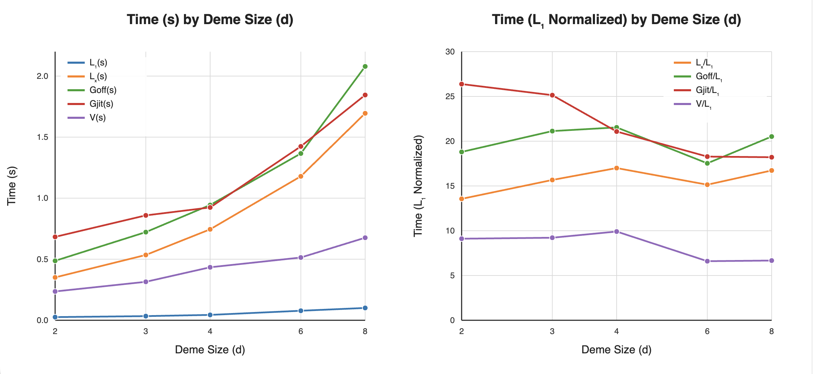

#### Results: d ∈ {4,10,20,35,50,80,120}

| `d` | <code>L<sub>1</sub>(s)</code> | <code>L<sub>x</sub>(s)</code> | <code>L<sub>x</sub>/L<sub>1</sub></code> | <code>G<sub>off</sub>(s)</code> | <code>G<sub>off</sub>/L<sub>1</sub></code> | <code>G<sub>jit</sub>(s)</code> | <code>G<sub>jit</sub>/L<sub>1</sub></code> | `V` | <code>V/L<sub>1</sub></code> | `fastest` |
|---:|---:|---:|--:|--:|--:|--:|--:|--:|--:|:--:|
| 4 | 0.043 | 0.754 | 17.65 | 0.951 | 22.24 | 1.062 | 24.84 | 0.372 | 8.69 | `V` |
| 10 | 0.138 | 2.368 | 17.15 | 2.525 | 18.29 | 2.283 | 16.54 | 0.818 | 5.93 | `V` |
| 20 | 0.366 | 5.907 | 16.16 | 6.018 | 16.46 | 5.113 | 13.99 | 1.581 | 4.32 | `V` |
| 35 | 0.724 | 12.894 | 17.81 | 13.566 | 18.74 | 9.645 | 13.33 | 2.831 | 3.91 | `V` |
| 50 | 1.349 | 22.537 | 16.70 | 23.196 | 17.19 | 14.834 | 10.99 | 4.192 | 3.11 | `V` |
| 80 | 2.854 | 45.126 | 15.81 | 47.602 | 16.68 | 27.163 | 9.52 | 7.062 | 2.47 | `V` |
| 120 | 5.071 | 79.941 | 15.77 | 85.891 | 16.94 | 45.650 | 9.00 | 11.196 | 2.21 | `V` |

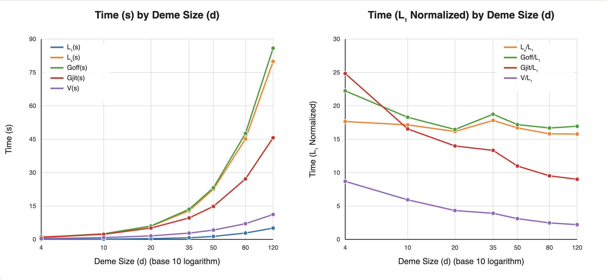

#### Summary

`V` (`"generational-vector"`) is the fastest column at every point in both
tables — the full measured range is `d=2` through `d=120`, with no lower
crossover found yet. <code>G<sub>off</sub>(s)</code>'s own
<code>G<sub>off</sub>/L<sub>1</sub></code> ratio stays roughly flat (16-22x)
across the whole range; <code>G<sub>jit</sub>(s)</code>'s own ratio falls as `d` grows (26x at `d=2`
down to 9x at `d=120`).

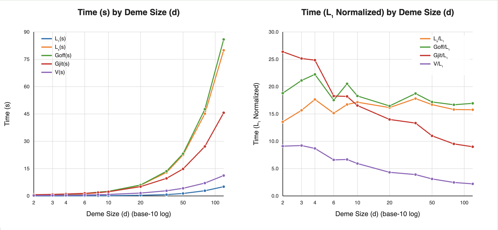

### B.2 G thread-count sweep

#### Setup

- Commit: `883c41e`
- System: Intel Core Ultra 9 185H, 22 threads, 93GB RAM
- OS: Ubuntu 24.04.4 LTS, kernel 6.8.0-139-generic, idle)
- Run Date: 2026-09-03
- Fixed Parameters:
  - `d=60`
  - `N=200`
  - `m=0.1`
  - `mu=0.02`
  - `replicates=8`
  - `convergence_window=150`
  - `workers ∈ {1,2,4,6,8,10}`
  - `jit ∈ {"off", "numba"}`
  - `trials=3`

Scheduled against a real core budget rather than run either fully
serial or fully concurrent (concurrent same-worker-count trials
would corrupt each other's own timing).

#### Command

Not captured.

#### Results

| Workers | <code>G<sub>jit=off</sub>(s)</code> | <code><code>G<sub>jit=off,w</sub>/G<sub>jit=off,w=1</sub></code> | <code>G<sub>jit=numba</sub></code> | <code>G<sub>jit=numba,w</sub>/G<sub>jit=off,w=1</sub></code> |
|---:|---:|---:|--:|--:|
| 1 | 250.87 | 1.00 | 134.80 | 1.86 |
| 2 | 241.28 | 1.04 | 120.45 | 2.08 |
| 4 | 241.28 | 1.00 | 128.96 | 1.95 |
| 6 | 298.21 | 0.84 | 131.13 | 1.91 |
| 8 | 285.60 | 0.88 | 151.20 | 1.66 |
| 10 | 230.21 | 1.09 | 123.83 | 2.03 |

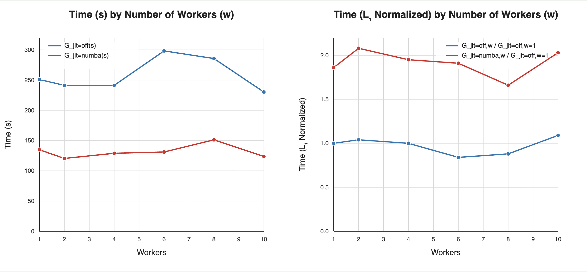

#### Summary

`jit="off"` shows no real speedup at any worker count. `jit="numba"` shows a
real, consistent ~1.7-2.1x speedup that is already fully present at `workers=1`
and does not grow with more workers.

### B.3 Locus length (capacity) sweep

#### Setup

- Commit: `883c41e`
- System: Intel Core Ultra 9 185H, 22 threads, 93GB RAM
- OS: Ubuntu 24.04.4 LTS, kernel 6.8.0-139-generic, idle)
- Run Date: 2026-09-04
- Fixed Parameters:
  - `d=60`
  - `N=500`
  - `m=0.05`
  - `mu=0.001`
  - `replicates=16`
  - `generations=100`
  - `lengths ∈ {2,4,5,6,7,8}` (Capacity is `4 ** length`; §3.2's own
finite-alleles state space)
  - `trials=3`

#### Command

```console
dev/bin/benchmark-engines --sweep loci-length --values 2,4,5,6,7,8 \
    --replicates 16 --generations 100 --trials 3
```

#### Results

| length | capacity | <code>L<sub>1</sub>(s)</code> | <code>L<sub>x</sub>(s)</code> | <code>L<sub>x</sub>/L<sub>1</sub></code> | <code>G<sub>off</sub>(s)</code> | <code>G<sub>off</sub>/L<sub>1</sub></code> | <code>G<sub>jit</sub>(s)</code> | <code>G<sub>jit</sub>/L<sub>1</sub></code> | `V` | <code>V/L<sub>1</sub></code> | `fastest` |
|---:|---:|---:|---:|---:|---:|---:|---:|---:|---:|---:|:---|
| 2 | 16 | 0.831 | 10.963 | 13.20 | 11.089 | 13.35 | 10.066 | 12.12 | 3.636 | 4.38 | V |
| 4 | 256 | 1.887 | 29.095 | 15.42 | 30.237 | 16.03 | 18.649 | 9.88 | 5.017 | 2.66 | V |
| 5 | 1024 | 2.358 | 36.381 | 15.43 | 38.078 | 16.15 | 25.927 | 11.00 | 6.184 | 2.62 | V |
| 6 | 4096 | 2.326 | 37.168 | 15.98 | 39.189 | 16.85 | 29.391 | 12.63 | 9.577 | 4.12 | V |
| 7 | 16384 | 2.132 | 36.563 | 17.15 | 38.202 | 17.92 | 30.135 | 14.13 | 29.629 | 13.90 | V |
| 8 | 65536 | 2.516 | 37.663 | 14.97 | 39.008 | 15.50 | 31.319 | 12.45 | 102.112 | 40.58 | G-jit |

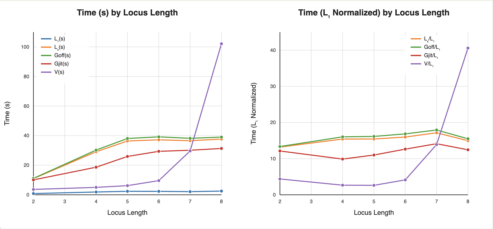

#### Summary

`"generational-vector"` wins through capacity 16384, then loses to
`"generational"` with `jit="numba"` at capacity 65536 — the crossover sits
somewhere in that interval, not yet narrowed further. That is a materially
larger range than the capacity-4096 crossover this project's own earlier sweep
found (backend-factory design §10 item 10b) — commits `fbb8107` and `a2a9159`
change V's own capacity scaling, not only its `d` scaling, which is the most
likely explanation for the difference.

### B.4 `d` sweep extended to `d=500`

#### Setup

- Commit: `d354608`/`7862dd7` (the boundary between the two is
  dev-tooling-only — `0179bd9`/`a18ba58`/`a8f001d`/`ea966da`/`7862dd7`
  touch only `dev/bin/`, none of `src/fim/model/` or `src/fim/engine.py`
  — so both runs below share functionally identical simulation code),
- System: Intel Core Ultra 9 185H, 22 threads, 93GB RAM
- OS: Ubuntu 24.04.4 LTS, kernel 6.8.0-139-generic, idle)
- Run Date: 2026-09-04
- Fixed Parameters:
  - `N=500`
  - `m=0.05`
  - `mu=0.001`
  - locus length 4 (capacity 256).
  - `replicates=16`
  - `generations=100`
  - `trials=3`

`dev/bin/benchmark-engines`'s own default fixed baseline, identical to B.1's;
run with no `--config` override, so the exact values are the tool's own
`DEFAULT_N`/`DEFAULT_M`/`DEFAULT_MU`/`DEFAULT_LOCUS_ LENGTH`.

#### Command

```console
dev/bin/benchmark-engines --sweep d --values 150,200,300,500 \
    --replicates 16 --generations 100 --trials 3
```

#### Results

First run, isolated (no other benchmark work sharing the host at the time):

| `d` | <code>L<sub>1</sub>(s)</code> | <code>L<sub>x</sub>(s)</code> | <code>L<sub>x</sub>/L<sub>1</sub></code> | <code>G<sub>off</sub>(s)</code> | <code>G<sub>off</sub>/L<sub>1</sub></code> | <code>G<sub>jit</sub>(s)</code> | <code>G<sub>jit</sub>/L<sub>1</sub></code> | `V` | <code>V/L<sub>1</sub></code> | `fastest` |
|---:|---:|---:|---:|---:|---:|---:|---:|---:|---:|:---|
| 150 | 7.092 | 112.691 | 15.89 | 121.633 | 17.15 | 63.344 | 8.93 | 14.368 | 2.03 | V |
| 200 | 9.956 | 166.283 | 16.70 | 177.703 | 17.85 | 87.545 | 8.79 | 19.058 | 1.91 | V |
| 300 | 15.683 | 251.352 | 16.03 | 271.693 | 17.32 | 135.296 | 8.63 | 29.211 | 1.86 | V |
| 500 | 27.699 | 481.363 | 17.38 | 552.933 | 19.96 | 257.300 | 9.29 | 52.614 | 1.90 | V |

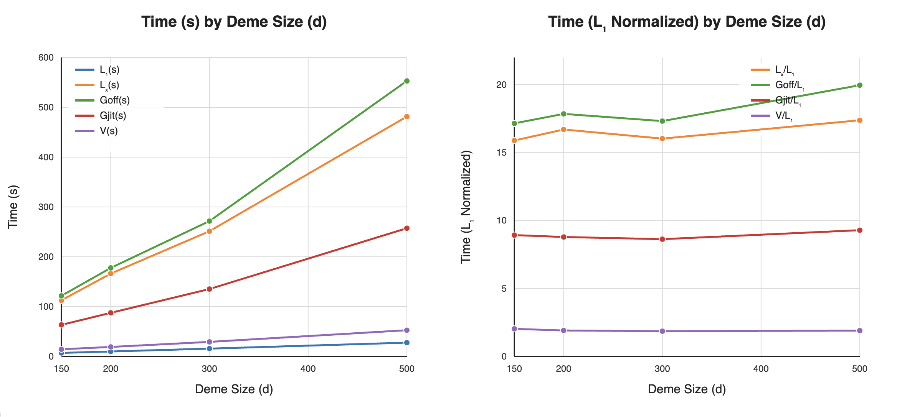

Second run, the same sweep repeated a few hours later, **overlapping the
first ~5 minutes of the B.5 heatmap queue's own 4-concurrent-job start**
(§B.5, below) for roughly the last 40 of its own ~47-minute run:

| `d` | <code>L<sub>1</sub>(s)</code> | <code>L<sub>x</sub>(s)</code> | <code>L<sub>x</sub>/L<sub>1</sub></code> | <code>G<sub>off</sub>(s)</code> | <code>G<sub>off</sub>/L<sub>1</sub></code> | <code>G<sub>jit</sub>(s)</code> | <code>G<sub>jit</sub>/L<sub>1</sub></code> | `V` | <code>V/L<sub>1</sub></code> | `fastest` |
|---:|---:|---:|---:|---:|---:|---:|---:|---:|---:|:---|
| 150 | 6.545 | 111.316 | 17.01 | 146.274 | 22.35 | 68.672 | 10.49 | 10.964 | 1.68 | V |
| 200 | 10.307 | 167.829 | 16.28 | 188.367 | 18.28 | 87.467 | 8.49 | 14.205 | 1.38 | V |
| 300 | 17.000 | 266.453 | 15.67 | 280.294 | 16.49 | 132.860 | 7.82 | 21.138 | 1.24 | V |
| 500 | 27.444 | 426.877 | 15.55 | 769.457 | 28.04 | 266.820 | 9.72 | 38.979 | 1.42 | V |

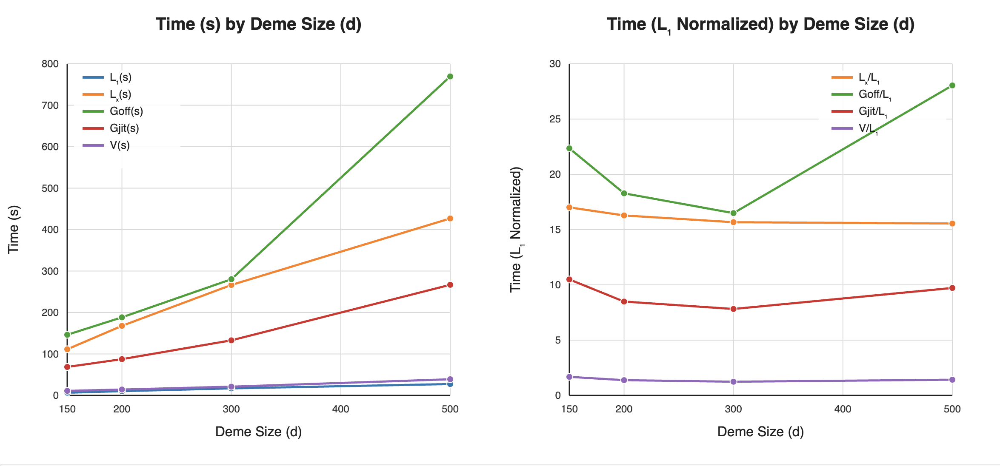

#### Summary

`V` still wins at every `d`, in both runs, extending B.1's own finding to
`d=500` with no crossover found yet. **The two runs' own `V`-over-`G-jit`
margins visibly differ (1.86-2.03x vs. 1.24-1.68x) despite functionally
identical code** — recorded honestly as an open, unexplained-by-code-change
discrepancy rather than folded into one table as if the two agreed: initially
read as evidence that this session's persistence/statistics validation-skip
fixes (`53afe81`/`d354608`) narrowed `V`'s advantage more than `G`'s, that
reading does not survive checking `git reflog` on the benchmark host —
both runs already had both fixes applied, so no code change separates
them at all. The second run's own timing sits inside a window that
started shortly before, and
mostly overlapped, four other concurrent `benchmark-engines` jobs on the same
22-thread host (§B.5's own heatmap queue) — real host contention, not a code
effect, is the far more likely explanation, and this pair of runs should not be
read as a controlled A/B comparison of anything. A genuine re-measurement of
whether those two fixes changed `V`-vs-`G` scaling would need to hold the commit
fixed and vary only isolation.

Combining all deme size timing runs:

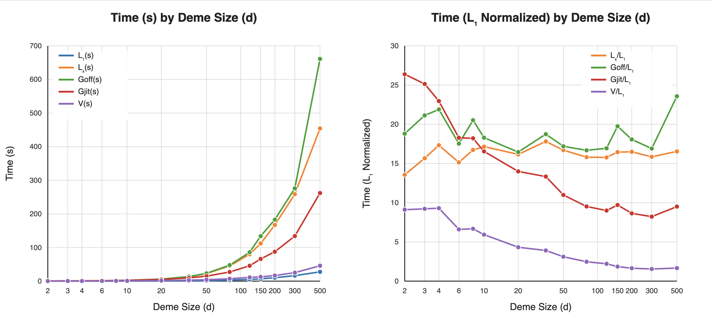

### B.5 Joint `d` × locus-length sweep (heatmap)

#### Setup

- Commit: `7862dd7`
- System: Intel Core Ultra 9 185H, 22 threads, 93GB RAM
- OS: Ubuntu 24.04.4 LTS, kernel 6.8.0-139-generic, idle)
- Run Date: 2026-09-04
- Fixed Parameters:
  - `N=500`
  - `m=0.05`
  - `mu=0.001`

This sweeps `d` and locus length together, to check whether the
two axes' own crossovers move independently of each other or interact. Run via
`dev/bin/generate-heatmap-queue` (one `benchmark-queue` job per locus length,
each internally sweeping `d`, all four dispatched concurrently) and rendered
with `dev/bin/ render-heatmap`; length 8 (capacity 65536) exceeded the queue's
own 4-hour per-job timeout and produced no data — consistent with B.3's own
finding that cost rises sharply somewhere between capacity 16384 and 65536.

#### Command

```console
dev/bin/generate-heatmap-queue --d-values 10,35,70,120,300 \
    --length-values 5,6,7,8 --out-dir /tmp/fim-heatmap
dev/bin/benchmark-queue /tmp/fim-heatmap/queue.json
dev/bin/render-heatmap /tmp/fim-heatmap
```

#### Results

- Length 5 (capacity 1024):

| `d` | <code>L<sub>1</sub>(s)</code> | <code>L<sub>x</sub>(s)</code> | <code>L<sub>x</sub>/L<sub>1</sub></code> | <code>G<sub>off</sub>(s)</code> | <code>G<sub>off</sub>/L<sub>1</sub></code> | <code>G<sub>jit</sub>(s)</code> | <code>G<sub>jit</sub>/L<sub>1</sub></code> | `V` | <code>V/L<sub>1</sub></code> | `fastest` |
|---:|---:|---:|---:|---:|---:|---:|---:|---:|---:|:---|
| 10 | 0.153 | 2.359 | 15.39 | 2.931 | 19.12 | 2.213 | 14.43 | 1.381 | 9.01 | V |
| 35 | 1.720 | 30.083 | 17.49 | 19.831 | 11.53 | 12.451 | 7.24 | 2.801 | 1.63 | V |
| 70 | 3.329 | 102.344 | 30.74 | 64.094 | 19.25 | 36.527 | 10.97 | 6.547 | 1.97 | V |
| 120 | 8.260 | 188.728 | 22.85 | 164.821 | 19.95 | 84.999 | 10.29 | 12.007 | 1.45 | V |
| 300 | 37.267 | 762.980 | 20.47 | 696.033 | 18.68 | 340.861 | 9.15 | 39.047 | 1.05 | V |

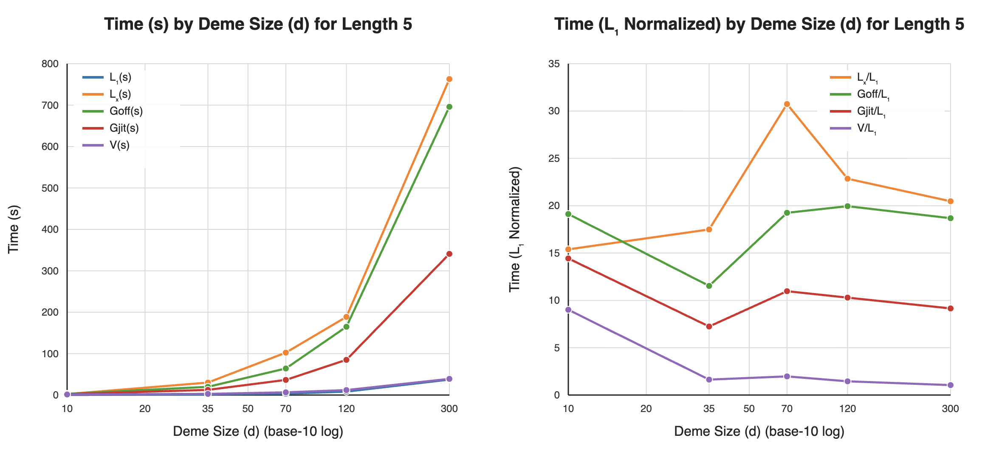

- Length 6 (capacity 4096):

| `d` | <code>L<sub>1</sub>(s)</code> | <code>L<sub>x</sub>(s)</code> | <code>L<sub>x</sub>/L<sub>1</sub></code> | <code>G<sub>off</sub>(s)</code> | <code>G<sub>off</sub>/L<sub>1</sub></code> | <code>G<sub>jit</sub>(s)</code> | <code>G<sub>jit</sub>/L<sub>1</sub></code> | `V` | <code>V/L<sub>1</sub></code> | `fastest` |
|---:|---:|---:|---:|---:|---:|---:|---:|---:|---:|:---|
| 10 | 0.136 | 2.422 | 17.85 | 2.916 | 21.49 | 2.345 | 17.28 | 2.720 | 20.05 | G-jit |
| 35 | 2.635 | 35.205 | 13.36 | 19.932 | 7.57 | 13.980 | 5.31 | 8.871 | 3.37 | V |
| 70 | 6.944 | 105.070 | 15.13 | 65.818 | 9.48 | 42.739 | 6.15 | 10.743 | 1.55 | V |
| 120 | 11.334 | 208.391 | 18.39 | 182.162 | 16.07 | 108.416 | 9.57 | 37.023 | 3.27 | V |
| 300 | 81.725 | 879.380 | 10.76 | 963.568 | 11.79 | 514.111 | 6.29 | 102.335 | 1.25 | V |

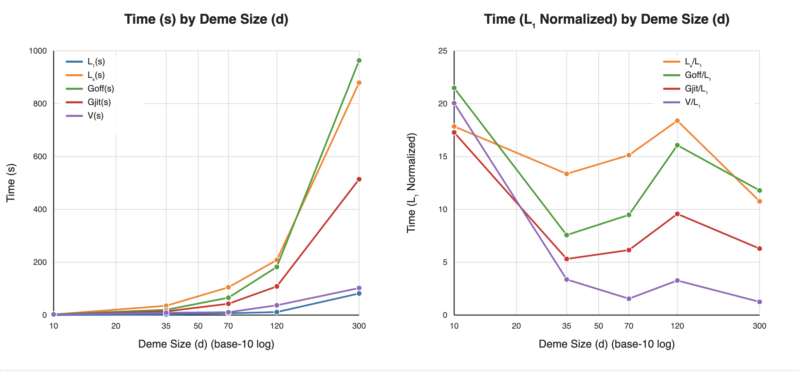

- Length 7 (capacity 16384):

| `d` | <code>L<sub>1</sub>(s)</code> | <code>L<sub>x</sub>(s)</code> | <code>L<sub>x</sub>/L<sub>1</sub></code> | <code>G<sub>off</sub>(s)</code> | <code>G<sub>off</sub>/L<sub>1</sub></code> | <code>G<sub>jit</sub>(s)</code> | <code>G<sub>jit</sub>/L<sub>1</sub></code> | `V` | <code>V/L<sub>1</sub></code> | `fastest` |
|---:|---:|---:|---:|---:|---:|---:|---:|---:|---:|:---|
| 10 | 0.181 | 2.397 | 13.23 | 2.896 | 15.98 | 2.274 | 12.55 | 5.093 | 28.10 | G-jit |
| 35 | 1.963 | 35.020 | 17.84 | 19.719 | 10.04 | 13.810 | 7.04 | 33.764 | 17.20 | G-jit |
| 70 | 3.906 | 106.571 | 27.29 | 66.773 | 17.10 | 45.970 | 11.77 | 50.844 | 13.02 | G-jit |
| 120 | 10.270 | 206.832 | 20.14 | 183.874 | 17.90 | 124.231 | 12.10 | 77.499 | 7.55 | V |
| 300 | 50.889 | 867.887 | 17.05 | 1028.933 | 20.22 | 645.902 | 12.69 | 230.319 | 4.53 | V |

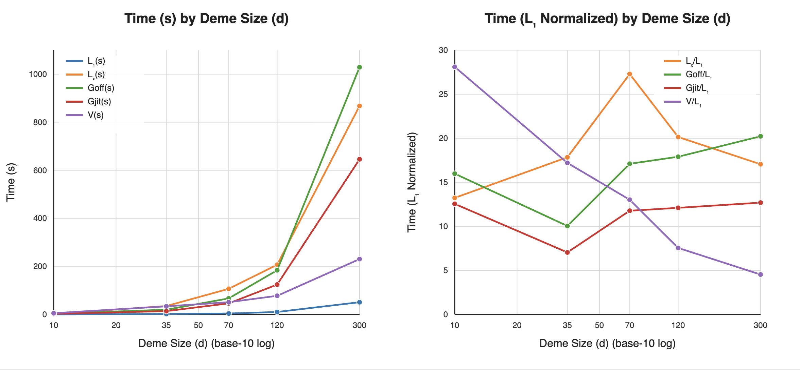

Fastest backend, and the `V`/<code>G<sub>jit</sub>(s)</code> wall-clock
ratio (below 1.0 means `V` is still ahead), across all three completed
lengths:

##### Fastest backend

| `deme x capacity` | **1024** | **4096** | **16384** |
|---:|---:|---:|---:|
| **10** | `V` | <code>G<sub>jit</sub>(s)</code> | <code>G<sub>jit</sub>(s)</code> |
| **35** | `V` | `V` | <code>G<sub>jit</sub>(s)</code> |
| **70** | `V` | `V` | <code>G<sub>jit</sub>(s)</code> |
| **120** | `V` | `V` | `V` |
| **300** | `V` | `V` | `V` |

##### G-jit / V wall-clock ratio (below 1.0 = V still ahead)

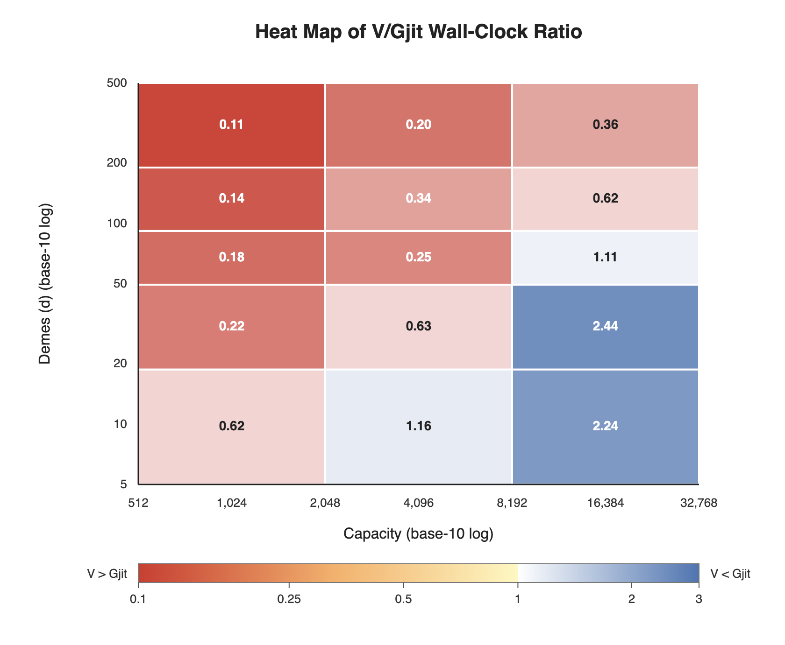

#### Summary

The `V`/`G` boundary this reveals is **diagonal, not rectangular**: `V`'s own
advantage shrinks steadily as locus length grows at fixed `d`, and grows as `d`
grows at fixed length — the two axes trade off against each other rather than
either one alone deciding the winner. At length 7 specifically, `V` only wins
once `d >= 120`; at length 5 it wins at every `d` sampled. The current
`auto_vector_min_d`/`auto_vector_max_capacity` cutover (two independent scalar
thresholds, `"auto"` requiring both to clear before choosing `V`) cannot express
a diagonal boundary — a config near one axis's own threshold but comfortably
inside the other's could still land on the wrong side of this data. Not yet
acted on: the current defaults still come from B.1/B.3's own single-axis sweeps,
and changing the cutover shape itself (not just its two threshold values) is a
real design question, not a parameter tweak.

### B.6 Joint `d` × locus-length sweep, post-Phase-7 (2026-09-05)

#### Setup

- Commit: `49ab7ca`
- System: Intel Core Ultra 9 185H, 22 threads, 93GB RAM
- OS: Ubuntu 24.04.4 LTS, kernel 6.8.0-139-generic, idle)
- Run Date: 2026-09-05/06
- Fixed Parameters:
  - `N=500`
  - `m=0.05`
  - `mu=0.001`

Re-runs B.5's own joint grid — wider and denser this time (13 `d`
values from `2` through `500`, all 8 locus lengths, `capacity 4` through
`65536`, 104 points total) — after every Phase 1-7 correctness/performance fix
landed (`20260904-claude-sonnet-5-fim-engine-review-remediations.md`), not just
Stage F8: `FIM-52`'s own re-measurement of `auto_vector_min_d`/
`auto_vector_max_capacity`, done as a joint sweep rather than two single-axis
ones specifically because B.5 already showed the two axes interact.

#### Command

```console
dev/bin/generate-heatmap-queue \
    --d-values 2,4,8,16,25,35,50,70,100,150,250,350,500 \
    --length-values 1,2,3,4,5,6,7,8 \
    --replicates 12 --generations 75 --trials 3 --measure-rss \
    --out-dir /tmp/fim-heatmap-v2
dev/bin/benchmark-queue /tmp/fim-heatmap-v2/queue.json \
    --default-timeout-seconds 172800
dev/bin/render-heatmap /tmp/fim-heatmap-v2
```

Every job used `--resume` (`generate-heatmap-queue`'s own new default — see the
commit that added it) and `--measure-rss`; the whole grid ran as one queue, 8
jobs in parallel (one per locus length, each internally sweeping all 13 `d`
values), and took just under 11 hours wall-clock, dominated by the
largest-`d`/largest-capacity cells (`benchmark-queue`'s own per-job timings:
length 1 finished in 2412s, length 8 in 39350s).

#### Results

##### Fastest backend

| `deme x loci-length` | **1** | **2** | **3** |  **4** |  **5** |  **6** |  **7** | **8** |
|:--:|:--:|:--:|:--:|:--:|:--:|:--:|:--:|:--:|
| **2** | `L` | `V` | `V` | `V` | `V` | `L` | `L` | `L` |
| **4** | `V` | `V` | `V` | `V` | `V` | `V` | `L` | `L` |
| **8** | `V` | `V` | `V` | `V` | `V` | `V` | `L` | `L` |
| **16** | `V` | `V` | `V` | `V` | `V` | `V` | <code>G<sub>jit</sub></code> | <code>G<sub>jit</sub></code> |
| **25** | `V` | `V` | `V` | `V` | `V` | `V` | `L` | <code>G<sub>jit</sub></code> |
| **35** | `V` | `V` | `V` | `V` | `V` | `V` | `L` | <code>G<sub>jit</sub></code> |
| **50** | `V` | `V` | `V` | `V` | `V` | `V` | `L` | <code>G<sub>jit</sub></code> |
| **70** | `V` | `V` | `V` | `V` | `V` | `V` | `V` | <code>G<sub>jit</sub></code> |
| **100** | `V` | `V` | `V` | `V` | `V` | `V` | `V` | <code>G<sub>jit</sub></code> |
| **150** | `V` | `V` | `V` | `V` | `V` | `V` | `V` | <code>G<sub>jit</sub></code> |
| **250** | `V` | `V` | `V` | `V` | `V` | `V` | `V` | <code>G<sub>jit</sub></code> |
| **350** | `V` | `V` | `V` | `V` | `V` | `V` | `V` | `V`|
| **500** | `V` | `V` | `V` | `V` | `V` | `V` | `V` | `V`|

##### G-jit:V Wall-Clock Ratio

| `deme x loci-length` | **1** | **2** | **3** |  **4** |  **5** |  **6** |  **7** | **8** |
|:--:|---:|---:|---:|---:|---:|---:|---:|---:|
| **2** | 0.71 | 0.45 | 0.44 | 0.52 | 0.51 | 1.07 | 1.99 | 6.63 |
| **4** | 0.56 | 0.45 | 0.48 | 0.37 | 0.47 | 0.69 | 1.59 | 6.31 |
| **8** | 0.42 | 0.36 | 0.33 | 0.32 | 0.41 | 0.65 | 1.69 | 13.15 |
| **16** | 0.36 | 0.51 | 0.43 | 0.30 | 0.49 | 0.56 | 1.03 | 12.97 |
| **25** | 0.96 | 0.35 | 0.30 | 0.56 | 0.47 | 0.54 | 1.18 | 13.00 |
| **35** | 0.45 | 0.36 | 0.43 | 0.28 | 0.23 | 0.86 | 1.84 | 6.78 |
| **50** | 0.38 | 0.22 | 0.46 | 0.21 | 0.37 | 0.36 | 1.32 | 4.40 |
| **70** | 0.45 | 0.53 | 0.26 | 0.20 | 0.32 | 0.21 | 1.39 | 4.39 |
| **100** | 0.80 | 0.43 | 0.17 | 0.15 | 0.17 | 0.17 | 0.68 | 2.76 |
| **150** | 0.87 | 0.22 | 0.27 | 0.08 | 0.11 | 0.27 | 0.56 | 1.97 |
| **250** | 0.40 | 0.43 | 0.16 | 0.15 | 0.12 | 0.23 | 0.35 | 1.14 |
| **350** | 0.43 | 0.35 | 0.19 | 0.13 | 0.09 | 0.19 | 0.32 | 0.88 |
| **500** | 0.39 | 0.35 | 0.23 | 0.14 | 0.14 | 0.15 | 0.24 | 0.67 |

Note: *Below 1.0 means V is still ahead.*

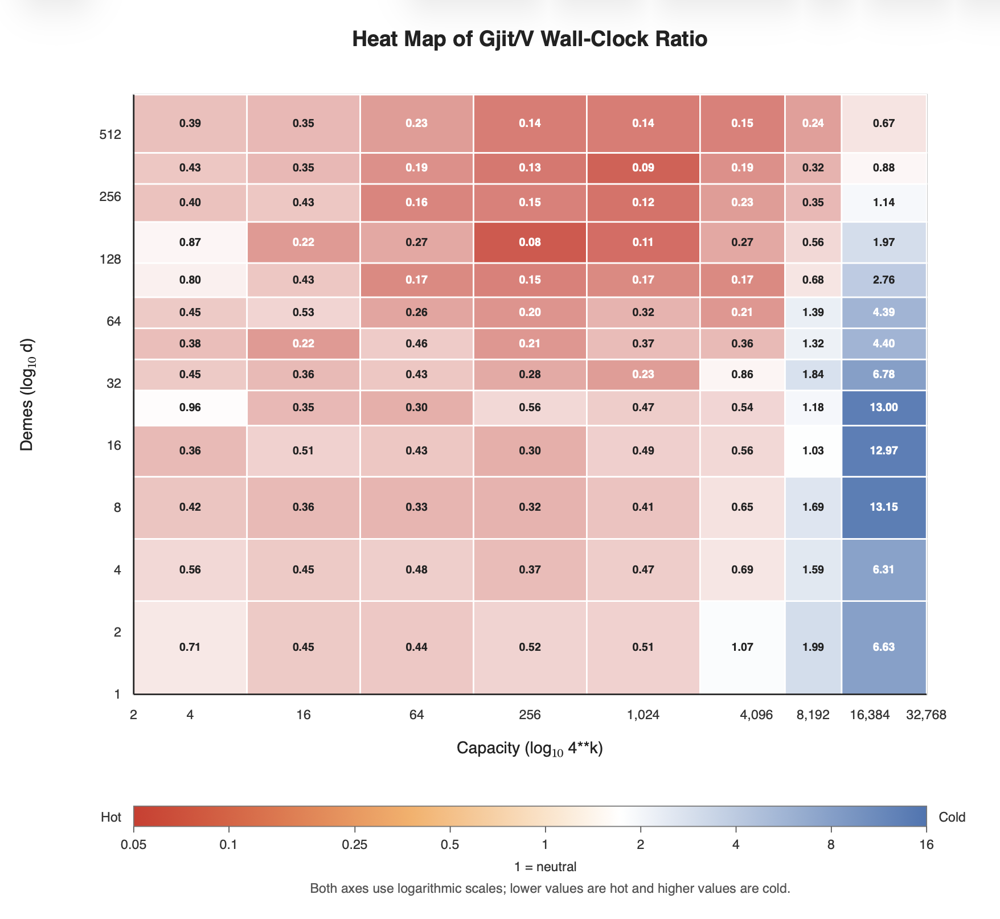

#### Summary

Three findings:

1. **Through capacity 4096 (length 6), `V` wins at every tested `d`, with no
   exception.** This is the load-bearing result: it confirms, at 13 `d` values
   instead of B.5's 5, that the diagonal-boundary risk B.5 itself raised does
   not actually reach this capacity range on current code — Phase 7's own
   capacity-scaling fixes (`FIM-53`, `FIM-54`, `FIM-27`/`FIM-28`) moved the
   boundary that B.5 found starting at capacity 4096 (length 6, `d<=35` losing
   to G-jit) up to capacity 16384 (length 7) instead.
   `auto_vector_max_capacity=4096` and `auto_vector_min_d=2` (both changed in
   this commit — see each constant's own docstring in `src/fim/model/params.py`)
   are the direct consequence: the largest rectangle this data supports without
   ever misrouting a config to the slower engine.
1. **The diagonal region still exists, just further out.** At capacity 16384
   (length 7), G-jit wins for `16 <= d <= 70`; `V` regains the lead at
   `d >= 100`. At capacity 65536 (length 8), G-jit wins through `d=250`; `V`
   only recovers at `d >= 350`. Both regions sit entirely above the new
   `auto_vector_max_capacity`, so `"auto"` never enters them — but a caller who
   overrides `auto_vector_max_capacity` upward by hand should know a real,
   `d`-dependent losing region starts immediately above `4096`, not a clean win.
1. **`"lineal"` — never a candidate for `"auto"` at all — outright wins at the
   smallest scale in two places**: `d=2` at length `1` (capacity `4`) and `d<=8`
   at length `7` (capacity `16384`). §4.6's own table already flagged this as an
   open question ("never `"lineal"`, since no benchmark data yet characterizes
   that boundary") — this is the first real data point toward answering it, not
   a full characterization; `"auto"`'s own resolution is unchanged by this
   finding.

A discrepancy worth recording rather than quietly overwriting: B.3 (commit
`883c41e`, also fixed `d=60`) found `V` narrowly *winning* at length 7
(`29.629s` vs `30.135s`, ratio `0.98`) — this sweep's own nearest points
(`d=50`/`d=70` at length 7) both find G-jit winning by a wider margin (ratios
`1.32`/`1.39`). B.3's own margin was close enough to call it noise rather than a
real regression between the two measurements — this sweep's own larger grid (13
`d` values, corroborated by the single-axis re-measurement in the immediately
preceding commit, which agrees with this one and not with B.3) is treated as the
more reliable reading, not B.3's, but the disagreement itself is real and left
visible here rather than silently resolved in one direction.

`--measure-rss` produced a `V`/G-off/G-jit/`L` peak-RSS ratio of exactly `1.00`
at every single point in this grid — not a finding about engine memory behavior,
a limitation of the measurement at this benchmark's own scale:
`InMemoryTrajectoryStore` retains every generation's full state for the whole
run, and at up to 75 generations and `d=500`/capacity `65536`, that accumulated
trajectory dwarfs any transient difference between the four engines' own
internal working sets, so the four backends' peak RSS is dominated by the store,
not the engine. A future RSS characterization aimed at engine-internal memory
behavior specifically (rather than whole-run memory behavior, which this grid
does answer, just uninformatively across backends) would need either a
null/discarding store or a much shorter run.

## Known gaps: axes not yet measured

Recorded here, named, rather than left as a silent absence someone has to
notice by reading the table of contents and inferring what is missing. Each
of these needs real hardware time on an idle machine — hours, for the
larger ones — which is why none is closed by code alone; none is blocked on
a design decision.

### Replicate concurrency (`max_concurrent_replicates`) has never been swept

`max_concurrent_replicates` caps how many replicate lanes are ever alive at
once (`fim.engine.run_batch`; `None`, the default, means every requested
replicate). It exists specifically for its effect on **steady-state memory**
under `"generational-vector"`, where each concurrently active lane holds its
own cached `VectorizedState` — so bounding the lane count bounds that
backend's working set independently of `n_replicates`. What that bound costs
in wall-clock time, and how much peak RSS it actually buys, is unmeasured:

- **No table here sweeps it.** Every table above holds it at its default.
- **`dev/bin/benchmark-engines` has no axis for it.** Its `--sweep` field
  list is `d`, `N`, `mu`, `m`, `loci-length`, and `replicates` — adding a
  `max-concurrent-replicates` axis is a small, self-contained change to that
  script, and is a prerequisite for the sweep rather than part of it.
- **Correctness is already covered, and is not the gap.** That a window
  changes only *when* a lane is built, never what a run computes, is
  asserted directly for both the dict-based and the vectorized advancer
  (`test_max_concurrent_replicates_does_not_change_what_a_batch_computes`
  and `test_generational_vector_backend_windowed_batch_matches_unbounded`),
  as is the lane-count bound itself
  (`test_run_batch_bounds_concurrently_active_lanes_to_the_configured_window`).
  What is missing is only the performance/memory characterization.

The honest consequence: this document supports no recommendation about what
to set `max_concurrent_replicates` to, for any configuration. Until the
sweep runs, the default (`None`) is the only setting with recorded evidence
behind it, and that evidence is every table above rather than a comparison.
A useful sweep would need `--measure-rss` and a store that does not dominate
peak RSS — see B.6's own closing note on exactly that limitation.

### Batch size (`n_replicates`) is sweepable but unrecorded

Distinct from the above, and often confused with it: `n_replicates` is how
many replicates a batch runs, `max_concurrent_replicates` is how many of
them may be in flight at once. `benchmark-engines` **can** sweep
`n_replicates` (`--sweep replicates`), but no table in this document records
a run of it — every table above instead holds it fixed (at `16`, or at `12`
for B.6) and sweeps something else. So the cross-engine comparisons here are
all at one batch size, and nothing measured says whether the `V`-versus-`G`
boundary moves with batch size the way B.5 showed it moves with `d` and
capacity together.

This one needs only machine time, not a tooling change.
