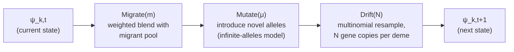
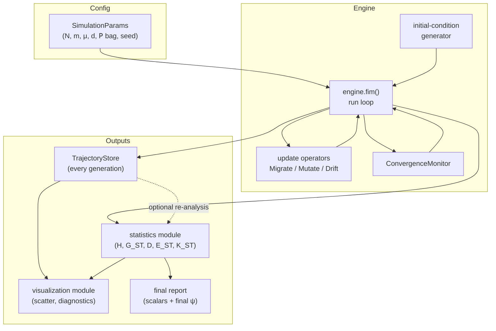

# Finite island model simulator: design document

- [Finite island model simulator: design document](#finite-island-model-simulator-design-document)
  - [Who this document is for](#who-this-document-is-for)
  - [1. Purpose and scope](#1-purpose-and-scope)
  - [2. Requirements](#2-requirements)
  - [3. The formal model](#3-the-formal-model)
    - [3.1 Signature and state](#31-signature-and-state)
    - [3.2 Alleles, loci, and identity](#32-alleles-loci-and-identity)
    - [3.3 Initial conditions](#33-initial-conditions)
    - [3.4 The generation-update pipeline](#34-the-generation-update-pipeline)
    - [3.5 What "converges" means here](#35-what-converges-means-here)
  - [4. System architecture](#4-system-architecture)
    - [4.1 Component overview](#41-component-overview)
    - [4.2 Data flow](#42-data-flow)
    - [4.3 The parameter bag (P)](#43-the-parameter-bag-p)
    - [4.4 Language and library choice](#44-language-and-library-choice)
    - [4.5 Packaging and distribution](#45-packaging-and-distribution)
  - [5. Module layout](#5-module-layout)
  - [6. Persistence design](#6-persistence-design)
  - [7. Statistics module](#7-statistics-module)
  - [8. Visualization module](#8-visualization-module)
  - [9. Extensibility: where the next "what if" lands](#9-extensibility-where-the-next-what-if-lands)
    - [9.1 Variations reachable from configuration](#91-variations-reachable-from-configuration)
    - [9.2 Landing spots for changes that are not built](#92-landing-spots-for-changes-that-are-not-built)
  - [10. Validation and test strategy](#10-validation-and-test-strategy)
  - [11. Out of scope](#11-out-of-scope)
  - [12. Illustrated walkthrough](#12-illustrated-walkthrough)
    - [Installing it](#installing-it)
    - [Using it from the command line](#using-it-from-the-command-line)
  - [Appendix A. Graphical front-end sketches](#appendix-a-graphical-front-end-sketches)
  - [Metadata](#metadata)
    - [Revisions](#revisions)

## Who this document is for

Primarily written for whoever maintains or extends the simulator:
comfortable with software architecture, arrays, and basic probability; no
population-genetics background assumed beyond what is restated inline.
It is also the model and architecture reference for software a botanist
uses directly, so the prose stays readable for that reader as well. Not
every section needs to be; the table below says which do.

| If you are... | Read | Treat as optional |
|---|---|---|
| The botanist | §1, §2 (what the tool does), §4.5 (how to install and run it), §12 (a plain walkthrough — start here if you want the short version) | §3, §5, §6, §7, §9, §10 — internal architecture, informative but not required |
| The botanist, curious about a specific design choice | Also skim §8 (what the plots actually show and why) | §5, §6, §9, §10 — module-level detail |
| Whoever maintains or extends the simulator | Everything, in order | — |

Sections written for the implementer are marked as such at their start;
skipping them costs nothing needed to follow §12's walkthrough.

Two companion documents in this directory —
[the finite island model introduction](finite-island-model-introduction.md)
and
[the Jost differentiation-measures guide](jost-differentiation-measures.md)
— are the source of every formula and biological claim used below and are
not re-derived here. This document is the architecture built on top of
them.

Sections §4.3, §8, and §10 additionally cite one primary source directly:
`Dear-NolanMarch17Final.pdf`, an unpublished open letter from Lou Jost to
Nolan Kane, undated beyond its filename (internal references to Whitlock
(2011) place it in or after 2011). It answers a blog post with two worked
finite-island-model simulations, run by Anne Chao and T. C. Hsieh, and
reports their parameters, expected and observed statistic values, and
scatter plots. It is primary correspondence from the model's own author
rather than a peer-reviewed publication, and the sections below treat it
accordingly. The letter is not distributed with this repository; every
value taken from it appears in §4.3's table below, so no reader needs the
original to follow this document or the test plan that consumes the same
values.

## 1. Purpose and scope

A simulator for the finite island model (FIM) that a botanist — Lou Jost,
or a collaborator working in that tradition — uses to generate
known-ground-truth allele-frequency trajectories, then compute and inspect
population-differentiation statistics against that known history. The
motivating gap, per the companion introduction (§4 of that document): the
existing tools in this space (quantiNemo 2, `hierfstat`) are built to
answer "what is the equilibrium statistic?", not "show me every
generation's allele frequencies" — and per-generation history is exactly
what this project exists to keep.

The core is a single, symmetric-island model (`N`, `m`, μ shared across
demes by default; one allele length `L` shared across loci by default)
built so that further variations are extensions of the parameter set and
the update pipeline rather than rewrites of it. Section §9 maps every
"what if" this way, and separates the variations the simulator already
supports — unequal deme sizes, a general or spatial migration matrix,
per-locus length and mutation rate, stochastic migrant counts, a
finite-alleles mutation model, several simultaneous convergence
statistics, and adaptive replicate batching — from the ones that remain
deferred (§11).

## 2. Requirements

The simulator's functional requirements, restated for reference:

1. Simulate the FIM: fim(N, m, μ, d; 𝖯) ⇒ {\psi<sub>k,t</sub> : k ∈ [1..d], t ∈  ℤ+}.
   `N`, `m`, μ, `d` are named inputs; `𝖯` is an open, untyped bag of
   further parameters. \psi<sub>k,t</sub> is the state of deme `k` at generation `t`.
   The run ends when a selected population statistic converges.
2. Alleles are an unordered, countably infinite set {a<sub>k</sub> : k ∈ ℤ+} with
   identity comparison same(a<sub>j</sub>, a<sub>k</sub>) = (j \equiv k) and no other structure
   — no ordering, no distance, no similarity.
3. Each allele has a locus l ∈ ℤ+ and a length L ∈ ℤ+. `L` may vary
   independently per locus.
4. Initial allele-frequency distributions per deme may be random; the
   model is asserted to converge analytically for any starting
   population.
5. Every intermediate generation's state is persisted, and the converged
   final state is reported.
6. Botanist-facing output is (a) final population-differentiation metrics
   (scalars) and (b) per-deme allele-frequency distributions, with a
   canonical visual of a scatter plot of allele frequency in `d`-dimensional
   space.

Two places in this list carry real ambiguity, worth naming rather than
silently resolving:

- **"Locus" vs. "allele" as the length-bearer** (item 3). The companion
  differentiation-measures document (Part I) defines length as a property
  of the **locus** (the interval), not the allele (the value found there):
  μ ≈ μ<sub>b</sub> · L for a per-base-pair rate μ<sub>b</sub>. §3.2 below follows that
  document, treating `L` as a `LocusSpec` field.
- **"Converges" applied to a stochastic process that has no fixed point**
  (item 1, item 4). Under the finite island model with μ > 0, no state
  is absorbing — allele frequencies keep moving forever, and the system
  settles into a *stochastic equilibrium*: the **distribution** of a
  summary statistic stabilizes, not the state itself. §3.5 makes this
  operational.

## 3. The formal model

*Implementer detail — optional for the botanist; §12 shows what this
adds up to in practice.*

### 3.1 Signature and state

```math
\mathrm{fim}(N, m, \mu, d;\, \mathsf{P}) \;\Rightarrow\; \{\psi_{k,t} : k \in [1..d],\ t \in \mathbf{Z}^+\}
```

\psi_k,t is deme `k`'s complete state at generation `t`: one allele-frequency
vector per tracked locus.

```math
\psi_{k,t} = \bigl\{\, (l,\ p_{k,t,l}) \;:\; l \in \text{Loci} \,\bigr\},
\qquad
p_{k,t,l} : \text{Allele} \to [0, 1],
\qquad
\sum_{a} p_{k,t,l}(a) = 1
```

p<sub>k,t,l</sub> is a probability vector over whatever alleles are actually
present at locus `l` in deme `k` at generation `t` — not over the whole
infinite allele universe. This is the load-bearing representational choice
(§3.2): the universe is unbounded, but the *support* of p<sub>k,t,l</sub> is
never larger than `N` (there are only `N` gene copies at that locus in
that deme to be one allele or another — see the ploidy note directly
below), so the state is finite and small at every instant even though the
label space it draws from is not.

**`N` is a gene-copy count, not an individual count — deliberately
ploidy-neutral.** The companion introduction document frames `N` as
"diploid individuals per deme," i.e. `2N` gene copies, which is the
standard convention for autosomal nuclear markers and is what most of that
document's exposition assumes. Jost's own worked examples (the "Dear
Nolan" letter — §4.3, §8) are explicitly **haploid**: `N` there already
*is* the gene-copy count. Rather than bake in a ploidy assumption and
special-case haploid markers later, `fim`'s `N` is defined here as the
gene-copy count directly, and `drift` (§3.4, §5) draws `N` copies, not
`2N`. A caller modeling diploid autosomal individuals passes `N = 2 ×
(census individuals)`; a caller modeling a haploid marker (mitochondrial
DNA, a Y-chromosome locus, an organelle genome) passes census individuals
directly, unchanged. This is strictly more general — it covers both cases
with one parameter and no ploidy flag — and it is what makes Jost's own
example parameters (`N = 100`, `N = 2000`) usable as §4.3's default
scenarios without a conversion.

### 3.2 Alleles, loci, and identity

An allele is an opaque label with exactly one operation: `same(a<sub>j</sub>, a<sub>k</sub>) =
(j \equiv k)`. No ordering, no metric, no structure — this is deliberate (the
differentiation-measures guide, "Distance between alleles is a different
model," is explicit that imposing a metric on alleles answers a different
question than the one this model and Jost's statistics are built for).
Implementation consequence: an allele is represented as an opaque integer
ID, nothing more — never a string, never a structured value that invites
comparison by anything other than equality.

New alleles are minted by mutation under the infinite-alleles assumption by
default (every mutation event produces a label never seen before — a good
approximation once a locus spans "many base pairs," per the
differentiation-measures guide). A single global `AlleleRegistry` hands out
the next unused integer on every mutation event across the whole run,
guaranteeing `same()` is exactly integer equality with no risk of two
independent mutations colliding on the same label.

An opt-in finite-alleles (`K`-allele) model (§9) relaxes that assumption for
loci short enough that it stops holding: each locus gets a bounded state
space of `4 ** L` possible states, and a mutation event can *recur* to a
state already present elsewhere in the run rather than always minting
fresh. This still imposes no ordering or metric on
alleles — a K-allele target is chosen uniformly among the other `K - 1`
states, with no notion of one being "closer" to another — so it stays
inside the same distance-free identity model as the paragraph above, only
with a ceiling.

A locus is a separate concept from an allele: it names *where* to look,
carrying its own identity l ∈ ℤ+ and length L ∈ ℤ+. `L` matters
through the mutation rate (μ ≈ μ<sub>b</sub> · L, per the differentiation-measures
guide) and, under the finite-alleles model only, through that state-space
ceiling; it plays no role in any statistic computed from a frequency
vector. It is represented as a LocusSpec(locus_id, length) value object,
with every run configuration providing one `LocusSpec` per tracked locus.
`length` may be equal across loci (the common case) or vary per locus
(§9); either way it is a data change, never a schema change.

### 3.3 Initial conditions

The per-deme, per-locus initial frequency vector p<sub>k,0,l</sub> is generated,
not hand-specified, by default: an i.i.d. symmetric Dirichlet draw over a
starting allele set, one draw per `(deme, locus)` pair, seeded from the
run's RNG seed for exact reproducibility. Concentration parameter and
starting allele count live in `𝖯` (§4.3), not as hardcoded constants —
different concentration values produce visibly different starting
"evenness," which is itself a useful knob for a botanist probing the
model. An explicit, user-supplied p<sub>0</sub> is also accepted as an alternative
initial-condition source, for reproducing a specific published scenario or
a real allele-frequency survey as a starting point.

**Generation 0 is a continuous prior, not a state on the model's own
`1/N` lattice.** Every generation from 1 onward is produced by `drift`
(§3.4), a multinomial resample at exactly `N` gene copies, so every
frequency at generation 1 or later is a ratio of integers with
denominator `N` — the only values `N` gene copies can actually realize.
`DirichletInitialCondition`'s draw has no such constraint: a symmetric
Dirichlet distribution is continuous, so generation 0's frequencies
almost surely do *not* land on that lattice (an explicit, user-supplied
p<sub>0</sub> is not bound by it either). This is deliberate, not an oversight —
generation 0 represents the *belief* a starting frequency is drawn from,
not a sampled population state, and `drift`'s first application (to
produce generation 1) is what turns that belief into the model's first
actual `N`-gene-copy realization. A statistic computed at generation 0
(`fim stats --generation 0`) describes this continuous prior, not a
population; treat it accordingly rather than assuming it is comparable,
lattice-for-lattice, to every later generation.

The requirement's claim that the model "is guaranteed (analytically) to
converge for any starting population" is a property of the underlying
Markov chain (ergodicity toward a stationary distribution once mutation
keeps the chain from being absorbed), not something this software proves
or needs to prove — it is inherited as a modeling assumption from the
theory the companion documents describe. The simulator's job is purely
operational: detect, empirically, when a chosen statistic has stopped
moving (§3.5).

One labeling detail worth being deliberate about: the founding allele set
at `t = 0` for each locus is assigned small, **locus-relative** IDs (`0,
1, …` up to initial_allele_count - 1) rather than draws from the same
global `AlleleRegistry` counter used for mutations. This is what keeps a
question like "did locus 1 and locus 2 fix on the same starting allele"
well-defined and cheap to answer — it reduces to comparing two small
integers — while every allele *born from a mutation event* still gets a
globally unique ID from the registry, so it can never be mistaken for one
of the founding alleles or for a mutant at another locus. Founding IDs and
minted IDs share one namespace (both are just `AlleleId` integers) but are
allocated from disjoint ranges so the two can never collide.

### 3.4 The generation-update pipeline

Per the finite-island-model introduction (§3.2), one generation is two
composed operators — migration (weighted blend) then drift (random
resampling) — with mutation as a documented optional third step inserted
between them (introduction, §3.3):

```math
p_{t+1} = \mathrm{Drift}\bigl(\mathrm{Mutate}_\mu\bigl(\mathrm{Migrate}_{m}(p_t)\bigr)\bigr)
```



Each stage is implemented as a pure function of state to state — no
stage reads or mutates global state, and each is independently
unit-testable against the closed-form expectations in the companion
documents (§10). Keeping the generative model and the statistic
computation as two separate concerns, and keeping each stage of the
generative model itself separately testable rather than one fused update
step, is what makes both halves easy to verify independently.

### 3.5 What "converges" means here

There is no state to converge to once μ > 0 — frequencies keep moving
forever. What the requirement means, operationally, is: **the value of a
chosen population statistic, tracked generation over generation, stops
changing beyond a tolerance, over a trailing window of generations.** That
is a statement about the statistic's trajectory, not about \psi itself, and
it is what `ConvergenceMonitor` (§5) actually implements.

Degenerate case worth naming: if μ = 0 exactly, the whole system *is*
eventually absorbed (every deme fixed for a single shared allele, per the
finite-island-model introduction §2.2) — a literal fixed point. The
monitor should detect that case as a special, faster-converging instance
of the same general check (the statistic's trailing-window variance goes
to exactly zero), not as a separate code path.

## 4. System architecture

### 4.1 Component overview

*§4.1–§4.4 are implementer detail — optional for the botanist; skip
ahead to §4.5 for what this means for installing and running the
software.*



`engine.fim()` owns the run loop; every other component is a function or
small class it calls, none of them aware of the loop that drives them.
`TrajectoryStore` and the statistics module are usable standalone against
a previously persisted run — re-computing a new statistic against an old
trajectory should never require re-running the simulation.

### 4.2 Data flow

1. `SimulationParams` (validated) plus a seed produce an initial \psi_0 via
   the initial-condition generator (§3.3).
2. The run loop writes \psi_0 to the `TrajectoryStore`, then repeatedly
   applies the update pipeline (§3.4), writing each \psi_t as it is
   produced, and feeding the chosen statistic's value at \psi_t to the
   `ConvergenceMonitor`.
3. When the monitor signals stop (statistic converged) or a hard
   generation cap is hit (safety valve — see §5), the loop ends.
4. The statistics module computes the full final-generation report from
   \psi<sub>T</sub>.
5. The visualization module reads from the `TrajectoryStore` (for the
   canonical scatter and any diagnostic plots) and from the final report.

### 4.3 The parameter bag (P)

`𝖯` is deliberately open — the requirement says so, and the pattern
across every companion document is "the botanist will keep asking to vary
one more thing." The design response: every value that varies by
scenario — not just the four named arguments — is a named entry in `𝖯`,
read at the point of use with an explicit default, and never a hardcoded
literal inside an operator or the run loop.

The table below is the architectural shape of `𝖯`, not its full key list;
[`doc/configuration.md`](configuration.md) is the authoritative reference
for every key, type, default, and validation rule, and is the one place
that has to change when a key is added.

| Key | Meaning | Default |
|---|---|---|
| `seed` | RNG seed for the whole run | required, no default |
| n<sub>loci</sub> | number of independent loci tracked | `1` |
| locus_lengths | `LocusSpec.length` per locus | one shared constant |
| initial_allele_count | starting allele count per locus | `2` (biallelic/SNP-like) |
| initial_concentration | Dirichlet concentration for random start | `1.0` (uniform) |
| deme_weighting | `"equal"` or `"size"` — used only by E<sub>ST</sub>; every other reported statistic (`D`, G<sub>ST</sub>, K<sub>ST</sub>, H<sub>S</sub>, H<sub>T</sub>, H<sub>ST</sub>) always uses equal deme weighting regardless of this setting | `"size"` |
| convergence_statistic | which statistic(s) the monitor watches | `D` |
| convergence_window | trailing-window length, generations | `50` |
| convergence_tolerance | stability tolerance on that window | `0.01` |
| max_generations | hard safety cap | `10000` |

`N` and `m` each accept either a scalar (the symmetric case) or an
array/matrix (per-deme size, full or sparse migration matrix) — see §9.
Passing a richer value for either is a config change, not a new code path
threaded through the operators.

**Deme weighting defaults to `"size"`, not `"equal"`.** `"size"` is the
more general case — it is well-defined and correct whether or not deme
sizes actually differ — while `"equal"` is only correct in the special
case they don't. The two weighting choices are numerically identical only
when every deme's N<sub>i</sub> happens to be equal; with unequal deme sizes (§9)
they diverge, and `"size"` is the correct one. `D` remains defined with
equal deme weighting by construction regardless of this setting (§7); so
do G<sub>ST</sub>, K<sub>ST</sub>, H<sub>S</sub>, H<sub>T</sub>, and H<sub>ST</sub> — the deme_weighting key
governs E<sub>ST</sub> alone (fim.statistics.differentiation.statistics_report)
and nothing else, so setting convergence_statistic to anything other
than E<sub>ST</sub> makes this key a no-op for that run.

**Default values.** convergence_window and convergence_tolerance have
no botanically-derived default — the values above (`50` generations,
`0.01`) are generic stability-detection defaults, not a claim about what a
real study needs; a real study should tune them. For `N`, `m`, μ, and
`d` themselves, Jost's own "Dear Nolan" letter (identified above; see
[§8](#8-visualization-module) and [§10](#10-validation-and-test-strategy)
for how it is used there) gives two concrete, real worked scenarios —
run by Jost's colleagues Anne Chao and T. C. Hsieh specifically to test
the finite island model at equilibrium — which are a far better source for a
starting scenario than an arbitrary guess:

| Scenario | `N` | `d` | `m` | μ | `Nm` | expected G<sub>ST</sub> | expected `D` |
|---|---|---|---|---|---|---|---|
| Low migration, low mutation | `100` | `5` | `0.0001` | `0.000001` | `0.01` | `0.97` | `0.04` |
| Higher migration, higher mutation | `2000` | `100` | `0.01` | `0.001` | `20` | `0.02` | `0.91` |

**A stopping rule must be reachable, not just well-typed.**
convergence_window and replicate_minimum are each individually
bounds-checked (above; §9), but a value can pass that check and still
describe a rule the engine could never satisfy: a convergence_window
larger than max_generations + 1 (the most generations a run can ever
record — generation 0 plus max_generations steps) can never fill
before the generation cap ends the run, and a replicate_minimum
larger than n<sub>replicates</sub> can never be reached before the batch's own
replicate cap ends it. `SimulationParams.__post_init__` rejects both
at construction rather than letting the run complete and report an
ordinary-looking capped result with no indication the configured
stopping rule was unreachable from the start.

Both scenarios are explicitly **haploid** in the letter ("`N=100` haploid
reproductive individuals," "`100` demes of `2000` haploid reproductive
individuals") — i.e. `N` there already is the gene-copy count, which is
exactly the ploidy-neutral convention §3.1 adopts for `fim`'s own `N`, so
these two scenarios plug in directly with no conversion. (Mean *observed*
values from the letter's own simulations agree closely with the expected
values shown above — `0.04` observed vs. `0.04` expected `D` for the
first scenario, `0.90` observed vs. `0.91` expected `D` for the second —
which is itself a small piece of corroborating evidence that the letter's
worked examples are internally consistent.)

These two points sit at opposite ends of the interesting range — one
nearly fully fixed (G<sub>ST</sub> near its ceiling, `D` near zero — the demes
agree because everything has drifted to one shared allele), the other
strongly allelically differentiated (`D` near one) while barely departing
from fixation-neutrality (G<sub>ST</sub> near zero) — which is exactly the point
the letter itself is making (Nm does not control allelic differentiation;
m/[μ(d-1)] does), rendered as a parameter sweep rather than a static
table. Approximately the geometric midpoint of the two — N ≈ 450, d ≈ 20,
m ≈ 0.001, μ ≈ 0.00003 — is the default scenario for exercising the
simulator end to end, sitting between the two regimes rather than at
either extreme.

One notational caution, confirmed directly from the letter's own figures
(both plot titles read the parameters back verbatim, e.g. `"L=200 N=100
d=5 m=0.0001 u=0.000001"`): `L` there is the number of independent
**replicate simulation runs** plotted together (`200` and `50`
respectively) — confirmed, not merely suspected — and is **not** the same
`L` as this document's `LocusSpec.length` (§3.2) despite the shared
letter; a coincidence of the letter's own notation (which also writes the
mutation rate as `u`, not μ), not a hint about locus-length defaults.

### 4.4 Language and library choice

**Python 3, with NumPy as the array backend.** NumPy's `Generator` gives
vectorized batched binomial/multinomial sampling across loci and replicate
runs, the natural fit for the drift step's workload. Output formats (§6)
are chosen to be equally easy to load from R, because the project exists
to give a researcher per-generation frequencies loadable into their own
analysis tooling. §4.5 below records the packaging
consequence of this choice.

### 4.5 Packaging and distribution

A firm, non-tunable constraint, not one of the "what if" knobs elsewhere
in this document: the tool must be easy for a researcher to install and
run on a **Windows laptop**, with minimal demands on that researcher to
set up their own system — no expectation that they separately install
Python, a package manager, or a compiler toolchain, and no admin-rights
installer step beyond what "download and run" already requires.

This constrains, rather than reopens, several choices already made
above:

- **Single self-contained executable.** Package the CLI (§5's `cli.py`)
  as a one-file Windows executable (e.g. via PyInstaller), bundling the
  Python interpreter and every dependency. The researcher's own machine
  needs nothing pre-installed.
- **Dependency footprint stays deliberately small,** and every dependency
  is chosen for having solid, well-maintained prebuilt Windows wheels —
  NumPy and a plotting library (e.g. Matplotlib) both qualify — so the
  bundling step itself stays simple and reproducible. Anything that would
  need a local compiler to install from source on a researcher's machine
  is disqualified by this constraint alone, independent of its other
  merits.
- **Plain-text configuration and output** reinforce the same goal from a
  different angle: a `SimulationParams` config file the researcher edits
  directly (§4.3) and a persistence backend (§6) that is human-readable
  and needs no separate database engine or server process to inspect —
  which is also, independently, why JSONL (§6) is the right default
  persistence backend rather than a compiled/columnar format that would
  need extra tooling to open.
- **No network dependency at run time.** The tool must run entirely
  offline once installed — nothing in the update pipeline, statistics, or
  visualization modules should require reaching out to any remote
  service.

The researcher-facing front end is a config file plus a command-line
executable; there is no GUI. Updates reach the researcher's machine as a
new one-file executable attached to a versioned GitHub Release, downloaded
and manually swapped in place — no installer, no background updater. The
engineering and release reference covers both in full.

## 5. Module layout

*Implementer detail — optional for the botanist.*

Package layout:

```text
jost-finite-island-model/
├── doc/
├── src/
│   └── fim/
│       ├── __init__.py
│       ├── model/
│       │   ├── allele.py          # AlleleId, AlleleRegistry
│       │   ├── locus.py           # LocusSpec
│       │   ├── state.py           # ModelState (ψ_k,t), (de)serialization
│       │   ├── params.py          # SimulationParams, validated P-bag schema
│       │   ├── initial.py         # initial-condition generators
│       │   ├── operators.py       # migrate(), mutate(), drift() — pure fns
│       │   └── topology.py        # sparse and stepping-stone migration maps
│       ├── convergence/
│       │   ├── criteria.py        # ConvergenceCriterion protocol + built-ins
│       │   └── monitor.py         # ConvergenceMonitor
│       ├── statistics/
│       │   ├── differentiation.py # H, H_S, H_T, G_ST, D, E_ST, K_ST, Hill numbers
│       │   └── interval.py        # across-replicate confidence intervals
│       ├── persistence/
│       │   ├── store.py           # TrajectoryStore protocol (backend-agnostic)
│       │   ├── jsonl_store.py     # JSONLTrajectoryStore — the only backend
│       │   └── manifest.py
│       ├── viz/
│       │   ├── scatter.py         # canonical d-dimensional frequency scatter
│       │   └── diagnostics.py     # convergence trace, per-deme frequency bars
│       ├── engine.py              # fim(N, m, μ, d, P) — the public entry point
│       └── cli.py                 # command-line entry point
├── test/
│   ├── model/
│   ├── convergence/
│   ├── statistics/
│   ├── persistence/
│   ├── viz/
│   ├── engine/
│   ├── cli/
│   └── validation/                # published-scenario + asymptotic checks
└── bin/
    └── fim                        # thin wrapper invoking the CLI
```

**`model/allele.py`.** `AlleleId` is a plain integer newtype (or an
`int`-backed enum-like wrapper if the language's type system rewards it) —
carries no payload beyond its identity. AlleleRegistry.next_id() hands
out a fresh globally-unique ID; the registry is the *only* place a new
`AlleleId` value is ever created under the default infinite-alleles model,
so its guarantee (every mutation event is novel) reduces to "call this one
function." The opt-in finite-alleles model's `FiniteAlleleSpace` (one per
locus, holding a bounded state and the identities minted into it so far)
and `FiniteAlleleRegistry` (dispatches to the right locus's space) live
alongside it — see §9.

**`model/locus.py`.** LocusSpec(locus_id, length), immutable. A run's
`loci: tuple[LocusSpec, ...]` is part of `SimulationParams`.
finite_allele_capacity(length) -> 4 ** length is the finite-alleles
model's only other consumer of `length`.

**`model/state.py`.** `ModelState` holds, per deme and per locus, a
sparse mapping `AlleleId → frequency` (§3.1's p<sub>k,t,l</sub>) — not a dense
array indexed by allele, because the allele universe is unbounded and
only a small, varying subset is ever present. Provides equality,
serialization to/from the persistence layer's row format, and a
total_frequency() invariant check (Σ{p} ≈ 1, within floating-point
tolerance) usable by tests. Where a run is known in advance to be
fixed-`K`, no-mutation (the common biallelic/SNP case), the drift
operator may use a dense-array fast path internally for vectorization —
purely an internal performance detail behind `operators.drift()`'s
interface, invisible to `ModelState`'s public shape.

**`model/params.py`.** `SimulationParams` is the validated, immutable
config object: the four named arguments (`N`, `m`, μ, `d`, each
scalar-or-array as described in §4.3/§9), the `loci` tuple, the RNG seed,
and the `𝖯` bag with a documented schema and defaults (§4.3's table,
extended as new variants are added — see §9). Serializes losslessly
alongside every run's output, so a run's exact parameters are always
recoverable from its persisted results (this is what makes a run
re-playable given its seed).

**`model/initial.py`.** generate_initial_state(params) -> ModelState,
implementing §3.3: default random-Dirichlet generator plus an
explicit-p<sub>0</sub> override path. Structured as a small strategy interface
(`InitialConditionGenerator`) so a botanist-supplied starting distribution
(e.g., from a real allele-frequency survey) is a second implementation of
the same interface, not a special case wired into the engine.

**`model/operators.py`.** Three pure functions, each `ModelState ->
ModelState`, matching §3.4 exactly:

- `migrate(state, m) -> ModelState` — per-deme weighted blend with the
  migrant pool. A scalar `m` is the introduction's "island model proper"
  (all-other-demes average); a full `d × d` matrix generalizes this to
  asymmetric or spatial (stepping-stone) migration — see §9 and
  `model/topology.py` below.
- `mutate(state, mu, registry) -> ModelState` — infinite-alleles model:
  each of the `N` gene copies independently mutates with probability μ;
  a mutating copy's label is replaced by a fresh ID from `registry`. μ
  accepts a scalar (shared by every locus) or a per-locus tuple — see §9
  and SimulationParams.from_mapping's μ<sub>b</sub> for deriving the latter
  from a per-base rate. An optional finite_alleles registry switches to
  the K-allele model instead — see §9 and `model/allele.py` above.
- `drift(state, N) -> ModelState` — multinomial resample of `N` gene
  copies (§3.1's ploidy-neutral convention: `N` is already a gene-copy
  count, not an individual count) from the post-migration/mutation
  frequency vector, per deme, per locus.

**`model/topology.py`.** Sparse migration-map construction: turns a
one-based `{deme: {neighbor: weight, ...}, ...}` map — hand-written, or
generated by stepping_stone_neighbors() for a ring or bounded 1D
chain — into the dense `d × d` matrix `operators.migrate()` consumes. Each
deme's self-retention is implicit, the complement of its listed weights.
Used only at config-load time (§4.3); `migrate()` itself never knows a
sparse map was involved.

**`convergence/criteria.py`.** `ConvergenceCriterion` protocol:
`is_stable(history: Sequence[float], window: int, tolerance: float) ->
bool`. Built-ins: a trailing-window stability check (compare the mean of
the window's first half against its second half; stable when the
difference is within `tolerance`), a fixed-max_generations fallback
that always eventually fires regardless of statistical behavior — the
safety valve named in §3.5, since stochastic-equilibrium detection is not
guaranteed to trigger quickly, or at all, for a badly chosen tolerance —
and a confidence-interval criterion that reads a sequence of
across-replicate values rather than a within-run trajectory (§9's adaptive
replicate batching), stable once the interval's half-width is within
`tolerance`.
The **default** run watches a single statistic (𝖯["convergence_statistic"],
default `"D"`) — the common case, and still the cheapest path through the
code, exercising exactly one history and one criterion evaluation per
generation. 𝖯["convergence_statistic"] also accepts a list of several
statistics, combined by 𝖯["convergence_combinator"] (`"all"`, the
default — every watched statistic must be simultaneously stable — or
`"any"` — stopping as soon as one is), landing as §9's "several statistics
needed to agree before stopping." `AnyCriterion`/`AllCriterion` here
compose several *criteria* over one shared history (useful for stacking
different stability rules on the same statistic); the several-*statistic*
case is a distinct axis, handled directly by `ConvergenceMonitor` itself
(below) rather than by these two classes, since each watched statistic
needs its own independent history, not a shared one.

**`convergence/monitor.py`.** `ConvergenceMonitor` wraps one criterion,
applied independently to one history per watched statistic, plus a
combinator over their per-statistic stability results when there is more
than one; the engine calls `monitor.record(t, values)` once per
generation and checks monitor.should_stop(). A single watched statistic
— the default — is exactly this general mechanism's one-element case: the
combinator has nothing to combine, and `record()` accepts a bare float
instead of a per-statistic mapping for convenience. On stop, the monitor
reports *why* (statistic converged, vs. hard cap
reached) — a run that hit the cap without converging is still a valid,
inspectable result, not an error (a botanist probing an edge case where
the model genuinely does not settle is itself useful information, and the
run should say so plainly rather than raise).

**`statistics/differentiation.py`.** Pure functions of a frequency table,
entirely independent of the simulator — the generative model and the
statistic computation are kept as two separate concerns. Implements
exactly the
formula sheet in the differentiation-measures guide's Appendix A: `H`,
H<sub>S</sub>, H<sub>T</sub>, `J`, Hill numbers `^qD`, G<sub>ST</sub>, `D` (Jost's), E<sub>ST</sub>,
K<sub>ST</sub>, plus the general Differentiation_q family formula so a botanist
can sweep `q` directly rather than being limited to the three named
measures. Usable standalone against any persisted trajectory, current run
or historical.

**`statistics/interval.py`.** The across-replicate counterpart: a
Student's-t confidence interval on the mean of one statistic's final
value over several independent replicate runs. It reads a plain sequence
of floats and knows nothing about the engine, matching
`differentiation.py`'s own independence from it. The critical value comes
from a published t-table (interpolated in `1/df`, with the exact normal
quantile beyond the table's tail) rather than a hand-rolled special
function, keeping the statistical surface under outside review small and
the dependency footprint at the standard library. This is what
`ConfidenceIntervalCriterion` and the batch summary (§9) both report.

**`persistence/store.py`**, **jsonl_store.py**, and **`manifest.py`** —
see §6.

**`viz/scatter.py`** and **`viz/diagnostics.py`** — see §8.

**`engine.py`.** `fim(N, m, mu, d, *, params: SimulationParams) ->
RunResult` — the public entry point matching the requirement's own
signature. Owns the run loop described in §4.2 and nothing else; every
step it takes is a call into one of the modules above. With
n<sub>replicates</sub> above one it returns one `RunResult` per independently
seeded replicate instead, optionally stopping the batch early on an
across-replicate confidence interval and optionally distributing
replicates over worker processes (§9); replicate_summary reports each
statistic's realized interval. The batch layer orchestrates whole runs
and changes nothing inside one.

**`cli.py`** / **`bin/fim`.** Thin command-line wrapper: parse a config
file or flags into `SimulationParams`, call `engine.fim()`, print a
one-page summary of the final report, and write the persisted trajectory,
manifest, report, and canonical scatter to an output directory. A
replicate batch writes that same set per replicate subdirectory, plus the
batch's own manifest and its `summary.json` of realized confidence
intervals; `doc/usage.md` is the artifact contract in full.

## 6. Persistence design

*Implementer detail — optional for the botanist.*

Every generation is persisted (requirement 5) as it is produced — not
batched in memory and flushed at the end, since a botanist's own future
"what if" is likely to include "run it for a lot longer" long before it
includes "keep less history." Row shape, one row per `(generation, deme,
locus, allele)` with nonzero frequency (the sparse representation from
§3.1/§5 carries straight through to storage — no wasted rows for absent
alleles):

| Column | Type | Meaning |
|---|---|---|
| run_id | string | groups rows from one `fim()` call |
| `generation` | int | `t` |
| `deme` | int | `k`, `[1..d]` |
| locus_id | int | `l` |
| allele_id | int | opaque allele label |
| `frequency` | float | p<sub>k,t,l</sub>(allele_id) |

Long-format, tidy, one value per row — directly loadable into R or Python
without a custom parser, matching this project's purpose:
giving a researcher per-generation frequencies loadable into their own
analysis, not a black box.

**Backend is swappable behind a `TrajectoryStore` protocol** (`persistence/
store.py`); the row schema above is the store's public contract, not any
one file format's. write_generation(run_id, generation, rows) and
read(run_id) -> Iterator[row] are the whole interface the rest of the
system depends on — `engine.py`, the statistics module, and the
visualization module all talk to a `TrajectoryStore`, never to a file
format directly.

**`JSONLTrajectoryStore` (persistence/jsonl_store.py) is the only
implementation**: one JSON object per line, one line per row, appended as
each generation is produced. Human-readable with no extra tooling to open
(reinforcing §4.5's packaging constraint), trivial to append to
incrementally without rewriting the file, and zero-dependency to read
from R or Python. Run sizes large enough for JSONL's lack of compression
or columnar structure to matter should get a second backend (Parquet is
the obvious candidate) implementing the same protocol, selected by
configuration, not by changing any caller. Nothing downstream of
`TrajectoryStore` needs to know which backend is in use.

A **run manifest** is written alongside the trajectory: the full
`SimulationParams` (including seed — this is what makes a run exactly
re-playable), start/end wall-clock time, the convergence outcome
(converged vs. hit the cap, on which statistic, at which generation),
software version, and which engine backend and JIT setting actually
produced the run (`engine_backend`/`jit` — the *resolved* backend when
`engine_backend="auto"` was used, never the literal string `"auto"`
itself). The manifest is what lets someone hand a run_id to a
collaborator and have them reproduce the identical trajectory.

## 7. Statistics module

*Implementer detail — optional for the botanist; the numbers it produces
are what §12's results screen shows.*

Implements, from the differentiation-measures guide's Appendix A formula
sheet, exactly:

```math
H = 1 - \sum_i p_i^2 \qquad J = 1 - H \qquad {}^{q}D = \Bigl(\sum_i p_i^q\Bigr)^{1/(1-q)}\ (q\neq1)
```

```math
G_{ST} = 1 - \frac{H_{S}}{H_{T}} \qquad
D = \left[\frac{H_{T}-H_{S}}{1-H_{S}}\right]\cdot\frac{d}{d-1} \qquad
E_{ST} = \frac{E_{T}-E_{S}}{E_{w}} \qquad
K_{ST} = 1 - \frac{K_{T}/K_{S}-d}{1-d}
```

against the frequency table produced by a `ModelState` (or read back from
a persisted trajectory — the module never depends on the engine). Deme
weighting (𝖯["deme_weighting"], §4.3) is threaded through here: `D` is
defined with equal deme weighting by construction (per the guide, Part
III), while E<sub>ST</sub> natively supports size weighting — the module exposes
both, and the caller's weighting choice is explicit rather than a
silently different default per function. This is also where the final
scalar report (requirement 6a) and the final per-deme frequency table
(requirement 6b) both originate — the report is nothing more than this
module's output at `t = T`, formatted.

## 8. Visualization module

*Written for the implementer, but describes the botanist-facing output
directly: this section explains why the plots take the form they do, and
§12 shows the result itself.*

**Canonical view (requirement 6, "scatter plot of frequency in
`d`-dimensional space"):** one point per `(locus, allele)`, plotted with
coordinates (p<sub>1,T,l</sub>(a), p<sub>2,T,l</sub>(a), …, p<sub>d,T,l</sub>(a)) — i.e., the
axes are the `d` demes, and a point's position shows how that allele's
frequency is distributed across them. An allele private to one deme sits
on that deme's axis; an allele shared evenly across all demes sits near
the diagonal. This reads directly against the differentiation-measures
guide's central theme — allelic differentiation is exactly a question of
which alleles are shared versus private across demes, and this plot shows
that question's answer geometrically rather than as a single scalar.

Direct rendering only works for `d ≤ 3`. For `d > 3` — the common case —
`viz/scatter.py` dispatches to one of two layouts, both computed from
the same underlying point set:

- a pairwise scatterplot matrix (`d choose 2` panels), which stays fully
  faithful to the data at the cost of screen space; the default for
  moderate `d`.
- one explicit deme pair (Deme 1 vs. Deme 2 by default, any pair on
  request) for large `d` — not a PCA or other dimensionality-reduction
  projection: keeping faithful, unreduced coordinates matches this
  section's own precedent argument below better than a projection
  would (computational cost, cross-frame instability once the GUI
  animates a run, and interpretability all argue against a projection;
  none argue for one). PCA remains directly callable in `viz/
  scatter.py` for whoever wants an exploratory reduction, just no
  longer the automatic choice at any `d`.

**This fallback is confirmed by precedent.** The "Dear Nolan" letter's own two figures (§4.3) are, in the
letter's own words, built by "plot[ting] the frequency of each allele in
Deme 1 versus its frequency in Deme 2" — always exactly **two named
demes** on the two axes, with a `y = x` reference line drawn in and a
title stating the run's `N`, `m`, μ, `d` directly on the figure, even
at `d = 100` demes (Fig. 2). That is a single panel of exactly the
pairwise-matrix fallback described above, confirming both that the
fallback's shape is right and that titling a plot with its own generating
parameters is worth adopting as a house style for every scatter this
module produces, not just this one.

One real difference is worth being precise about, because it changes what
gets built, not just how it looks: the letter's plots are **not** a single
run's per-locus, per-allele scatter (this document's own primary design,
above) — they aggregate one point per allele **per independent replicate
run**, many replicate runs overlaid on the same axes, all drawn from
demes assumed to already be at equilibrium. Where many points coincide
(common in that regime — Fig. 1 has `189` of `200` replicate points
landing on exactly `(1, 1)`), the letter's rendering scales the marker and
annotates the count rather than letting the points silently overplot; Fig.
2 additionally colors points by whether they represent a common or a rare
allele in their run. Both are good, cheap techniques worth adopting
directly in `viz/scatter.py` regardless of which mode is rendering.

**Both views belong in this module, as two distinct, non-competing
modes:**

- The **single-run, full-`d`-dimensional view** (this section's opening
  paragraph) is what requirement 6 literally asks for — the per-deme
  allele-frequency distribution of *the* converged run being reported —
  and stays the primary, always-available output.
- A **replicate-aggregate, two-deme view**, modeled directly on the
  letter's own convention, is a natural second mode on top of
  n<sub>replicates</sub> batching (§4.3): pick two demes (or sweep every pair,
  `d choose 2` panels), run many replicates to equilibrium, and overlay
  one point per allele per replicate with the letter's own
  coincidence-count and common/rare-color conventions. This is exactly
  the view a botanist needs to sanity-check a *distribution* of outcomes
  against a single reported run, and it costs nothing new
  architecturally — it consumes the same `TrajectoryStore` rows and the
  same per-pair projection `viz/scatter.py` already needs for `d > 3`.

Because every generation is already persisted (§6), the primary scatter
function also trivially generalizes to an animation or small-multiples
view of one run across generations — not a requirement, but effectively
free given the persistence design, and a natural answer to a future "what
does this look like *building up* over time" request.

**Supporting diagnostic views**, useful for trusting the primary output
rather than botanist-facing deliverables in their own right: a time
series of the watched convergence statistic (lets a user visually confirm
`ConvergenceMonitor`'s decision, and see at a glance whether a
non-converged run was heading somewhere or genuinely oscillating), and a
per-deme stacked allele-frequency bar chart (the same information as the
final report table, in the STRUCTURE-plot style population geneticists
already read fluently).

## 9. Extensibility: where the next "what if" lands

*Implementer detail — optional for the botanist, though the tables
themselves may be worth skimming: they are a direct list of which changes
are cheap.*

Every companion document ends with some version of "it would be
interesting to see what happens if you could change X." The architecture
is built so each such change has a specific, small landing spot rather
than requiring a redesign.

The first table is the answer for changes the simulator already covers:
each is a configuration change, and
[`doc/configuration.md`](configuration.md) documents its exact key, type,
and default. The second table is the answer for changes that are not
built (§11): each names the one place the change lands.

### 9.1 Variations reachable from configuration

| "What if…" | Where it lives | Why it stayed small |
|---|---|---|
| …island sizes differed (N<sub>i</sub>)? | `N` accepts a length-`d` array | `drift()` receives `N` as a parameter, so per-deme N<sub>i</sub> gene copies is a broadcast, not new logic |
| …migration were asymmetric, or a full matrix? | `m` accepts a `d × d` matrix; its rows are the authoritative weights and are never rescaled by `N` ([`doc/configuration.md`](configuration.md#m)) | `migrate()`'s weighted blend generalizes to a matrix–vector product; the scalar case is that matrix's symmetric special case |
| …migration were spatial (stepping-stone)? | `m` accepts a sparse, neighbor-restricted map, or `{topology, rate}` sugar for a 1D ring or bounded chain (`fim.model.topology`) | same mechanism as the row above; "who is a neighbor" is a matrix-construction question, not an operator change |
| …migration counted gene copies rather than blending an idealized continuous fraction? | 𝖯["migrant_sampling"] = "stochastic" draws each deme's migrant count from Binomial(N<sub>i</sub>, rate); migrant composition stays the deterministic pool average, so `drift()` remains the only operator that resamples every gene copy | `migrate()`'s rate/pool split already separates "how much moves" from "what it is made of"; only the first half becomes random |
| …locus length varied? | `LocusSpec.length` per locus, driving the finite-alleles capacity and μ<sub>b</sub>'s rate derivation | a first-class field of the locus (§3.2) |
| …mutation rate were per base rather than per locus, so two loci of different lengths do not silently mutate at the same rate? | 𝖯[μ] accepts a per-locus tuple; 𝖯[μ<sub>b</sub>], mutually exclusive with it, derives one via the exact Eq. 5 relation μ = 1 - (1 - μ<sub>b</sub>)<sup>length</sup> (differentiation-measures guide, Part VI) | mutate() loops per locus already, so reading a per-locus rate out of a tuple is a broadcast; μ<sub>b</sub>'s derivation lives entirely in SimulationParams.from_mapping and expands to the per-locus μ a hand-written list would give |
| …the mutation model weren't infinite-alleles, to remove artifacts the infinite-length assumption causes at short loci? | 𝖯["mutation_model"] = "finite_alleles" bounds each locus to 4<sup>length</sup> states (finite_allele_capacity) and lets a mutation recur to a state already present elsewhere in the run, without imposing any ordering or distance between alleles | `AlleleRegistry` is the sole minting point for new IDs, so `FiniteAlleleSpace`/`FiniteAlleleRegistry` slot in behind the same `mutate()` call, selected by which registry `step()` threads through |
| …several statistics had to agree before stopping? | 𝖯["convergence_statistic"] as a list plus 𝖯["convergence_combinator"] (`"all"`/`"any"`) | the single-statistic path (§5) is that combinator's one-element special case, not a different code path |
| …many replicate runs were needed for a confidence interval, without hand-guessing the count? | 𝖯["replicate_tolerance"]: once replicate_minimum replicates exist, the batch stops as soon as every watched statistic's across-replicate Student's-t interval (`fim.statistics.interval`) is that tight, combined by the same convergence_combinator used within a run, with n<sub>replicates</sub> as the hard cap. fim.engine.replicate_summary and the CLI's `summary.json` report the realized interval | `ConfidenceIntervalCriterion` implements the same `ConvergenceCriterion` protocol as `TrailingWindowCriterion` and plugs into an unmodified `ConvergenceMonitor`, so the replicate batch loop gains a second stopping rule rather than a second loop |
| …replicate batches ran faster? | max_workers (library) / `--workers`, `--sequential` (CLI); the library default is sequential, the CLI default is one worker per processor | replicates are fully independent (own seed, own registries, own convergence monitor), so `ProcessPoolExecutor` runs _run_one unmodified. Worker *processes*, not threads: per-generation state is Python-object sparse maps that hold the GIL. A store_factory gives each replicate its own trajectory store in either mode, since one store object cannot cross a process boundary |
| …replicate batches ran faster, without process-per-replicate overhead? | `fim()`'s own `engine_backend="generational"` (library only, no CLI flag yet) | a second engine implementation, `ReplicaLane`/`run_batch`, advances every still-active replicate's own generation together, fanned out across real threads (`ThreadedAdvancer`) rather than processes — one address space, no picklability constraint, bit-identical trajectory to the default for the same seed. `jit="numba"` additionally JIT-compiles `drift`'s own random draw (optional `numba` dependency); measured to fix a real per-call overhead regression an earlier internal attempt had, but not yet a proven wall-clock win for `drift` as a whole — the per-generation Python/array marshaling cost, not the draw itself, currently dominates. Threading itself is also `d`-dependent, not a flat win: measured to actively hurt at small `d` (dispatch overhead dominates a handful of demes' worth of work) and help more as thread count rises the larger `d` gets — stays an explicit, opt-in choice rather than becoming the default for exactly this reason |
| …`migrate`/`mutate`/`drift` themselves operated on dense arrays instead of one Python loop per deme, for the bounded-K (finite-alleles) mutation model? | `fim()`'s own `engine_backend="generational-vector"` (library only, no CLI flag yet), scoped to `mutation_model="finite_alleles"` and `migrant_sampling="continuous"` — a config outside that scope raises `ValueError` naming the violated constraint | a third engine implementation, `VectorizedAdvancer`, converts each replicate's own state to a dense `(deme, allele)` array once per generation and runs `migrate`/`mutate`/`drift` fused on that array (`fim.model.vectorized`), statistically — not bit-identically — equivalent to the other two backends. Needs the optional `numba` dependency unconditionally (no separate `jit` toggle). Measured against `"lineal"` across a deme-count sweep, not one fixed scale: performance **crosses over** as `d` grows — slower than `"lineal"` for `d` up to roughly 30, clearly faster (roughly 1.2x-1.65x, varying between benchmark runs) from around `d≈35` on — driven by `"lineal"`'s own per-deme Python loop cost growing linearly in `d` while this backend's fixed per-generation overhead (the `ModelState` round-trip) does not; pick `"generational-vector"` for large-`d` scenarios specifically, not as a universal default |
| …the choice between `"generational"` and `"generational-vector"` were made automatically, on `d`, instead of by hand? | `fim()`'s own `engine_backend="auto"` (library only, no CLI flag yet), with `auto_vector_min_d` (default 35) as the configurable cutover | picks `"generational-vector"` when `d` clears the cutover *and* the config is otherwise eligible for it (`finite_alleles`/continuous migration), `"generational"` otherwise — never `"lineal"`, since no benchmark data yet characterizes that boundary. The resolved choice (never the literal string `"auto"`) and the `jit` setting are both recorded on the run's own `manifest.engine_backend`/`manifest.jit`, so a saved run's own record always says what actually produced it |

### 9.2 Landing spots for changes that are not built

| "What if…" | Landing spot | Why it's small |
|---|---|---|
| …selection were added? | a new `select()` operator inserted before `drift()` | the pipeline (§3.4) is a composition of independent stages, so adding one is additive |
| …migration were spatial beyond one dimension, or itself changed over a run? | a 2D lattice constructor beside `fim.model.topology`'s existing ones, or a `MigrantPoolStrategy` interface for neighbor selection that does not reduce to a precomputed matrix | anything expressible as a matrix needs only a new constructor; only genuinely dynamic migration needs the interface |
| …the mutation model needed genuine spatial structure (stepwise mutation for microsatellites, where "how far" one allele is from another matters)? | swap the strategy behind `mutate()` again | a different, distance-based model from finite alleles, deliberately not the direction taken (§3.2) |
| …a different convergence *rule* were needed, rather than a different statistic to watch? | `ConvergenceCriterion` is a pluggable protocol | `ConvergenceMonitor` accepts any object implementing it; `engine.py` constructs the built-in criteria directly, so selecting one from configuration is the only missing piece |
| …a study needed run outputs at a scale JSONL does not suit? | a second `TrajectoryStore` implementation, Parquet-backed being the obvious candidate | `TrajectoryStore` is already a protocol (§6); nothing outside `persistence/` knows which backend is in use |
| …the same dense-array `migrate`/`mutate`/`drift` treatment applied to the default (infinite-alleles) mutation model too, not just the bounded-K case? | extend `fim.model.vectorized`'s own array representation to infinite alleles, or a parallel module for it | unlike the bounded-K case (built — §9.1), infinite alleles' own allele-identity space is unbounded and ragged from one generation to the next, so a dense array cannot simply be sized once at the start of a run; needs its own reindexing story before the same fusion technique applies |

## 10. Validation and test strategy

*Implementer detail — optional for the botanist.*

**Golden worked examples.** The differentiation-measures guide's Part IV
provides several fully worked, hand-checked scenarios with exact expected
values — including one documented erratum against the published paper
(`D = 0.5556`, not the paper's printed `0.5`, for the "five demes fixed
for A, five for B" case) — which makes them unusually good regression
fixtures: the "nine-fixed-for-A, one-for-B" family (`D` = 0.20, 0.5556,
1.00 across three configurations), the three-species G<sub>ST</sub>-near-zero
family (Species A/B/C), the "98% within demes" trap recomputation, and
the `D`-vs-K<sub>ST</sub> disagreement case. `statistics/differentiation.py`'s
test suite asserts against these exact values directly, not just against
internal consistency — they were independently recomputed from first
principles in that document, not copied from the paper.

**Invariant tests**, checked as properties over randomly generated
frequency tables rather than single fixed inputs:

- G<sub>ST</sub> ≤ 1 - H<sub>S</sub> (the ceiling identity, Part V).
- H<sub>T</sub> ≥ H<sub>S</sub> always.
- H<sub>T</sub> = H<sub>S</sub> + H<sub>ST</sub> - H<sub>S</sub> · H<sub>ST</sub> (the correct subadditive partition,
  Part V) with H<sub>ST</sub> matching `D`'s own first bracket exactly.
- D ∈ [0, 1]; `D = 1` iff demes share no alleles; `D = 0` iff demes are
  identical.
- The replication principle: pooling two equally sized, equally diverse,
  completely disjoint groups exactly doubles ^HD<sub>T</sub> / ^HD<sub>S</sub> (Part V).

**Statistical/asymptotic property tests** exercise the model itself, not
just the statistics module: the drift operator's per-generation variance
is checked against the theoretical `p(1-p)/N` (§3.1's gene-copy-count
`N`), and many-replicate runs at fixed N, m, μ, d have their sample-mean
G<sub>ST</sub> and `D` checked against the equilibrium formulas
(differentiation-measures guide, Part VI, Eq. 2 and Eq. 4) within a
pre-derived confidence bound. These are inherently stochastic checks; they
must still be **deterministic given the commit** — fix the seed(s) used,
and derive the tolerance band analytically in advance from the sample
size chosen, rather than picking a seed after the fact because it happens
to pass. A test whose outcome can change on a re-run with the code
unchanged is a defect in the test, not an acceptable property of a
stochastic simulator.

**Published-scenario fixtures.** The two scenarios in §4.3's defaults
table — from Jost's "Dear Nolan" letter, source and citation confirmed
above ("Who this document is for") — are used exactly this way: real
(N, m, μ, d) tuples with a stated expected G<sub>ST</sub> and both expected
*and* mean-observed `D`, letting a test compare a many-replicate
simulated run against a real prior result in addition to the two
equilibrium formulas from the differentiation-measures guide's Part VI.
One caveat applies: they are themselves simulation output from a
colleague's independent tool (Anne Chao and T. C. Hsieh's, per the
letter), not an analytically exact value, and the letter is
correspondence rather than a peer-reviewed publication — appropriate for
a tolerance-banded statistical check (consistent with how this section
treats every other stochastic test), not for an exact-equality assertion.
The letter's own closed-form approximations for H<sub>S</sub> and H<sub>T</sub> (stated
in terms of `N`, `m`, μ, `d` directly) are an additional, independent
analytic cross-check beyond the differentiation-measures guide's Eq. 2
and Eq. 4, used the same way.

**Interface-level tests.** `ConvergenceMonitor` against synthetic
statistic sequences (constant, slowly converging, oscillating-forever) to
confirm both the stability criterion and the hard-cap fallback fire
correctly and report the right reason. `TrajectoryStore` round-trips
(write then read back, exact match) independent of any simulation run.

## 11. Out of scope

The simulator does not model selection. Its mutation models are
distance-free by design (§3.2), so a stepwise model for microsatellites —
where how *far* one allele is from another carries meaning — is outside
it; the finite-alleles model is a bounded label space, not a metric one.
Migration is any topology expressible as a fixed `d × d` matrix, which
excludes a 2D lattice constructor and any neighbor-selection logic that
changes over a run. A single graphical front end is likewise out of scope
(§4.5); the command line is the only one.

Each of these has a named landing spot in §9.2. They are deferred, not
precluded, and none of them requires revisiting a decision made above.

## 12. Illustrated walkthrough

*For the botanist as much as the implementer: installing the tool,
running it, and reading what it produces.*

### Installing it

Per §4.5's packaging constraint — a Windows laptop, no separate Python or
package-manager install, no admin rights beyond running a downloaded
file:

1. Download `fim-windows-x64.exe` from the project's release page.
2. Double-click it. Windows SmartScreen will likely warn that the file is
   from an unrecognized publisher (it is a small, unsigned research tool,
   not commercial software) — click **More info**, then **Run anyway**.
3. `fim init` creates project-root\results\ and drops a starter config
   file (`example-run.yaml`) there, pre-filled with the default scenario
   from §4.3.
4. Edit it, then `fim run` it from a terminal (below). Both commands read
   and write the same project-root\results\ folder.

No install step touches anything outside that one folder; uninstalling is
deleting the `.exe` and, if wanted, that folder.

### Using it from the command line

A config file (`myrun.yaml`) — every key here is one of §4.3's `𝖯`-bag
entries, plus the four named arguments; this is exactly `fim init`'s own
starter config:

```yaml
# myrun.yaml
N: 450                    # gene copies per deme (§3.1: ploidy-neutral)
d: 20                     # demes
m: 0.001                  # migration rate
mu: 0.00003               # mutation rate
seed: 20260814
loci:
  - locus_id: 1
    length: 200
initial_allele_count: 2
initial_concentration: 1.0
deme_weighting: size
convergence_statistic: D
convergence_window: 50
convergence_tolerance: 0.01
max_generations: 10000
```

Running it — a real, reproducible transcript, not a sketch:

```console
$ fim run myrun.yaml -o results/example
Running run-cee6b47ea87691ee (N=450, d=20, m=0.001, mu=3e-05, seed=20260814)
Statistic converged: generation 49, D=0.238373, G_ST=0.365507
Trajectory -> results/example/trajectory.jsonl
Manifest   -> results/example/manifest.json
Report     -> results/example/report.json
Scatter    -> results/example/scatter.png
```

`report.json`, in full — this is requirement 6a, the final scalar report:

```json
{
  "D": 0.23837333062689336,
  "E_ST": 0.0688982376040047,
  "G_ST": 0.3655065112207567,
  "H_S": 0.2821812345679013,
  "H_ST": 0.2264546640955487,
  "H_T": 0.44473464197530865,
  "K_ST": 0.024390243902439046,
  "converged": true,
  "converged_on": "D",
  "generation": 49,
  "reason": "statistic converged",
  "run_id": "run-cee6b47ea87691ee"
}
```

`trajectory.jsonl` — one line per `(generation, deme, locus, allele)` row,
exactly §6's schema, openable in a text editor, Excel, R, or pandas
without any custom parser:

```jsonl
{"allele_id":0,"deme":1,"frequency":0.9469332873780484,"generation":0,"locus_id":1,"run_id":"run-cee6b47ea87691ee"}
{"allele_id":1,"deme":1,"frequency":0.053066712621951555,"generation":0,"locus_id":1,"run_id":"run-cee6b47ea87691ee"}
{"allele_id":0,"deme":2,"frequency":0.9042452958446685,"generation":0,"locus_id":1,"run_id":"run-cee6b47ea87691ee"}
```

Given the same version, parameters, and seed, this transcript reproduces
byte for byte — see [doc/usage.md](usage.md#reproduce-a-run).

## Appendix A. Graphical front-end sketches

The front end is the command line only (§4.5, §2.2 of the engineering and
release reference). The three screens below sketch what a graphical front
end could look like, drawn from a small illustrative simulation rather
than the run above. They are recorded here as a starting point should a
graphical front end ever be commissioned; nothing in the simulator
depends on them.

**Screen 1 — model input.** The four named arguments and the `𝖯`-bag
entries from §4.3, as a form instead of a YAML file: labeled fields for
`N`, `d`, `m`, μ, seed, convergence statistic, initial condition, and
loci, with a "Run simulation" button.

**Screen 2 — results.** Requirement 6 in one view: the run summary
(scalars, requirement 6a) beside the canonical scatter (per-deme allele
frequencies, requirement 6b). The scenario is a deliberately tiny `d = 2`
one, small enough that its whole trajectory fits on one screen, rather
than §12's `N = 450, d = 20` run, which has too many demes for a single
two-axis scatter (§8's `d > 3` fallback applies there instead). Each
point is one allele; the axes are the two demes' frequencies for it: a
run-summary sidebar (converged, generation 50, D=0.65, G<sub>ST</sub>=0.34) beside
a scatter plot of four alleles' frequency in Deme 1 versus Deme 2, most
of them well off the diagonal.

**Screen 3 — watching a run converge.** The same scenario animated across
its generations: migration and drift pull the four alleles' points away
from the diagonal as the demes differentiate. Because every generation is
persisted (§6, §8), this view needs no data a run does not already write:
the same four-allele scatter plot stepping through generations 0, 5,
10, … 50, with points starting near the diagonal and drifting apart as
the demes differentiate.

These three sketches predate a real graphical front end (`fim-gui`)
under active development — kept here only as the original illustrative
sketches this appendix's introduction describes, with their
now-unavailable images (moved out of this repository) replaced by their
own alt-text descriptions rather than left as broken links.

## Metadata

```text
generator-name: Claude Code
generator-version: Claude Sonnet 5
generator-model-token: claude-sonnet-5
generator-provider: Anthropic
generation-date: 2026-08-14
generator-responsibility: other
```

### Revisions

Documentation review. Corrected §12's transcript identity against a
re-run of the documented configuration, added `statistics/interval.py` and
the replicate-batch layer to §5, split §9 into the variations reachable
from configuration and the landing spots for changes that are not built,
moved the graphical front-end sketches to Appendix A, and replaced the
machine-local citation path in the source note with a self-contained one.

```text
generator-name: Claude Code
generator-version: Claude Opus 5
generator-model-token: claude-opus-5
generator-provider: Anthropic
generation-date: 2026-08-18
generator-responsibility: revision
```

Corrected §8's own visualization description: `viz/scatter.py` does not
project large-`d` states through PCA by default; the default is one
explicit deme pair (Deme 1 vs. Deme 2 by default). This resolves an
inconsistency §8's own precedent argument already pointed at without
acting on it — the "Dear Nolan" letter's own `d = 100` figure is "a
single panel of exactly the pairwise-matrix fallback," not a
projection, and the same conclusion follows independently from
computational cost, cross-frame instability once the GUI animates a
run, and interpretability, all of which argue against a projection.
PCA remains directly callable in `viz/scatter.py` for an exploratory
view; it is simply not the automatic choice at any `d`.

```text
generator-name: Claude Code
generator-version: Claude Sonnet 5
generator-model-token: claude-sonnet-5
generator-provider: Anthropic
generation-date: 2026-08-23
generator-responsibility: revision
```
