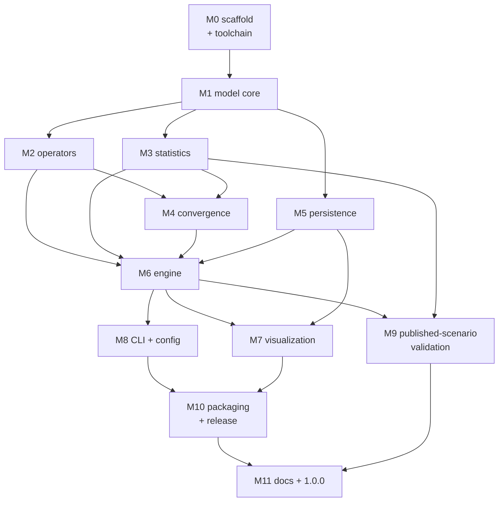

<!-- markdownlint-disable MD013 -->

# Finite island model simulator: detailed design and implementation plan

- [Finite island model simulator: detailed design and implementation plan](#finite-island-model-simulator-detailed-design-and-implementation-plan)
  - [Who this document is for](#who-this-document-is-for)
  - [1. Scope and ground rules](#1-scope-and-ground-rules)
  - [2. Decisions this document locks down](#2-decisions-this-document-locks-down)
    - [2.1 Language, runtime, and dependency footprint](#21-language-runtime-and-dependency-footprint)
    - [2.2 Front-end shape — resolving open question 1](#22-front-end-shape--resolving-open-question-1)
    - [2.3 Distribution and update mechanism — resolving open question 2](#23-distribution-and-update-mechanism--resolving-open-question-2)
    - [2.4 Determinism and reproducibility contract](#24-determinism-and-reproducibility-contract)
  - [3. Repository layout](#3-repository-layout)
  - [4. Toolchain and quality gates](#4-toolchain-and-quality-gates)
  - [5. Continuous integration and release automation](#5-continuous-integration-and-release-automation)
    - [5.1 Branch and tag model](#51-branch-and-tag-model)
    - [5.2 The `ci` workflow](#52-the-ci-workflow)
    - [5.3 The `gitleaks` workflow](#53-the-gitleaks-workflow)
    - [5.4 The `release` workflow](#54-the-release-workflow)
  - [6. Packaging and distribution](#6-packaging-and-distribution)
    - [6.1 `pyproject.toml` and the source layout](#61-pyprojecttoml-and-the-source-layout)
    - [6.2 The Windows one-file executable](#62-the-windows-one-file-executable)
    - [6.3 Developer installation paths](#63-developer-installation-paths)
    - [6.4 Versioning](#64-versioning)
  - [7. The `build` script — local CI equivalent](#7-the-build-script--local-ci-equivalent)
  - [8. Documentation set and developer workflow](#8-documentation-set-and-developer-workflow)
    - [8.1 Generated API reference and doc freshness](#81-generated-api-reference-and-doc-freshness)
    - [8.2 Git hooks: the local pre-CI safety gate](#82-git-hooks-the-local-pre-ci-safety-gate)
  - [9. Commit-level implementation plan](#9-commit-level-implementation-plan)
    - [9.1 Commit conventions and definition of done](#91-commit-conventions-and-definition-of-done)
    - [9.2 Milestone dependency graph](#92-milestone-dependency-graph)
    - [9.3 Milestone 0 — repository scaffold and toolchain](#93-milestone-0--repository-scaffold-and-toolchain)
    - [9.4 Milestone 1 — model core](#94-milestone-1--model-core)
    - [9.5 Milestone 2 — update operators](#95-milestone-2--update-operators)
    - [9.6 Milestone 3 — statistics module](#96-milestone-3--statistics-module)
    - [9.7 Milestone 4 — convergence](#97-milestone-4--convergence)
    - [9.8 Milestone 5 — persistence](#98-milestone-5--persistence)
    - [9.9 Milestone 6 — engine](#99-milestone-6--engine)
    - [9.10 Milestone 7 — visualization](#910-milestone-7--visualization)
    - [9.11 Milestone 8 — CLI and configuration](#911-milestone-8--cli-and-configuration)
    - [9.12 Milestone 9 — published-scenario validation](#912-milestone-9--published-scenario-validation)
    - [9.13 Milestone 10 — packaging and release](#913-milestone-10--packaging-and-release)
    - [9.14 Milestone 11 — documentation and 1.0.0](#914-milestone-11--documentation-and-100)
  - [10. Test strategy summary](#10-test-strategy-summary)
  - [11. Risks and how the plan de-risks them](#11-risks-and-how-the-plan-de-risks-them)
  - [12. Definition of done for v1.0.0](#12-definition-of-done-for-v100)
  - [Metadata](#metadata)

## Who this document is for

Written for whoever implements the simulator. The companion
[design document](fim-simulator-design.md) answers
*what* is being built and *why*; every architectural decision, formula, and
biological claim used below is settled there and is not re-derived here.
This document answers the next three questions the design document
deliberately leaves open: *in what order* the code is written, *how each
step is proven correct*, and *how the result is packaged, shipped, and
maintained*. It is planned to the commit level (§9) so that the work is a
sequence of small, individually green, individually reviewable steps rather
than one large drop.

Test detail is delegated in full to the companion
[test plan](fim-simulator-test-plan.md); §10 here is
only a summary and a pointer. Section references of the form "design §N"
point into the design document; bare "§N" references point within this
document.

The four documentation reader roles this project serves — non-technical
user, sysops, visiting technician, and developer — are defined in §8. This
document itself is a developer artifact and does not need the other three.

## 1. Scope and ground rules

This plans the **first implementation pass** exactly as the design document
scopes it (design §1): a single symmetric-island core, built so the known
future variations are extensions of the parameter set and pipeline rather
than rewrites (design §9). Nothing in §12 "Out of scope" of the design
document is planned here.

Two ground rules shape everything below and are worth stating once:

- **Single maintainer, built to be inherited.** This is not a
  multiple-developer repository; there is no team workflow, no review
  rota, no branch-protection ceremony to design for. What replaces all of
  that is the durability requirement the design document already carries:
  write as if the original author is permanently unavailable. The
  practical consequence is that `CONTRIBUTING.md` is a *maintainer's
  runbook* — how to set up, build, test, and release — not a guide for
  soliciting outside pull requests, and the test suite plus the `build`
  script are the only "reviewer" a lone maintainer reliably has.
- **A green commit is the unit of progress.** Every commit in §9 leaves
  the tree lint-clean, type-clean, and test-green. There is no "wire it up
  later" commit whose tests fail until a subsequent commit lands. This is
  what makes the plan bisectable and what lets the maintainer stop at any
  commit boundary with a working tool.

## 2. Decisions this document locks down

The design document confirms the large choices (Python, NumPy, JSONL,
ploidy-neutral `N`, and so on — design §11 "Resolved") and leaves two
questions open (design §11 "Still open"). This section records the concrete
engineering decisions the implementer needs settled before the first
commit, and closes both open questions.

### 2.1 Language, runtime, and dependency footprint

| Concern | Decision | Rationale |
|---|---|---|
| Language | Python 3.12+ | Design §4.4 confirms Python 3; 3.12 is the floor for `type` aliases and improved error messages, and has stable Windows wheels for every dependency below. |
| Array backend | NumPy | Design §4.4; the drift/mutation workload is batched multinomial/binomial sampling (design §5). |
| Plotting | Matplotlib | Design §8; prebuilt Windows wheels, no compiler needed (design §4.5). Rendered with the non-interactive `Agg` backend so plots are reproducible and headless-safe. |
| Config parsing | PyYAML | The mocked config is YAML (design §13); pure-Python wheel, trivial to bundle. |
| **Excluded** | SciPy, pandas | Neither is needed: NumPy's `Generator` supplies `dirichlet`/`multinomial`, and the persistence row schema is plain dict/JSON. Excluding them keeps the PyInstaller bundle small and the offline constraint (design §4.5) easy to honor. |

Everything a run touches — the update pipeline, statistics, and
visualization — depends only on NumPy and Matplotlib. This is the whole
runtime dependency set, chosen so the one-file executable (§6.2) stays
small and every dependency has a solid prebuilt Windows wheel (design
§4.5).

### 2.2 Front-end shape — resolving open question 1

**Decision: a command-line front end for v1.0.0; the GUI is deferred, not
cancelled.** The design document's mocked walkthrough (design §13) shows a
CLI and a GUI as "two windows onto the exact same engine," explicitly
leaving the choice open. This plan builds the CLI first and only the CLI,
for three reasons: it is the shortest path to a tool the botanist can
actually run against real parameters; a config file plus a one-file
executable already satisfies design §4.5's install constraint with the
smallest possible bundle; and bundling a GUI toolkit into a one-file
Windows executable is materially heavier to package and test than a CLI.

Crucially, this decision costs nothing later. The design's architecture
(design §4) keeps every front end strictly outside `engine.py` and the
modules it calls, so a future GUI is a new consumer of `fim.engine.fim()`
and the `TrajectoryStore`, not a rewrite. The mocked GUI screens (design
§13) remain the north star for that later pass; §9 records the GUI as a
named post-1.0 milestone rather than dropping it.

### 2.3 Distribution and update mechanism — resolving open question 2

**Decision: versioned GitHub Releases, with manual replacement as the
update path and an opt-in version check.** Concretely:

- Every `v*` tag triggers the release workflow (§5.4), which builds
  `fim-windows-x64.exe`, computes its SHA-256, and attaches both to a
  GitHub Release whose notes are the matching `CHANGELOG.md` section.
- Updating is downloading the newer `.exe` and replacing the old one —
  matching design §13's "uninstalling is deleting the `.exe`" model, with
  no installer, no admin rights, and no background updater.
- `fim --version` prints the bundled version. `fim update --check` (an
  explicit, user-invoked subcommand only) queries the GitHub Releases API
  over HTTPS and reports whether a newer tag exists, printing the download
  URL. It never downloads or self-modifies.

This preserves design §4.5's hard "no network dependency at run time"
guarantee precisely: a *simulation* run — the update pipeline, statistics,
and visualization — reaches no network. The only code path that touches the
network is a subcommand a user runs deliberately to ask "is there a newer
version," never as part of producing a result.

### 2.4 Determinism and reproducibility contract

The design document's convergence semantics are inherently stochastic
(design §3.5) and its test strategy leans on stochastic checks (design
§10). The house rule that a test must be a pure function of its commit is
therefore load-bearing here, and is stated once as a contract the whole
codebase obeys:

1. **One RNG, explicitly seeded, explicitly threaded.** A single
   `numpy.random.Generator` (`PCG64`) is constructed from
   `SimulationParams.seed` and passed into every operator and
   initial-condition generator as an argument. No module ever calls the
   global NumPy RNG, `random`, or reseeds mid-run. Given a seed, a run is
   byte-for-byte reproducible, which is what makes the manifest's "hand a
   collaborator a `run_id` and reproduce the trajectory" promise (design
   §6) true.
2. **No wall-clock or environment in logic.** Timestamps appear only in the
   manifest and in output *filenames*, never in a value that a statistic,
   convergence decision, or persisted row depends on.
3. **No network in a run.** Enforced structurally by §2.3.
4. **Tolerances derived before the seed is chosen.** Every statistical test
   fixes its seed(s) and derives its tolerance band analytically from the
   sample size *in advance* (see the test plan). A seed is never selected
   after the fact because it happens to pass.

## 3. Repository layout

The final layout extends the design document's proposed package tree
(design §5) with the packaging, CI, install, and documentation scaffolding
that the "fit and finish" bar requires. Files already present in the
repository (`LICENSE.md`, `README.md`, `doc/`, `.gitignore`) are marked.

```text
jost-finite-island-model/
├── .github/
│   └── workflows/
│       ├── ci.yml                 # lint, type-check, test, coverage, package smoke
│       ├── gitleaks-ci.yml        # secret scan
│       └── release.yml            # tag → build exe + wheel/sdist → GitHub Release
├── .gitignore                     # present; extended for build artifacts
├── .markdownlint.json             # markdown lint config
├── .markdownlintignore
├── build                          # local CI equivalent (lint+type+test+package)
├── CHANGELOG.md                   # Keep a Changelog format
├── CONTRIBUTING.md                # maintainer runbook (single-maintainer)
├── LICENSE.md                     # present (AGPL-3.0-or-later)
├── README.md                      # present; expanded to the full user entry point
├── SECURITY.md                    # threat model + reporting
├── pyproject.toml                 # PEP 621 metadata, deps, tool config
├── version.txt                    # single source of truth for the version string
├── dev/
│   ├── git-hooks/                 # version-controlled hooks (§8.2)
│   │   ├── install                # symlinks the hooks into .git/hooks/
│   │   ├── pre-commit             # staged format + API-doc refresh + filename guard
│   │   ├── commit-msg             # Conventional Commits enforcement
│   │   ├── pre-push               # fast static gates against the pushed commits
│   │   └── README.md              # hook set + install instructions
│   └── bin/
│       ├── generate-api-docs      # docstrings → src/fim/API.md (pydoc-markdown)
│       └── check-doc-links        # validates Markdown links + anchors (§9.14)
├── doc/                           # present; design docs + user/developer guides
│   ├── 20260810-…-introduction.md         # present (companion)
│   ├── 20260810-…-differentiation.md      # present (companion)
│   ├── fim-simulator-design.md      # present (design)
│   ├── fim-simulator-detailed-design.md  # this doc
│   ├── fim-simulator-test-plan.md   # companion test plan
│   ├── usage.md                   # user-facing command + config reference
│   ├── configuration.md           # the P-bag schema, every key, every default
│   ├── developer.md               # architecture-for-maintainers + how to extend
│   └── img/                        # present (design mockups); release screenshots
├── install/
│   ├── README.md                  # non-default install paths
│   └── homebrew/
│       ├── Formula/fim.rb          # macOS/Linux developer install
│       └── test-formula            # dockerized brew style/audit check
├── packaging/
│   └── fim.spec                   # PyInstaller one-file spec
├── src/
│   ├── README.md                  # developer orientation for the source tree (§8.1)
│   └── fim/
│       ├── __init__.py            # __version__ read from version.txt
│       ├── API.md                 # generated Markdown API reference (§8.1)
│       ├── model/
│       │   ├── allele.py          # AlleleId, AlleleRegistry
│       │   ├── locus.py           # LocusSpec
│       │   ├── state.py           # ModelState (ψ_k,t), (de)serialization
│       │   ├── params.py          # SimulationParams, validated P-bag schema
│       │   ├── initial.py         # initial-condition generators
│       │   └── operators.py       # migrate(), mutate(), drift() — pure fns
│       ├── convergence/
│       │   ├── criteria.py        # ConvergenceCriterion protocol + built-ins
│       │   └── monitor.py         # ConvergenceMonitor
│       ├── statistics/
│       │   └── differentiation.py # H, H_S, H_T, G_ST, D, E_ST, K_ST, Hill numbers
│       ├── persistence/
│       │   ├── store.py           # TrajectoryStore protocol
│       │   ├── jsonl_store.py      # JSONLTrajectoryStore — the v1 backend
│       │   └── manifest.py
│       ├── viz/
│       │   ├── scatter.py         # canonical d-dimensional frequency scatter
│       │   └── diagnostics.py     # convergence trace, per-deme frequency bars
│       ├── engine.py              # fim(N, m, μ, d, P) — the public entry point
│       └── cli.py                 # command-line entry point
├── test/
│   ├── conftest.py                # shared fixtures, seeded RNG helpers
│   ├── data/                      # golden-value fixtures (Part IV scenarios)
│   ├── model/
│   ├── convergence/
│   ├── statistics/
│   ├── persistence/
│   ├── viz/
│   ├── engine/
│   ├── cli/
│   └── validation/                # published-scenario + asymptotic tests
└── bin/
    └── fim                        # thin POSIX wrapper invoking the CLI from a clone
```

The `src/fim/` subtree is exactly the design document's proposed layout
(design §5); this document adds only the scaffolding around it and one
directory it implies but does not name — `test/validation/` for the
stochastic published-scenario checks (design §10) that are neither pure
unit tests nor tied to one module. The `dev/` subtree holds the developer
workflow that never ships to a user — the git-hook safety gates and the
API-doc generator (§8) — and `src/README.md` plus the generated
`src/fim/API.md` are the two source-tree documents §8.1 defines.

## 4. Toolchain and quality gates

Every gate below runs identically in the local `build` script (§7) and in
CI (§5), so "green locally" and "green in CI" cannot diverge. Tool versions
are pinned — an unpinned linter or formatter makes a passing build a
function of upstream's release schedule instead of the commit, which is the
same defect class the determinism contract (§2.4) exists to prevent. Pins
live in `pyproject.toml`'s optional `dev` dependency group; the table gives
the intended baseline.

| Gate | Tool | Pin (baseline) | What it enforces |
|---|---|---|---|
| Lint + format | Ruff | `ruff==0.6.*` | Style, import order, common bugs; `ruff format` is the single formatter (no separate Black). Line length 88, matching the design docs' prose target. |
| Type check | mypy | `mypy==1.11.*` | `--strict`; every public function typed. `AlleleId` is a `NewType(int)` so the type checker refuses to let an allele be compared by anything but identity (design §3.2). |
| Unit + property tests | pytest, Hypothesis | `pytest==8.*`, `hypothesis==6.*` | Correctness (§10, test plan). |
| Coverage | coverage.py | `coverage==7.*` | Branch coverage; gate at the threshold in §5.2. |
| API reference docs | pydoc-markdown | `pydoc-markdown==4.*` | Regenerates `src/fim/API.md` from module docstrings; dev-only, never a runtime dependency, so it never enters the PyInstaller bundle (§2.1/§8.1). |
| Secret scan | gitleaks | action `@v2` | No credentials in history (§5.3). |
| Markdown lint | markdownlint-cli2 | `@v0.13` (action) | Documentation consistency. |

`mypy --strict` on the model core is not ceremony: the design document's
single most important representational rule is that an allele carries no
structure but identity (design §3.2). Encoding `AlleleId` as a distinct
`NewType` makes "compare two alleles by anything other than equality" a
type error caught before any test runs.

The same gate set runs locally *before* CI through repository-managed git
hooks (§8.2): `pre-commit` auto-formats staged Python and refreshes the
generated API docs, `commit-msg` enforces Conventional Commits, and
`pre-push` runs the fast static gates against the exact commits being
pushed. The hooks are a convenience and a first line of defense, never the
authority — CI (§5) re-runs every gate, so a hook bypassed with
`--no-verify` still cannot land un-gated code on `main`.

## 5. Continuous integration and release automation

The project is a standard public GitHub-distributed application. CI is
self-contained — standard published actions plus the project's own `build`
script — rather than a shared/reusable organization workflow, because this
repository stands alone and should be forkable and buildable with no
dependency on any private workflow repo.

### 5.1 Branch and tag model

Matching the repository's existing history (`dev` is the working branch)
and the sibling projects' convention:

- `dev` — the working branch; every commit in §9 lands here.
- `main` — release-ready; `dev` is fast-forwarded or merged here only at a
  release boundary.
- `v*` tags — cut from `main`, drive the release workflow (§5.4).

CI runs on pushes to `dev`/`main` and on pull requests targeting them, and
on `v*` tags. Concurrency cancels superseded runs except on tags, so a
release build is never cancelled mid-flight.

### 5.2 The `ci` workflow

`.github/workflows/ci.yml` runs on `ubuntu-latest` with a Python matrix
(`3.12`, `3.13`) and does, in order: install the pinned `dev` dependencies,
`ruff check` + `ruff format --check`, `mypy --strict src`, `pytest` with
branch coverage, fail if coverage is below the gate (start at **90%** lines
on `src/fim` excluding `viz/`, which is smoke-tested not line-covered),
verify `src/fim/API.md` is up to date (regenerate it and `git diff
--exit-code` — the doc-freshness gate, §8.1), validate every Markdown link
and in-page anchor once the checker exists (`dev/bin/check-doc-links`,
§9.14 commit 11.5), and finally a **packaging smoke job** that builds the
wheel and runs `fim --version` / `fim --help` from the installed entry
point. The packaging smoke job is what keeps `pyproject.toml`'s entry-point
wiring from silently breaking between releases.

The whole of `ci.yml`'s substance is a single call to `./build --ci`, so
the workflow file stays a thin, stable shell and the logic lives in one
script that a maintainer can run identically offline (§7). Permissions are
`contents: read`.

### 5.3 The `gitleaks` workflow

`.github/workflows/gitleaks-ci.yml` mirrors the sibling repositories: a
full-history checkout (`fetch-depth: 0`) and `gitleaks/gitleaks-action@v2`.
It is a separate workflow, not a step in `ci.yml`, so a secret-scan failure
is legible on its own and does not mask a test failure or vice versa.

### 5.4 The `release` workflow

`.github/workflows/release.yml` runs only on `v*` tags, with
`contents: write` permission, and has two jobs:

1. **`windows` (runs-on `windows-latest`).** Install pinned runtime + build
   deps, run `pyinstaller packaging/fim.spec`, smoke-test the resulting
   `dist/fim.exe` (`fim.exe --version` must print the tag's version, and a
   tiny bundled config must run end-to-end offline), rename to
   `fim-windows-x64.exe`, and emit its `.sha256`.
2. **`publish` (needs `windows`, runs-on `ubuntu-latest`).** Build the
   `sdist` + `wheel`, verify `version.txt` equals the tag (fail loudly on
   mismatch — a tag that disagrees with `version.txt` is a release bug, not
   a warning), extract the matching `CHANGELOG.md` section as the release
   notes, and create the GitHub Release attaching the `.exe`, its
   `.sha256`, the wheel, and the sdist.

The tag-equals-`version.txt` check is the one guard that makes the version
string trustworthy everywhere it appears (bundle, manifest, `--version`,
Homebrew formula).

## 6. Packaging and distribution

### 6.1 `pyproject.toml` and the source layout

PEP 621 metadata with a `src/` layout and a standard build backend
(`hatchling`). Key fields: `name = "fim"`, `requires-python = ">=3.12"`,
runtime dependencies `numpy`, `matplotlib`, `pyyaml`; a `dev` optional group
holding the pinned toolchain (§4); dynamic `version` read from
`version.txt`; and a console entry point:

```toml
[project.scripts]
fim = "fim.cli:main"
```

The `src/` layout guarantees tests run against the installed package, not
the working tree, which is what makes the packaging smoke job (§5.2)
meaningful.

### 6.2 The Windows one-file executable

`packaging/fim.spec` drives PyInstaller in one-file mode (design §4.5). The
spec must: collect Matplotlib's data files and the `Agg` backend as hidden
imports; exclude the interactive GUI backends (Tk/Qt) so the bundle stays
small and needs no display; and set `console=True` (the v1 front end is the
CLI, §2.2). The build is done in the release workflow on `windows-latest`
(§5.4); no cross-compilation, no local Windows machine required of the
maintainer.

The bundled binary is self-contained: interpreter, NumPy, Matplotlib, and
PyYAML all inside, so the researcher installs nothing (design §4.5). First
run creates the run folder and drops a starter config, exactly as design
§13 mocks.

### 6.3 Developer installation paths

`install/homebrew/Formula/fim.rb` provides a macOS/Linux developer install
(`pipx`-style behavior via a Python formula, or a thin wrapper installing
`bin/fim`), and `install/homebrew/test-formula` validates it with
`brew style`/`brew audit` inside the `homebrew/brew` Docker image — no
Homebrew on the host, mirroring the sibling repositories. `install/README.md`
documents the non-default paths (Homebrew, `pip install`, and plain
`PATH`-from-a-clone via `bin/fim`). The homepage/URL fields point at
`github.com/selby-botany/jost-finite-island-model`.

### 6.4 Versioning

`version.txt` is the single source of truth. `src/fim/__init__.py` reads it
to expose `__version__`; `pyproject.toml` binds `version` to it dynamically;
the manifest records it per run (design §6); the release workflow asserts
the tag matches it (§5.4). Semantic Versioning; the first shipped release is
`1.0.0` (§9.14). `CHANGELOG.md` follows Keep a Changelog with an
`[Unreleased]` section that every feature commit updates as it lands.

## 7. The `build` script — local CI equivalent

A single `build` script at the repository root is the local mirror of CI,
in the spirit of the sibling `usb-explore`/`bwx` `build` scripts but for a
Python project. It is what a solo maintainer runs before every push and is
the exact body of `ci.yml` (§5.2), so the two cannot drift.

Stages, in order, each skippable by flag for fast iteration:

```text
build [--ci] [--no-lint] [--no-type] [--no-test] [--no-docs] [--no-package]
      [--coverage] [--dry-run] [--help]

  1. lint     ruff check + ruff format --check
  2. type     mypy --strict src
  3. test     pytest (+ branch coverage with --coverage or --ci)
  4. docs     regenerate src/fim/API.md from docstrings; with --ci, verify
              it matches the committed copy and fail if stale (§8.1); once
              present, run dev/bin/check-doc-links to validate every
              Markdown link and anchor (§9.14 commit 11.5)
  5. package  build wheel/sdist, install into a throwaway venv,
              run `fim --version` and `fim --help`
```

`--ci` selects the full, non-skippable gate set with coverage enforcement
and the stale-doc check, and is what `ci.yml` calls. Run without `--ci`,
the `docs` stage regenerates `src/fim/API.md` in place (the write the
`pre-commit` hook performs); with `--ci` it regenerates to a temporary
location and diffs, never writing, so CI stays read-only. `--dry-run`
prints each command without running it. The script needs only Python and a
POSIX shell; it creates and tears down its own virtual environments so it
never mutates the maintainer's global Python.

## 8. Documentation set and developer workflow

All user-facing documentation serves the four reader roles the project
mandates. The table maps each document to its primary audience and to the
milestone that first writes it; documents are organized for reader
efficiency (progressive disclosure, role callouts) rather than one file per
role.

| Document | Primary role(s) | Written in | Contents |
|---|---|---|---|
| `README.md` | Non-technical user, sysops, developer | M0 seed, M11 fill | Contents, quick start (install + first run), architecture overview, link map to everything else. The single entry point. |
| `doc/usage.md` | Non-technical user, sysops | M8/M11 | Every subcommand and flag, the config file walked key by key, worked examples mirroring design §13. |
| `doc/configuration.md` | Sysops, developer | M1/M11 | The `P`-bag schema (design §4.3) as a reference: every key, type, default, and effect. |
| `doc/developer.md` | Developer | M11 | Architecture for a maintainer/inheritor: module map, the pure-function pipeline, where each future "what if" lands (design §9), how to run and extend the tests. |
| `src/README.md` | Developer | M0 | Orientation for the source tree: module map, the pure-function pipeline in one paragraph, how to run `build`, and how the generated API reference is produced and kept fresh (§8.1). |
| `src/fim/API.md` | Developer | M0 seed, every module commit | Generated Markdown API reference (pydoc) for the public API; regenerated by the `pre-commit` hook and the `build` docs stage, verified fresh in CI (§8.1). |
| `SECURITY.md` | Sysops, Geek Squad, developer | M0/M10 | Threat model (offline tool, unsigned Windows binary, SmartScreen note), the opt-in-only network path (§2.3), CVE/dependency posture, and how to report an issue. |
| `CONTRIBUTING.md` | Developer (maintainer) | M0 | Maintainer runbook: dev setup (incl. `bash dev/git-hooks/install`), `build`, test layout, commit conventions, release steps. Explicitly single-maintainer (§1). |
| `CHANGELOG.md` | Sysops, developer | M0, every commit | Keep a Changelog; release notes source (§5.4). |
| `dev/git-hooks/README.md` | Developer | M0 | The hook set, what each gate does, and the one-line install step (§8.2). |
| The two companion design docs | Developer, botanist | present | Model + statistics reference (design doc's own sources). |
| This document + test plan | Developer | this pass | Build plan and test plan. |

The durability rule applies to every row: no document says "ask the
author." Recovery, extension, and troubleshooting steps are written for a
competent stranger.

### 8.1 Generated API reference and doc freshness

The source tree carries two developer documents. `src/README.md` is
hand-written — an orientation to the module layout, the three-stage
pure-function pipeline, and how to run the tooling. `src/fim/API.md` is
**generated** from the module docstrings, which already follow the
Purpose / Args / Returns convention every commit's definition of done
requires (§9.1). The generator is `pydoc-markdown` (a `lazydocs`-style
alternative is interchangeable), invoked through the thin
`dev/bin/generate-api-docs` wrapper and the `build` docs stage (§7).

`pydoc-markdown` is a **dev-only** tool: it is in the `dev` dependency
group, never in the runtime set, so it never enters the Windows bundle
(§2.1). The API reference is committed into the tree — not produced only as
a CI artifact — for two concrete reasons: it is browsable directly on
GitHub with no build step (serving the inheriting developer of §1), and its
diff in a pull request or a `git log` is a reviewable signal that the public
API surface changed.

Because a generated file can silently drift from the code it documents,
freshness is enforced in **three layers of defense**, matching the
determinism spirit of the whole project (a doc that lies is a defect, not a
cosmetic lag):

1. **`pre-commit` regenerates and re-stages.** When a staged change touches
   `src/fim/**/*.py`, the hook regenerates `src/fim/API.md` and re-stages
   it, so the doc lands in the same commit as the code — exactly the
   "re-stage normalized content" pattern the reference project's
   `pre-commit` uses for formatting. This holds under the botanist's own
   premise: generation is fast and per-commit diffs are small.
2. **`pre-push` verifies the pushed tree.** The hook regenerates against the
   commits actually being pushed and fails if the committed `API.md` differs.
   This closes the gap `pre-commit` cannot: a rebase, or a commit made with
   `--no-verify`, never runs `pre-commit`, so a series can reach the shape
   the per-commit gate exists to prevent — the same reasoning the reference
   project's `pre-push` documents for its own static checks.
3. **CI re-checks.** `build --ci` (and therefore `ci.yml`, §5.2)
   regenerates to a scratch path and runs `git diff --exit-code`, so even a
   fully bypassed local setup cannot land a stale `API.md` on `main`.

### 8.2 Git hooks: the local pre-CI safety gate

The repository ships version-controlled git hooks under `dev/git-hooks/`,
modeled directly on the reference project's `dev/git-hooks/` set. Hook
sources live in the working tree (authoritative and reviewable); a
`dev/git-hooks/install` script symlinks them into `.git/hooks/` so an edit
to a hook takes effect on the next run without reinstalling. The one-line
setup step — `bash dev/git-hooks/install`, re-run whenever the hook set
changes — is recorded in `README.md`, `CONTRIBUTING.md`, and
`dev/git-hooks/README.md`.

Three hooks, adapted from the reference set to a Python project:

- **`commit-msg` — Conventional Commits.** Validates the first non-comment
  subject line against `type(scope)!: summary`, allowing merge, revert, and
  `fixup!`/`squash!` prefixes. This logic is essentially project-agnostic
  and is carried over almost verbatim; it enforces the commit convention
  §9.1 already assumes.
- **`pre-commit` — staged, fast, self-healing.** On staged files only:
  run `ruff format` and `ruff check --fix` on staged Python and re-stage
  the result; regenerate `src/fim/API.md` when a staged `.py` changed and
  re-stage it (§8.1); and reject newly added non-ASCII filenames (kept from
  the reference hook). Staged-only keeps it fast enough to run on every
  commit without tempting a bypass.
- **`pre-push` — what is actually being published.** Runs the fast static
  gates — `ruff check`, `mypy --strict`, and the non-`statistical` `pytest`
  subset — plus the API-doc freshness check (§8.1) against the commits
  being pushed, not the working tree. Individual checks are bypassable in a
  genuine emergency via `PRE_PUSH_SKIP_*` environment variables, mirroring
  the reference design's escape hatches.

**Graceful degradation is a design requirement, not a nicety.** Each hook
no-ops with an informational message when its tool or `pyproject.toml` is
absent. This is what lets the hooks be installed at Milestone 0, *before*
any `src/` code exists (§9.3): they simply do nothing until the milestone
that introduces the thing they gate lands, and start enforcing
automatically once it does. It also means a fresh clone that has not yet
run `pip install` of the `dev` group is never blocked by a missing linter.

**The hooks are convenience and first-line defense, never the authority.**
`--no-verify` bypasses any of them, and that is acceptable precisely
because CI (§5) re-runs every one of these gates on the server, where it
cannot be skipped. The hooks exist to catch a mistake in seconds on the
maintainer's machine rather than minutes later in CI; they are deliberately
fast (staged-only `pre-commit`, fast-subset `pre-push`) so that speed never
becomes a reason to disable them.

## 9. Commit-level implementation plan

### 9.1 Commit conventions and definition of done

Every commit uses the repository's existing Conventional Commit style
(`type(scope): summary`, visible in the current history) with a body giving
**What changed**, **Why this change**, and **Validation**, and a model
attribution trailer. A representative shape:

```text
feat(model): add multinomial drift operator

What changed
  - Add fim.model.operators.drift(state, N, rng) resampling N gene
    copies per deme per locus from the post-migration frequency vector.

Why this change
  - Third stage of the generation pipeline (design §3.4); the source of
    genetic drift the whole model exists to study.

Validation
  - Unit tests assert Σp == 1 post-drift and support ≤ N; a seeded
    statistical test confirms per-generation variance matches p(1-p)/N
    within an analytically derived band (test plan §7).

Co-authored-by: Copilot <223556219+Copilot@users.noreply.github.com>
```

**Definition of done, per commit** (the invariant §1 promises): `ruff`,
`mypy --strict`, and `pytest` all pass; any behavior the commit adds ships
its own tests in the same commit; `CHANGELOG.md`'s `[Unreleased]` section is
updated; public functions carry docstrings (Purpose / Args / Returns); and
if the commit touched `src/fim/**`, `src/fim/API.md` was regenerated and
staged (the `pre-commit` hook does this automatically — §8.1).

The commit counts below (≈62 commits across 12 milestones) are the intended
granularity, not a ceiling; splitting a commit further is always fine, and
combining two is never allowed to produce a red intermediate state.

### 9.2 Milestone dependency graph



The critical path is M0→M1→M2→M6→M8→M10→M11. M3 (statistics) and M5
(persistence) parallel the operator work; M7 (viz) and M9 (validation) can
proceed once the engine exists. A maintainer working alone follows the path
top to bottom; the graph exists to show which milestones have no ordering
dependency on each other, not to enable parallel developers.

### 9.3 Milestone 0 — repository scaffold and toolchain

Goal: a repository that builds nothing yet but gates everything, so every
subsequent commit inherits the green-commit invariant. Ships no `fim`
behavior; ships the machinery that proves later commits.

| # | Commit | Key files | Adds |
|---|---|---|---|
| 0.1 | `chore: add Python packaging scaffold` | `pyproject.toml`, `src/fim/__init__.py`, `version.txt`, `bin/fim` | PEP 621 metadata, `src` layout, `__version__` from `version.txt`, empty package that imports. |
| 0.2 | `chore: add pinned dev toolchain and tool config` | `pyproject.toml` (`[dependency-groups]`, `[tool.ruff]`, `[tool.mypy]`, `[tool.pytest.ini_options]`, `[tool.coverage]`) | Ruff/mypy/pytest/coverage configuration and pins (§4). |
| 0.3 | `build: add local CI-equivalent build script` | `build` | The staged `build` script (§7); at this point lint+type+test trivially pass on an empty package. |
| 0.4 | `ci: add CI workflow (lint, type, test, package smoke)` | `.github/workflows/ci.yml` | Thin workflow calling `./build --ci` on the Python matrix (§5.2). |
| 0.5 | `ci: add gitleaks secret-scan workflow` | `.github/workflows/gitleaks-ci.yml` | §5.3. |
| 0.6 | `docs: add CONTRIBUTING, SECURITY, CHANGELOG scaffolds` | `CONTRIBUTING.md`, `SECURITY.md`, `CHANGELOG.md`, `.markdownlint.json`, `.markdownlintignore` | Maintainer runbook, threat-model skeleton, `[Unreleased]` changelog, markdown lint config. |
| 0.7 | `chore: extend .gitignore for build artifacts` | `.gitignore` | `dist/`, `build/`, `*.spec` outputs, `.coverage`, run-output dirs. |
| 0.8 | `chore: add git-hook safety gates and installer` | `dev/git-hooks/{install,pre-commit,commit-msg,pre-push,README.md}` | Conventional-commit, staged-format, and pre-push static gates (§8.2); the symlink installer; each check degrades gracefully until its tool/code exists. |
| 0.9 | `docs: add API-doc generator and source README` | `dev/bin/generate-api-docs`, `src/README.md`, `src/fim/API.md`, `pyproject.toml` (pydoc-markdown pin), `build` (docs stage), `ci.yml` (freshness check) | Markdown-pydoc generation, the developer source README, and the three-layer doc-freshness gate (§8.1). |

**Milestone DoD:** `./build --ci` is green on a package that does nothing;
both CI workflows pass on `dev`; `bash dev/git-hooks/install` links the
three hooks and they no-op cleanly on the empty package (§8.2); `build`'s
docs stage produces a (near-empty) `src/fim/API.md` and the CI freshness
check passes.

### 9.4 Milestone 1 — model core

Goal: the pure, deterministic representational core — alleles, loci, state,
parameters, initial conditions — with no dynamics yet. Everything here is a
value object or a pure function, and each lands with exhaustive unit tests
(test plan §4).

| # | Commit | Key files | Adds |
|---|---|---|---|
| 1.1 | `feat(model): add AlleleId and AlleleRegistry` | `model/allele.py` | `AlleleId = NewType('AlleleId', int)`; `AlleleRegistry.next_id()` as the sole minting point (design §3.2); disjoint founding vs. minted ID ranges (design §3.3). |
| 1.2 | `feat(model): add LocusSpec value object` | `model/locus.py` | Immutable `LocusSpec(locus_id, length)` (design §3.2). |
| 1.3 | `feat(model): add ModelState sparse representation` | `model/state.py` | Per-(deme,locus) sparse `AlleleId→frequency` map; `total_frequency()` invariant; equality (design §3.1/§5). |
| 1.4 | `feat(model): add ModelState (de)serialization` | `model/state.py` | To/from the persistence row shape (design §6), decoupled from any file format. |
| 1.5 | `feat(model): add SimulationParams and P-bag schema` | `model/params.py` | Validated, immutable params: `N, m, μ, d` (scalar-or-array typed for §9 future), `loci` tuple, `seed`, and the `P`-bag with documented defaults (design §4.3). Rejects invalid combinations with clear messages. |
| 1.6 | `feat(model): add initial-condition generators` | `model/initial.py` | `InitialConditionGenerator` strategy: default symmetric-Dirichlet draw (seeded) + explicit-`p_0` override (design §3.3); locus-relative founding IDs. |

**Milestone DoD:** a `SimulationParams` can be constructed, validated, and
turned into a `ModelState` via `generate_initial_state`, with `Σp ≈ 1` per
(deme, locus); round-trip (de)serialization is exact; full unit coverage.

### 9.5 Milestone 2 — update operators

Goal: the three pure stages of one generation (design §3.4), each a
`ModelState → ModelState` function of an explicit RNG, each independently
tested against closed-form expectations (test plan §4, §7).

| # | Commit | Key files | Adds |
|---|---|---|---|
| 2.1 | `feat(model): add migrate operator` | `model/operators.py` | `migrate(state, m, rng?)` — per-deme weighted blend with the all-other-demes migrant pool (design §3.4). Deterministic given inputs (no sampling); expectation-preserving. |
| 2.2 | `feat(model): add mutate operator` | `model/operators.py` | `mutate(state, mu, registry, rng)` — infinite-alleles: each of `N` copies mutates w.p. `μ` to a fresh `AlleleId` (design §3.4). |
| 2.3 | `feat(model): add drift operator` | `model/operators.py` | `drift(state, N, rng)` — multinomial resample of `N` gene copies per deme per locus (design §3.1's ploidy-neutral `N`); optional dense fast path for fixed-`K` no-mutation runs behind the same interface (design §5). |
| 2.4 | `feat(model): compose the generation pipeline` | `model/operators.py` | `step(state, params, registry, rng)` = `drift(mutate(migrate(...)))` (design §3.4); asserts the invariant after each stage. |
| 2.5 | `test(model): seed-determinism and pipeline properties` | `test/model/` | Same seed ⇒ identical trajectory; per-stage expectation checks; drift variance vs. `p(1-p)/N` (seeded, banded — test plan §7). |

**Milestone DoD:** one generation can be advanced deterministically from a
seed; each operator's statistical behavior matches theory within its
pre-derived band; `μ = 0` drives toward fixation, `μ > 0` does not (design
§3.5).

### 9.6 Milestone 3 — statistics module

Goal: the differentiation statistics as pure functions of a frequency
table, entirely independent of the engine (design §7), validated against
the differentiation guide's hand-checked golden values and its algebraic
identities (test plan §5, §6).

| # | Commit | Key files | Adds |
|---|---|---|---|
| 3.1 | `feat(stats): add within/among heterozygosity and Hill numbers` | `statistics/differentiation.py` | `H`, `J`, `H_S`, `H_T`, and the `^qD` Hill-number family (design §7). |
| 3.2 | `feat(stats): add G_ST and Jost's D` | `statistics/differentiation.py` | `G_ST`, `D` with the `d/(d-1)` correction; `D` fixed to equal deme weighting by construction (design §7). |
| 3.3 | `feat(stats): add E_ST and K_ST with deme weighting` | `statistics/differentiation.py` | `E_ST` (native size weighting), `K_ST`, and the general `Differentiation_q` family; `P["deme_weighting"]` threaded explicitly (design §4.3/§7). |
| 3.4 | `test(stats): golden worked examples and invariants` | `test/statistics/`, `test/data/` | Exact Part IV fixtures (including the `D = 0.5556` erratum); Part V invariants as Hypothesis properties (test plan §5–§6). |

**Milestone DoD:** every named statistic matches its hand-checked value; the
ceiling identity, subadditive partition, `D ∈ [0,1]` endpoints, and the
replication principle all hold as properties.

### 9.7 Milestone 4 — convergence

Goal: the operational meaning of "converges" (design §3.5) as a pluggable
criterion plus a monitor that reports *why* it stopped.

| # | Commit | Key files | Adds |
|---|---|---|---|
| 4.1 | `feat(convergence): add ConvergenceCriterion protocol and built-ins` | `convergence/criteria.py` | `is_stable(history, window, tolerance)`; trailing-window half-vs-half check; `max_generations` safety-valve criterion; ANY/ALL combinator scaffolding (single-statistic path is its one-element case — design §5). |
| 4.2 | `feat(convergence): add ConvergenceMonitor` | `convergence/monitor.py` | `record(t, value)` / `should_stop()` / `reason()`; a capped-but-unconverged run is a valid, inspectable result, never an error (design §5). |
| 4.3 | `test(convergence): synthetic sequence behavior` | `test/convergence/` | Constant, slowly converging, and forever-oscillating sequences fire the right decision and reason (test plan §4). |

**Milestone DoD:** the monitor stops on a stabilized statistic and on the
hard cap, distinguishes the two, and detects the `μ = 0` zero-variance case
as a fast instance of the same check (design §3.5).

### 9.8 Milestone 5 — persistence

Goal: incremental, human-readable persistence of every generation behind a
swappable protocol (design §6).

| # | Commit | Key files | Adds |
|---|---|---|---|
| 5.1 | `feat(persist): add TrajectoryStore protocol and row schema` | `persistence/store.py` | `write_generation` / `read` over the `(run_id, generation, deme, locus_id, allele_id, frequency)` row (design §6). |
| 5.2 | `feat(persist): add JSONLTrajectoryStore` | `persistence/jsonl_store.py` | One JSON object per line, appended per generation; zero extra tooling to read (design §6). |
| 5.3 | `feat(persist): add run manifest` | `persistence/manifest.py` | Full `SimulationParams` (incl. seed), wall-clock start/end, convergence outcome, software version — the replay contract (design §6). |
| 5.4 | `test(persist): round-trip and manifest replay` | `test/persistence/` | Write-then-read exact match, independent of any run; manifest captures enough to reconstruct params (test plan §4, §8). |

**Milestone DoD:** a sequence of `ModelState`s round-trips through JSONL
byte-for-faithful to the row schema; a manifest names everything needed to
replay a run from its seed.

### 9.9 Milestone 6 — engine

Goal: the public entry point that wires the modules into the run loop
(design §4.2) and nothing else.

| # | Commit | Key files | Adds |
|---|---|---|---|
| 6.1 | `feat(engine): add RunResult and fim() run loop` | `engine.py` | `fim(N, m, mu, d, *, params) -> RunResult`: initial state → per-generation `step` → persist each ψ → feed the watched statistic to the monitor → stop on convergence or cap (design §4.2/§5). |
| 6.2 | `feat(engine): assemble the final report` | `engine.py` | Final scalar report (requirement 6a) and per-deme frequency table (6b) from the statistics module at `t = T` (design §7). |
| 6.3 | `test(engine): end-to-end determinism and outcomes` | `test/engine/` | A small seeded run is bit-reproducible; converged vs. capped runs both return valid results with the right `reason`; re-computing a statistic from a persisted trajectory matches the live run (design §4.1). |

**Milestone DoD:** `fim(...)` produces a persisted trajectory, a manifest,
and a report for the §4.3 development-default scenario, deterministically
from its seed; the tool is usable as a library at this commit.

### 9.10 Milestone 7 — visualization

Goal: the botanist-facing plots (design §8), rendered headlessly and
deterministically.

| # | Commit | Key files | Adds |
|---|---|---|---|
| 7.1 | `feat(viz): add canonical d-dimensional frequency scatter` | `viz/scatter.py` | One point per (locus, allele) in deme-coordinate space for `d ≤ 3`; house-style title carrying the run's `N, m, μ, d` (design §8). |
| 7.2 | `feat(viz): add d>3 projections` | `viz/scatter.py` | Pairwise scatter-matrix (default, moderate `d`) and a labeled 2-D PCA projection (large `d`); coincidence-count marker scaling and common/rare coloring (design §8). |
| 7.3 | `feat(viz): add diagnostic views` | `viz/diagnostics.py` | Convergence-statistic time series and STRUCTURE-style per-deme stacked bars (design §8). |
| 7.4 | `test(viz): deterministic render smoke tests` | `test/viz/` | `Agg` backend; assert a figure is produced with expected axes/dimensions and title metadata, not pixel diffs (test plan §9). |

**Milestone DoD:** every design §8 view renders from a `RunResult` or a
persisted trajectory to a PNG headlessly; `d > 3` dispatches to a labeled
projection; smoke tests are deterministic.

### 9.11 Milestone 8 — CLI and configuration

Goal: the researcher-facing command line (design §13), the v1 front end
(§2.2).

| # | Commit | Key files | Adds |
|---|---|---|---|
| 8.1 | `feat(cli): parse YAML config into SimulationParams` | `cli.py` | Load/validate a config file (design §13) into `SimulationParams`, with precise errors on bad keys/values. |
| 8.2 | `feat(cli): add fim run end-to-end command` | `cli.py` | `fim run myrun.yaml` → progress log → write trajectory, manifest, report, and canonical scatter to an output dir (design §13). |
| 8.3 | `feat(cli): add fim stats re-analysis command` | `cli.py` | Re-compute any statistic (incl. a swept `q`) against a persisted trajectory without re-running the simulation (design §4.1/§7). |
| 8.4 | `feat(cli): add fim init and version print` | `cli.py` | First-run starter-config drop into the run folder (design §13); `fim --version` sourced from `version.txt` (§6.4). |
| 8.5 | `feat(cli): add opt-in fim update --check` | `cli.py` | The only network path, user-invoked only (§2.3); reports newer release + URL, never self-modifies. |
| 8.6 | `test(cli): argument parsing, validation, and end-to-end` | `test/cli/` | Config validation errors; a full `run` on a tiny seeded scenario writes exactly the four artifacts; `stats` reproduces the live report; `update --check` is fully mocked (no live network — determinism contract §2.4). |

**Milestone DoD:** the mocked CLI session in design §13 runs for real on a
small scenario, producing the documented artifacts; no simulation path
touches the network.

### 9.12 Milestone 9 — published-scenario validation

Goal: the stochastic checks against Jost's own worked examples and the
equilibrium formulas (design §10), each seeded and tolerance-banded (§2.4).

| # | Commit | Key files | Adds |
|---|---|---|---|
| 9.1 | `test(validation): equilibrium-formula cross-checks` | `test/validation/` | Many-replicate sample-mean `G_ST`/`D` approach the differentiation guide's Part VI Eq. 2/Eq. 4 within an a-priori band (test plan §7). |
| 9.2 | `test(validation): Dear-Nolan two-scenario fixtures` | `test/validation/`, `test/data/` | The two haploid scenarios (design §4.3) as tolerance-banded checks against expected `G_ST` and expected/observed `D`; treated as statistical, not exact, oracles (design §10). |
| 9.3 | `feat(engine): add replicate batching` | `engine.py` | `n_replicates` as a vectorized dimension (design §9) — the substrate the validation tests need; scalar case unchanged. |

**Milestone DoD:** the simulator reproduces both published scenarios and
both closed-form equilibria within their derived bands, reproducibly from
fixed seeds; no test can flip color on a re-run.

### 9.13 Milestone 10 — packaging and release

Goal: the shippable Windows executable and the release automation (§5.4,
§6.2).

| # | Commit | Key files | Adds |
|---|---|---|---|
| 10.1 | `build: add PyInstaller one-file spec` | `packaging/fim.spec` | One-file console build; Matplotlib data + `Agg` bundled; GUI backends excluded (§6.2). |
| 10.2 | `ci: add release workflow` | `.github/workflows/release.yml` | Tag-driven Windows build + smoke, wheel/sdist, tag-equals-version guard, changelog-sourced GitHub Release (§5.4). |
| 10.3 | `feat(build): wire package smoke into build and CI` | `build`, `ci.yml` | The `package` stage installs the wheel and runs `--version`/`--help` (§5.2/§7). |
| 10.4 | `docs: add Homebrew formula and install guide` | `install/homebrew/Formula/fim.rb`, `install/homebrew/test-formula`, `install/README.md` | Developer install paths (§6.3). |

**Milestone DoD:** a `v*` tag on `main` produces a GitHub Release carrying
`fim-windows-x64.exe` + `.sha256` + wheel + sdist; the exe runs a bundled
config offline on a clean Windows runner.

### 9.14 Milestone 11 — documentation and 1.0.0

Goal: the full user/developer documentation set (§8), a verified navigation
mesh across and within every document, and the first tagged release.

| # | Commit | Key files | Adds |
|---|---|---|---|
| 11.1 | `docs: write the README entry point` | `README.md` | Contents, quick start, architecture overview, link map (§8). |
| 11.2 | `docs: write the usage and configuration references` | `doc/usage.md`, `doc/configuration.md` | Every subcommand/flag and every `P`-bag key (§8). |
| 11.3 | `docs: write the developer/extension guide` | `doc/developer.md` | Maintainer architecture + the design §9 "what if" landing map, for an inheritor. |
| 11.4 | `docs: finalize SECURITY threat model` | `SECURITY.md` | Unsigned-binary/SmartScreen note, opt-in-only network path, dependency posture (§8). |
| 11.5 | `docs: audit and complete cross- and intra-document navigation` | every `*.md`, `dev/bin/check-doc-links` | Adds/repairs the navigation mesh: a per-document table of contents with working anchors, "see also" links between related documents, and back-links to the entry point; a link checker wired into `build` docs stage and CI (see below). |
| 11.6 | `chore: release 1.0.0` | `version.txt`, `CHANGELOG.md` | Set `1.0.0`, roll `[Unreleased]` into a dated section; merge `dev`→`main`; tag `v1.0.0` to trigger the release. |

**Commit 11.5 in detail.** Documentation is only durable (§1) if a reader
who lands on any page can reach every related page and every section within
it. This commit makes navigation *plentiful* and proves it *correct*:

- **Intra-document.** Every document longer than a couple of screens
  carries a table of contents whose anchors resolve, matching the style
  already used by the design documents and by this document. Long reference
  documents (`doc/usage.md`, `doc/configuration.md`, `src/fim/API.md`) get
  section anchors dense enough that any subcommand, flag, or `P`-bag key is
  one in-page jump away.
- **Inter-document.** A consistent link mesh: `README.md` is the hub and
  links to every user- and developer-facing document (§8's link map); each
  document links back to `README.md` and sideways to its natural neighbors
  (usage ↔ configuration, developer ↔ the two design docs ↔ the test plan,
  `src/README.md` ↔ `src/fim/API.md`). The generated `src/fim/API.md` is
  reachable from `src/README.md` and `doc/developer.md`, and links back.
- **Correctness is machine-checked, not eyeballed.** A
  `dev/bin/check-doc-links` script validates that every relative link and
  in-page anchor across all Markdown resolves to an existing file/heading,
  and flags obvious orphans (a document nothing links to). It runs in the
  `build` docs stage (§7) and in CI (§5.2), so a broken or dangling link
  fails the build exactly like a stale `API.md` does (§8.1) — a link that
  rots after a rename cannot silently survive. The checker is offline and
  deterministic (determinism contract, §2.4); external `http(s)` URLs are
  out of its scope by design (they would make the check a function of the
  public internet, not the commit — the exact non-determinism §2.4
  forbids).

**Milestone DoD:** §12 is satisfied, `dev/bin/check-doc-links` passes in CI
with zero unresolved links or anchors, and `v1.0.0` is published.

## 10. Test strategy summary

Full detail is in the
[test plan](fim-simulator-test-plan.md); this is
the shape only. Seven test layers, mapped to where they live:

- **Unit** (`test/<module>/`) — every value object and pure function,
  including the `Σp ≈ 1` invariant and (de)serialization round-trips.
- **Property-based** (Hypothesis) — the differentiation guide's Part V
  algebraic identities over randomly generated frequency tables.
- **Golden-value** (`test/data/`) — the Part IV hand-checked scenarios
  asserted to exact values, including the documented `D = 0.5556` erratum.
- **Statistical / asymptotic** (`test/validation/`) — drift variance
  `p(1-p)/N`, and many-replicate equilibria vs. the Part VI formulas; all
  seeded, all tolerance-banded a priori (§2.4).
- **Published-scenario** (`test/validation/`) — the two Dear-Nolan
  scenarios as banded statistical oracles.
- **Functional / end-to-end** (`test/cli/`, `test/engine/`) — a real CLI
  `run` producing the documented artifacts; `stats` re-analysis; manifest
  replay.
- **Packaging smoke** (CI/`build`) — entry point and one-file exe answer
  `--version`/`--help` and run offline.

Every layer obeys the determinism contract (§2.4): fixed seeds, bands
derived before seeds, no wall-clock, no network, order-independent.

## 11. Risks and how the plan de-risks them

| Risk | Consequence if ignored | Mitigation in this plan |
|---|---|---|
| Stochastic tests that flip color on re-run | A defect indistinguishable from "weather"; erodes trust in the suite | The determinism contract (§2.4) is a hard gate, not a guideline: one seeded RNG, bands derived before seeds, enforced across §9's every statistical commit. |
| PyInstaller + Matplotlib bundle bloat or missing data files | A `.exe` that fails to render or is needlessly large | Exclude GUI backends, bundle only `Agg` + Matplotlib data (§6.2); a release-workflow smoke test renders offline on a clean runner (§5.4). |
| JSONL cost at large run sizes (design §6) | Slow/large runs later | `TrajectoryStore` is a protocol from commit 5.1; a columnar backend is a config change, not a caller change (design §6/§9) — no rework needed to add it. |
| `d > 3` scatter illegible | The canonical output fails its own requirement | Two projection fallbacks with explicit "this is a projection" labeling (§9.10 / design §8). |
| Version string drift across bundle/manifest/formula | A release that misreports itself | `version.txt` is the single source; the release workflow fails on tag ≠ `version.txt` (§5.4/§6.4). |
| Generated `API.md` drifts from the code | Documentation that lies about the API | Three-layer freshness gate: `pre-commit` regenerates, `pre-push` verifies the pushed tree, CI re-checks with `git diff --exit-code` (§8.1) — no bypass lands a stale file on `main`. |
| Git hooks bypassed with `--no-verify` | Un-gated code reaches the branch | Hooks are convenience only; CI (§5) is the authority and re-runs every gate, so a bypass is caught before merge (§8.2). |
| Solo maintainer, no reviewer | Regressions land unseen | The `build` script (§7) and the git hooks (§8.2) are the standing reviewer; the green-commit invariant (§1) keeps every step bisectable. |

## 12. Definition of done for v1.0.0

The first release is done when all of the following hold:

1. `fim run` executes design §13's mocked CLI session for real on a small
   scenario and writes a trajectory, manifest, report, and canonical
   scatter (requirements 5 and 6).
2. `fim(N, m, μ, d; P)` produces per-generation, persisted state and a
   converged final report (requirements 1 and 5), with convergence meaning
   the operational stochastic-equilibrium test (design §3.5).
3. Every named statistic (`H`, `H_S`, `H_T`, `G_ST`, `D`, `E_ST`, `K_ST`,
   Hill numbers) matches its hand-checked golden value and all Part V
   invariants hold (design §10).
4. Both Dear-Nolan scenarios and both Part VI equilibrium formulas
   reproduce within their pre-derived bands, reproducibly from fixed seeds.
5. `./build --ci` and both CI workflows are green on `main`; coverage meets
   the gate.
6. A `v1.0.0` tag publishes a GitHub Release with `fim-windows-x64.exe` +
   `.sha256` + wheel + sdist, and the exe runs a bundled config offline on
   a clean Windows runner.
7. The documentation set (§8) is complete and serves the four reader roles;
   no document depends on the original author's availability; and every
   document's internal table of contents and every cross-document link
   resolve, verified by `dev/bin/check-doc-links` in CI (§9.14 commit 11.5).
8. `bash dev/git-hooks/install` installs the three safety gates (§8.2), and
   `src/README.md` plus a fresh, CI-verified `src/fim/API.md` are present
   (§8.1).

## Metadata

```text
generator-name: Copilot CLI
generator-version: Claude Opus 4.8
generator-model-token: claude-opus-4-8
generator-provider: Anthropic
generation-date: 2026-08-14
generator-responsibility: primary
```
